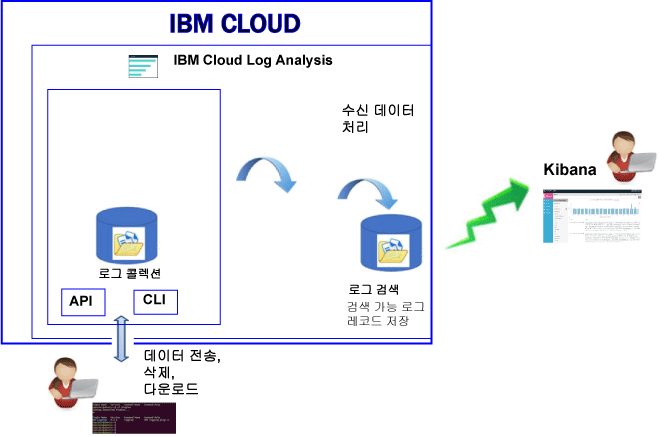

---

copyright:
  years: 2017

lastupdated: "2017-07-19"

---

{:shortdesc: .shortdesc}
{:new_window: target="_blank"}
{:codeblock: .codeblock}
{:screen: .screen}
{:pre: .pre}

# 정보
{: #log_analysis_ov}

{{site.data.keyword.loganalysisfull}} 서비스를 사용하여 {{site.data.keyword.Bluemix}}에서 로그 콜렉션, 로그 보존 및 로그 검색 기능을 확장할 수 있습니다. 애플리케이션의 집계 및 통합된 애플리케이션 또는 환경 통찰에 대한 환경 로그, 로그의 암호화, 필요로 하는 만큼의 기간 동안 로그 데이터의 보존, 문제의 신속한 발견 및 문제점 해결과 같은 기능으로 DevOps 팀의 권한을 강화하십시오. 고급 분석 태스크에 Kibana를 사용하십시오.
{:shortdesc}

{{site.data.keyword.Bluemix_notm}} 로깅 기능은 플랫폼에서 통합됩니다.

* 데이터의 수집이 클라우드 리소스에 대해 자동으로 사용 가능하게 설정됩니다. {{site.data.keyword.Bluemix_notm}}는 기본적으로 앱의 로그, 앱 런타임 및 해당 앱이 실행되는 컴퓨팅 런타임을 수집하고 표시합니다. 
* 하루에 최대 500MB의 로그를 검색할 수 있습니다. 
* 최근 3일 동안의 로그가 {{site.data.keyword.loganalysisshort}} 서비스의 컴포넌트인 로그 검색에 저장됩니다.

{{site.data.keyword.Bluemix_notm}}에서 로깅 기능을 사용하여 여기에서 실행 중인 클라우드 플랫폼 및 리소스의 동작을 이해할 수 있습니다. 표준 출력 및 표준 오류 로그를 수집하기 위해 특별한 인스트루먼테이션이 필요하지 않습니다. 예를 들면, 로그를 사용하여 애플리케이션에 대한 감사 추적 제공, 서비스에서 문제점 발견, 취약점 식별, 앱 배치 및 런타임 작동의 문제점 해결, 앱이 실행 중인 인프라에서 문제점 발견, 클라우드 플랫폼에서 앱 전체 컴포넌트 추적, 서비스 SLA에 영향을 미칠 수 있는 선점 조치를 사용할 수 있는 패턴 발견을 수행할 수 있습니다. 

다음 그림에는 {{site.data.keyword.loganalysisshort}} 서비스 컴포넌트의 상위 레벨 보기가 표시됩니다. 

클라우드 리소스의 로그를 수집하고 검색하려면 해당 클라우스 리소스가 실행 중인 동일한 {{site.data.keyword.Bluemix_notm}} 영역에서 {{site.data.keyword.loganalysisshort}} 서비스의 인스턴스를 프로비저닝해야 합니다. 

로그는 수집되어 로그 검색에 기본적으로 저장됩니다. 확장된 검색 및 수집 기능이 포함된 서비스 플랜을 선택하면 로그 역시 로그 콜렉션 컴포넌트에 수집 및 저장됩니다. 로그 콜렉션에 저장된 로그 데이터가 암호화됩니다.

로그 콜렉션에 수집하고 저장할 수 있는 로그 크기는 사용자가 선택하는 서비스 플랜에 따라 판별됩니다. 저장된 데이터에 대해 월별 GB의 데이터로 비용을 지불합니다. 로그는 JSON으로 로그 콜렉션에 저장됩니다. 

고급 검색 로그 분석 태스크를 위해 Kibana 5.1를 사용할 수 있습니다.

* 각 플랜은 하루에 검색할 수 있는 로그 크기를 제한합니다. 
* 검색은 지난 3일 동안의 데이터만 범위에 포함합니다.

3일 이전의 로그에 액세스하려면 로그 콜렉션 CLI 또는 로그 콜렉션 API를 사용하여 로그를 로컬로 다운로드하거나 다른 애플리케이션 또는 써드파티 클라우드 서비스로 로그를 보낼 수 있습니다. 

{{site.data.keyword.loganalysisshort}} CLI를 사용하여 수동으로 또는 보존 정책을 설정하여 로그를 자동으로 삭제할 수 있습니다.

## 로깅 서비스 사용 이유
{: #value}

1. **애플리케이션 설비에 시간을 덜 사용하고 그 가치를 향상하는 데 더 많은 시간 사용**

    {{site.data.keyword.loganalysislong_notm}}에서는 선택한 {{site.data.keyword.IBM_notm}} 클라우드 서비스에서 자동으로 데이터를 수집하며, 인스트루먼테이션은 필요하지 않습니다.
	
	하루에 검색할 수 있는 로그의 양을 선택할 수 있습니다. 하루에 로그의 500MB,  2GB, 5GB 및 10GB까지 검색하는 데 사용할 수 있는 다른 플랜이 사용 가능합니다. 

2. **사용자의 애플리케이션 워크로드에 가깝게 로그 데이터를 보존하고 클라우드 클래스 경제적인 스토리지 솔루션에서 안전하게 보호**

    중앙 집중식 로그에서 {{site.data.keyword.IBM_notm}} 클라우드에서 실행 중인 기존 및 마이크로서비스 중심 애플리케이션에서 로그 데이터를 수집하고 저장합니다. 사용자가 필요로 하는 만큼 로그 데이터를 보존합니다. 
	
	로그는 {{site.data.keyword.IBM_notm}} 클라우드 스토리지에 저장됩니다. 로그가 필요할 때 다운로드할 수 있습니다. 

3. **문제를 신속하게 발견, 진단 및 식별하도록 사용자의 환경에 대한 통찰을 얻음**

    사용자 정의 가능한 대시보드를 통해 사용자의 데이터를 시각화, 분석 및 상호작용하십시오. Elastic 스택 플랫폼에 빌드되어 로그 검색 기능은 사용자의 애플리케이션 요구사항대로 대시보드를 신속하게 빌드하도록 Kibana의 유연성 및 친숙성을 제공합니다. 

4. **API와 강력한 통합**

    서비스의 API를 통해 사용자의 애플리케이션 및 오퍼레이션에 로그 데이터를 통합합니다. {{site.data.keyword.loganalysisshort}} 서비스 API를 사용하여 보존된 로그를 관리하고 {{site.data.keyword.IBM_notm}} 클라우드 외부에서 로그 데이터를 전송하십시오. 

	
## 로그 수집
{: #log_collection}

기본적으로 {{site.data.keyword.Bluemix_notm}}는 최대 3일 동안 로그 검색에 로그 데이터를 저장합니다.   

* 영역당 최대 500MB의 데이터가 하루에 저장됩니다. 그 500MB 상한을 넘는 로그는 버려집니다. 상한 분배는 매일 오전 12:30 UTC에
재설정됩니다.
* 최대 1.5GB의 데이터를 최대 3일 동안 검색할 수 있습니다. 로그 데이터는 1.5GB의 데이터에 도달하거나 3일 이후에 롤오버(FIFO)됩니다.

{{site.data.keyword.loganalysisshort}} 서비스는 필요한 기간 만큼 로그 콜렉션에 로그를 저장하도록 허용하는 추가 플랜을 제공합니다. 각 플랜에 대한 자세한 정보는 [서비스 플랜](/docs/services/CloudLogAnalysis/log_analysis_ov.html#plans)을 참조하십시오.

## 로그 삭제
{: #log_deletion}

로그 검색에 저장된 로그는 3일 이후에 삭제됩니다.

로그 콜렉션에 저장된 로그는 보존 정책을 구성하지 않으면 30일 이후에 자동으로 삭제됩니다. 

* 로그 콜렉션에 로그를 보존하기 원하는 일 수를 정의하기 위한 로그 보존 정책을 구성할 수 있습니다. 자세한 정보는 [로그 보존 정책](/docs/services/CloudLogAnalysis/log_analysis_ov.html#policies)을 참조하십시오.

* 정책의 값을 *-1*로 설정하여 사용 안함으로 설정할 수 있습니다. 

로그 콜렉션 API 또는 로그 콜렉션 CLI를 사용하여 로그 콜렉션에서 수동으로 로그를 삭제할 수 있습니다. CLI를 통해 수동으로 로그 삭제하기에 대한 자세한 정보는 [cf logging delete](/docs/services/CloudLogAnalysis/reference/logging_cli.html#delete)를 참조하십시오.

## 로그 수집
{: #log_ingestion}

*라이트* 플랜을 제외한 모든 {{site.data.keyword.loganalysisshort}} 서비스 플랜에는 {{site.data.keyword.IBM_notm}} 클라우드 외부에서 로그 콜렉션으로 로그를 전송할 수 있는 기능이 포함되어 있습니다. 플랜에 대한 자세한 정보는 [서비스 플랜](/docs/services/CloudLogAnalysis/log_analysis_ov.html#plans)을 참조하십시오.

다중 테넌트 Logstash 포워더를 사용하여 {{site.data.keyword.loganalysisshort}}에 로그를 전송할 수 있습니다. 자세한 정보는 [다중 테넌트 Logstash 포워더(mt-logstash-forwarder)를 사용하여 로그 데이터 전송](/docs/services/CloudLogAnalysis/how-to/send-data/send_data_mt.html#send_data_mt)을 참조하십시오.

## 로그 검색
{: #log_search}

기본적으로 Kibana 5.1을 사용하여 {{site.data.keyword.Bluemix_notm}}에서 하루에 최대 500MB의 로그를 검색할 수 있습니다.  

{{site.data.keyword.loganalysisshort}} 서비스는 여러 가지 플랜을 제공합니다. 각 플랜에는 각기 다른 로그 검색 기능이 있으며, 예를 들어 *로그 콜렉션* 플랜은 하루에 최대 1GB의 데이터를 검색하도록 허용합니다. 플랜에 대한 자세한 정보는 [서비스 플랜](/docs/services/CloudLogAnalysis/log_analysis_ov.html#plans)을 참조하십시오.

## Bluemix의 로그 분석
{: #logging_bmx_ov_ui}

{{site.data.keyword.Bluemix_notm}}에서는 {{site.data.keyword.Bluemix_notm}} 관리 인프라에 배치된 컨테이너 또는 CF 앱에 대한 최신 로그를 보거나 실시간으로 로그를 수행할 수 있습니다. 

* UI를 통해 로그를 보고, 필터링하며 분석할 수 있습니다. 자세한 정보는 [Bluemix 콘솔에서 로그 분석](/docs/services/CloudLogAnalysis/logging_view_dashboard.html#analyzing_logs_bmx_ui)을 참조하십시오.

* 로그를 프로그래밍 방식으로 관리하기 위해 명령행을 사용하여 로그를 보고, 필터링하며 분석할 수 있습니다. 자세한 정보는 [CLI에서 로그 분석](/docs/services/CloudLogAnalysis/logging_view_cli.html#analyzing_logs_cli)을 참조하십시오.

* Kibana를 사용하여 고급 분석을 수행할 수 있습니다.

## Kibana를 사용한 고급 로그 분석
{: #logging_bmx_ov_kibana}

{{site.data.keyword.Bluemix_notm}}에서는 오픈 소스 분석 및 시각화 플랫폼인 Kibana를 사용하여 다양한 그래프(예: 차트, 표)로 된 데이터를 모니터, 검색, 분석 및 시각화할 수 있습니다. 자세한 정보는 [Kibana를 사용한 고급 로그 분석](/docs/services/CloudLogAnalysis/kibana/analyzing_logs_Kibana.html#analyzing_logs_Kibana)을 참조하십시오.

## CLI를 통한 로그 관리
{: #managing_logs}

로그를 관리하기 위해 {{site.data.keyword.loganalysisshort}} CLI를 사용하십시오. 

* CLI 설치 방법을 학습하려면 [로깅 CLI 설치](/docs/services/CloudLogAnalysis/how-to/manage-logs/config_log_collection_cli.html#config_log_collection_cli)를 참조하십시오.
* CLI의 버전을 확인하려면 * -version* 매개변수를 사용하여 [cf logging](/docs/services/CloudLogAnalysis/reference/logging_cli.html#base) 명령을 실행하십시오.
* 명령 실행 방법에 대한 도움말을 보려면 [명령 실행을 위한 명령행 도움말 가져오기](/docs/services/CloudLogAnalysis/how-to/manage-logs/config_log_collection_cli.html#cli_help)를 참조하십시오.

로그에 대한 일반 정보를 얻으려면 `cf logging status` 명령을 사용하십시오. 예를 들면, 다음과 같은 작업을 수행할 수 있습니다. 

* [일정 기간 동안의 로그에 대한 정보 가져오기](/docs/services/CloudLogAnalysis/how-to/manage-logs/viewing_log_information.html#viewing_logs).
* [일정 기간 동안의 로그 유형에 대한 정보 가져오기](/docs/services/CloudLogAnalysis/how-to/manage-logs/viewing_log_information.html#viewing_logs_by_log_type).
* [로그에 대한 계정 정보 가져오기](/docs/services/CloudLogAnalysis/how-to/manage-logs/viewing_log_information.html#viewing_logs_account).

비용을 계속 제어하기 위해 일정 기간 동안의 앱의 로그 크기를 모니터하고자 할 수 있습니다. 예를 들면, 앱 또는 서비스가 예상보다 더 많은 로그를 생성하고 있는지 식별하기 위해 {{site.data.keyword.Bluemix_notm}} 영역에 대해 1주일 동안의 각 로그 유형의 크기를 알려고 할 수 있습니다. 로그의 크기를 확인하려면 `cf logging status` 명령을 사용하십시오. 자세한 정보는 [로그 정보 보기](/docs/services/CloudLogAnalysis/how-to/manage-logs/viewing_log_information.html#viewing_log_status)를 참조하십시오.

Kibana에서 최근 3일 동안의 로그를 검색할 수 있습니다. 더 이전의 로그 데이터를 분석할 수 있도록 로그를 로컬 파일에 다운로드하거나 로컬 Elastic 스택과 같은 다른 프로그램에 해당 로그를 보낼 수 있습니다. 자세한 정보는 [로그 다운로드](/docs/services/CloudLogAnalysis/how-to/manage-logs/downloading_logs.html#downloading_logs)를 참조하십시오.

더 이상 필요하지 않은 로그를 수동으로 삭제하려면 [cf logging delete](/docs/services/CloudLogAnalysis/reference/logging_cli.html#delete) 명령을 사용하십시오.  

## 정책
{: #policies}

**로그 보존 정책**

{{site.data.keyword.loganalysisshort}} CLI를 사용하여 로그 보존 정책을 보고 구성할 수 있습니다. 이 정책은 로그 콜렉션에 로그가 보존되는 일 수를 지정합니다. 

* 기본적으로 로그는 30일 동안 보존됩니다.  
* 보존 기간이 만료된 후에 로그는 로그 콜렉션에서 자동으로 삭제되며 복구될 수 없습니다. 
* 계정에 대한 보존 기간을 지정할 수 있습니다. 그 계정의 모든 영역에 대해 보존 기간이 자동으로 구성됩니다. 
* {{site.data.keyword.Bluemix_notm}} 영역에 대한 보존 기간을 지정할 수 있습니다.
* 보존 기간을 언제든지 변경할 수 있습니다.
* 정책의 값을 *-1*로 설정하여 사용 안함으로 설정할 수 있습니다. 

**참고:** 로그 보존 정책을 사용 안함으로 설정하면 로그 콜렉션에서 로그를 유지보수해야 합니다. 이전 로그를 삭제하기 위해 CLI 명령 [cf logging delete](/docs/services/CloudLogAnalysis/reference/logging_cli.html#delete)를 사용할 수 있습니다. 

자세한 정보는 [로그 보존 정책 보기 및 구성](/docs/services/CloudLogAnalysis/how-to/manage-logs/configuring_retention_policy.html#configuring_retention_policy)을 참조하십시오.

## 서비스 플랜
{: #plans}

{{site.data.keyword.loganalysisshort}} 서비스는 여러 가지 플랜을 제공합니다. 각 플랜에는 여러 가지 로그 콜렉션 및 로그 검색 기능이 있습니다. 

{{site.data.keyword.Bluemix_notm}} UI 또는 명령행을 통해 플랜을 변경할 수 있습니다. 플랜은 언제든지 업그레이드하거나 줄일 수 있습니다. {{site.data.keyword.Bluemix_notm}}에서 서비스 플랜 업그레이드에 대한 자세한 정보는 [플랜 변경](/docs/services/CloudLogAnalysis/plan/change_plan.html#change_plan)을 참조하십시오. 

다음 표에서는 사용 가능한 플랜에 대한 개요를 설명합니다.

<table>
    <caption>플랜별 로그 검색 및 로그 콜렉션 기능의 요약</caption>
      <tr>
        <th>플랜</th>
        <th>로그 수집</th>
        <th>로그 보존</th>
        <th>데이터 암호화</th>
        <th>로그 검색</th>
      </tr>
      <tr>
        <td>라이트(기본값)</td>
        <td>아니오</td>
        <td>최근 3일</td>
        <td>아니오</td>
        <td>최대 500MB 검색</td>
      </tr>
      <tr>
        <td>로그 콜렉션</td>
        <td>예</td>
        <td>구성 가능한 일 수.</td>
        <td>예</td>
        <td>일별 최대 500MB 검색</td>
      </tr>
      <tr>
        <td>2GB/일 검색의 로그 콜렉션</td>
        <td>예</td>
        <td>구성 가능한 일 수.</td>
        <td>예</td>
        <td>일별 최대 2GB 검색</td>
      </tr>
      <tr>
        <td>5GB/일 검색의 로그 콜렉션</td>
        <td>예</td>
        <td>구성 가능한 일 수.</td>
        <td>예</td>
        <td>일별 최대 5GB 검색</td>
      </tr>
       <tr>
        <td>10GB/일 검색의 로그 콜렉션</td>
        <td>예</td>
        <td>구성 가능한 일 수.</td>
        <td>예</td>
        <td>일별 최대 10GB 검색</td>
      </tr>
</table>

**참고:** 로그 콜렉션 스토리지의 월별 비용은 청구 주기의 평균으로 계산됩니다. 

## 지역
{: #regions}

{{site.data.keyword.loganalysisfull_notm}} 서비스는 다음 지역에서 사용 가능합니다.

* 미국 남부

