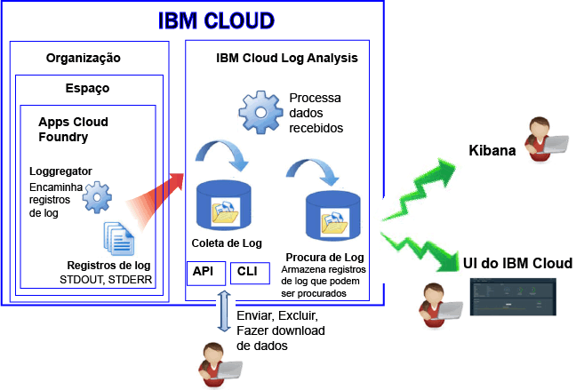

---

copyright:
  years: 2017

lastupdated: "2017-07-19"

---

{:shortdesc: .shortdesc}
{:new_window: target="_blank"}
{:codeblock: .codeblock}
{:screen: .screen}
{:pre: .pre}

# Criação de log para apps Cloud Foundry no Bluemix
{: #logging_bluemix_cf_apps}

No {{site.data.keyword.Bluemix}}, é possível visualizar, filtrar e analisar logs do Cloud Foundry (CF) por meio do painel do {{site.data.keyword.Bluemix_notm}}, do Kibana e da interface da linha de comandos. Além disso, é possível transmitir registros de log para uma ferramenta de gerenciamento de log externo. 
{:shortdesc}

O {{site.data.keyword.Bluemix_notm}} registra os dados do log que são gerados pela plataforma Cloud Foundry e por aplicativos Cloud Foundry. Nos logs, é possível visualizar os erros, os avisos e as mensagens informativas produzidas para o app. 

Ao executar seus apps em uma plataforma como serviço (PaaS) de nuvem, como Cloud Foundry no {{site.data.keyword.Bluemix_notm}}, não é possível usar SSH ou FTP na infraestrutura na qual seus apps estão em execução para acessar os logs. A plataforma é controlada pelo provedor em nuvem. Os apps Cloud Foundry em execução no {{site.data.keyword.Bluemix_notm}} usam o componente Loggerator para encaminhar os registros de log de dentro da infraestrutura do Cloud Foundry. O Loggregator seleciona automaticamente os dados STDOUT e STDERR. É possível visualizar e analisar esses logs por meio do painel do {{site.data.keyword.Bluemix_notm}}, Kibana e da interface da linha de comandos.

A figura a seguir mostra uma visualização de alto nível de criação de log para apps Cloud Foundry no {{site.data.keyword.Bluemix_notm}}:

 
A criação de log de apps Cloud Foundry é ativada automaticamente ao usar a infraestrutura do Cloud Foundry para executar seus apps no {{site.data.keyword.Bluemix_notm}}. Para visualizar os logs de tempo de execução do Cloud Foundry, deve-se gravar os logs em STDOUT e STDERR. Para obter mais informações, veja [Criação de log do aplicativo de tempo de execução por meio de apps CF](/docs/services/CloudLogAnalysis/cfapps/logging_writing_to_log_from_cf_app.html#logging_writing_to_log_from_cf_app).

O {{site.data.keyword.Bluemix_notm}} mantém uma quantia limitada de informação de log. Quando as informações são registradas, as informações antigas são substituídas pelas informações mais novas. Caso precise obedecer às políticas organizacionais ou de segmento de mercado que requeiram que você guarde todas ou parte das informações de log para auditoria ou outros propósitos, será possível transmitir seus logs para um host do log externo, como um serviço de gerenciamento de log de terceiro ou outro host. Para obter mais informações, veja [Configurando hosts do log externo](/docs/services/CloudLogAnalysis/external/logging_external_hosts.html#thirdparty_logging).

## Ingestão de log
{: #log_ingestion}

O serviço {{site.data.keyword.loganalysisshort}} oferece planos diferentes. Cada plano define se será possível ou não enviar logs para a Coleção de logs. Todos os planos, com a exceção do plano *Lite*, incluem a capacidade de enviar logs para a Coleção de logs. Para obter mais informações sobre os planos, veja [Planos de serviços](/docs/services/CloudLogAnalysis/log_analysis_ov.html#plans).

É possível enviar logs para o {{site.data.keyword.loganalysisshort}} usando o multi-tenant Logstash Forwarder. Para obter mais informações, veja [Enviar dados do log usando um Multi-Tenant Logstash Forwarder (mt-logstash-forwarder).](/docs/services/CloudLogAnalysis/how-to/send-data/send_data_mt.html#send_data_mt).

## Coleta de registro
{: #log_collection}

Por padrão, o {{site.data.keyword.Bluemix_notm}} armazena dados do log na Procura de log por até 3 dias:   

* Um máximo de 500 MB por espaço de dados é armazenado por dia. Qualquer log além desse valor máximo de 500 MB é descartado. As dotações de limite são
reconfiguradas diariamente às 0h30 UTC.
* Até 1,5 GB de dados podem ser procurados por um máximo de 3 dias. Os dados do log são substituídos (Primeiro a entrar, Primeiro a sair) depois de atingir 1,5 GB de dados ou depois de 3 dias.

O serviço {{site.data.keyword.loganalysisshort}} fornece planos adicionais que permitem armazenar logs na Coleção de logs o tempo que for necessário. Para obter mais informações sobre o preço de cada plano, veja [Planos de serviços](/docs/services/CloudLogAnalysis/log_analysis_ov.html#plans).

É possível configurar uma política de retenção de log que possa ser usada para definir o número de dias que você deseja manter os logs na Coleção de logs. Para obter mais informações, veja [Política de retenção de log](/docs/services/CloudLogAnalysis/log_analysis_ov.html#policies).

## Procura de log
{: #log_search}

Por padrão, é possível usar o Kibana para procurar até 500 MB de logs por dia no {{site.data.keyword.Bluemix_notm}}. 

O serviço {{site.data.keyword.loganalysisshort}} fornece múltiplos planos. Cada plano possui recursos de procura de log diferentes, por exemplo, o plano *Coleção de logs* permite procurar até 1 GB de dados por dia. Para obter mais informações sobre os planos, veja [Planos de serviços](/docs/services/CloudLogAnalysis/log_analysis_ov.html#plans).

## Métodos para analisar logs de app CF
{: #logging_bluemix_cf_apps_log_methods}

É possível escolher qualquer um dos métodos a seguir para analisar os logs de seu aplicativo Cloud Foundry:

* Analise o log no {{site.data.keyword.Bluemix_notm}} para visualizar a atividade mais recente do aplicativo.
    
    No {{site.data.keyword.Bluemix_notm}}, é possível visualizar, filtrar e analisar logs por meio do painel da guia **Log** que está disponível para cada aplicativo Cloud Foundry. Para obter mais informações, veja [Analisando logs do app CF no painel do Bluemix](/docs/services/CloudLogAnalysis/logging_view_dashboard.html#analyzing_logs_bmx_ui).
    
* Analise os logs no Kibana para executar tarefas analíticas avançadas.
    
    No {{site.data.keyword.Bluemix_notm}}, é possível usar o Kibana, uma plataforma de software livre para análise de dados e visualização, para monitorar, procurar, analisar e visualizar seus dados em uma variedade de gráficos, por exemplo, diagramas e tabelas. Para obter mais informações, veja [Analisando logs no Kibana](/docs/services/CloudLogAnalysis/kibana/analyzing_logs_Kibana.html#analyzing_logs_Kibana).
	
	**Dica:** para ativar kibana, veja [Navegando para o Kibana do painel de um app CF](/docs/services/CloudLogAnalysis/kibana/launch.html#launch_Kibana_from_cf_app).

* Analise os logs por meio da CLI para usar comandos para gerenciar logs programaticamente.
    
    No {{site.data.keyword.Bluemix_notm}}, é possível visualizar, filtrar e analisar logs por meio da interface da linha de comandos usando o comando **cf logs**. Para obter mais informações, veja [Analisando logs do app Cloud Foundry na interface da linha de comandos](/docs/services/CloudLogAnalysis/logging_view_cli.html#analyzing_logs_cli).

## Origens de log para apps CF implementados no Diego
{: #cf_apps_log_sources_diego}

Para aplicativos Cloud Foundry (CF) que são implementados na arquitetura Cloud Foundry que se baseia no Diego, as origens de log a seguir estão disponíveis:
    
| Origem do log | Nome do componente | Descrição | 
|------------|----------------|-------------|
| LGR | Loggregator | O componente LGR fornece informações sobre o Cloud Foundry Loggregator, que encaminha os logs de dentro do Cloud Foundry. |
| RTR | Roteador | O componente RTR fornece informações sobre solicitações de HTTP para um aplicativo. | 
| STG | Temporário | O componente STG fornece informações sobre como um aplicativo é montado ou remontado. | 
| APP | Aplicativo | O componente APP fornece logs do aplicativo. É neste local que o stderr e o stdout aparecerão em seu código. | 
| API | Cloud Foundry API | O componente API fornece informações sobre as ações internas que resultam da solicitação de um usuário para mudar o estado de um aplicativo. | 
| CELL | Célula Diego | O componente CELL fornece informações sobre o início, a parada ou o travamento de um aplicativo.|
| SSH | SSH | O componente SSH fornece informações cada vez que um usuário acessa um aplicativo usando o comando **cf ssh**. |
{: caption="Tabela 1. Origens de log para apps CF que são implementados em uma arquitetura CF que se baseia no Diego" caption-side="top"}

A figura a seguir mostra os diferentes componentes (origens de log) em uma arquitetura Cloud Foundry que se baseia no Diego: 

 em uma arquitetura Cloud Foundry que se baseia no Diego.")
	
## Origens de log para apps CF implementados no DEA
{: #logging_bluemix_cf_apps_log_sources}

Para aplicativos Cloud Foundry (CF) que são implementados em uma arquitetura Droplet Execution Agent (DEA), as origens de log a seguir estão disponíveis:
    
| Origem do log | Nome do componente | Descrição | 
|------------|----------------|-------------|
| LGR | Loggregator | O componente LGR fornece informações sobre o Cloud Foundry Loggregator, que encaminha os logs de dentro do Cloud Foundry. |
| RTR | Roteador | O componente RTR fornece informações sobre solicitações de HTTP para um aplicativo. | 
| STG | Temporário | O componente STG fornece informações sobre como um aplicativo é montado ou remontado. | 
| APP | Aplicativo | O componente APP fornece logs do aplicativo. É neste local que o stderr e o stdout aparecerão em seu código. | 
| API | Cloud Foundry API | O componente API fornece informações sobre as ações internas que resultam da solicitação de um usuário para mudar o estado de um aplicativo. | 
| DEA | Droplet Execution Agent | O componente DEA fornece informações sobre o início, a parada ou o travamento de um aplicativo.   Esse componente estará disponível somente se seu aplicativo for implementado na arquitetura Cloud Foundry que é baseada no DEA. | 
{: caption="Tabela 2. Origens de log para apps CF que são implementados em uma arquitetura CF que se baseia no DEA" caption-side="top"}

A figura a seguir mostra os diferentes componentes (origens de log) em uma arquitetura Cloud Foundry que se baseia no DEA: 

 em uma arquitetura Cloud Foundry que se baseia no Droplet Execution Agent (DEA).")

