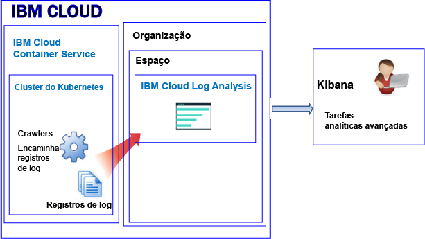
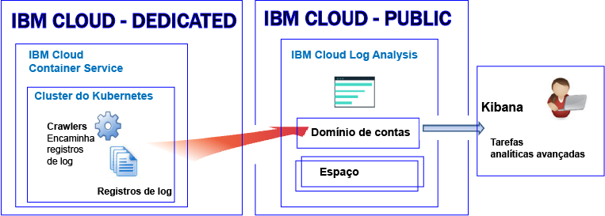

---

copyright:
  years: 2017, 2018

lastupdated: "2018-02-01"

---

{:new_window: target="_blank"}
{:shortdesc: .shortdesc}
{:screen: .screen}
{:pre: .pre}
{:table: .aria-labeledby="caption"}
{:codeblock: .codeblock}
{:tip: .tip}
{:download: .download}


# Criação de log para recursos em um cluster do Kubernetes
{: #containers_kubernetes}

É possível visualizar, filtrar e analisar logs para recursos em um cluster do Kubernetes por meio do serviço {{site.data.keyword.loganalysisshort}} no {{site.data.keyword.Bluemix_notm}}.
{:shortdesc}

Por padrão, o envio de logs de um cluster para o serviço {{site.data.keyword.loganalysisshort}} não é ativado automaticamente. **Nota:** essa é uma mudança recente para novos clusters. Antes, quando um cluster era criado, as informações impressas por um processo de contêiner em stdout (saída padrão) e stderr (erro padrão) eram coletadas automaticamente pelo {{site.data.keyword.containershort}} e encaminhadas para o serviço {{site.data.keyword.loganalysisshort}}. Agora, você tem que criar uma ou mais configurações de criação de log no cluster para encaminhar logs automaticamente para o serviço {{site.data.keyword.loganalysisshort}}.

Considere as informações a seguir ao trabalhar com logs de cluster:

* O envio de informações para stdout e stderr é a convenção padrão do Docker para expor as informações de um contêiner.
* Os logs do contêiner são monitorados e encaminhados de fora do contêiner usando crawlers. 
* Os dados são enviados pelos crawlers para um Elasticsearch com diversos locatários no {{site.data.keyword.Bluemix_notm}}. 
* É possível configurar seu cluster para encaminhar logs stdout e stderr, outros logs de aplicativo, logs de nó do trabalhador, os logs de componente do sistema do Kubernetes e os logs do controlador de Ingresso para o serviço {{site.data.keyword.loganalysisshort}}. Para obter mais informações, veja [Coletando logs do aplicativo e do cluster adicionais](/docs/services/CloudLogAnalysis/containers/containers_kubernetes.html#collect_logs).

## Sobre a criação de log no Public
{: #public}

No {{site.data.keyword.Bluemix_notm}}, é possível usar o serviço {{site.data.keyword.loganalysisshort}} para armazenar e analisar logs do contêiner e logs de cluster do Kubernetes que são coletados automaticamente pelo {{site.data.keyword.containershort}} no Public.

É possível ter 1 ou mais clusters do Kubernetes em uma conta. Os logs são coletados automaticamente pelo {{site.data.keyword.containershort}} assim que o cluster é provisionado. 

* Os logs do aplicativo são coletados assim que o pod é implementado. 
* As informações impressas por um processo de contêiner no stdout (saída padrão) e stderr (erro padrão) são coletadas automaticamente pelo {{site.data.keyword.containershort}}.

Para que esses logs estejam disponíveis para análise no serviço {{site.data.keyword.loganalysisshort}}, deve-se configurar o cluster para encaminhar os logs de cluster para o {{site.data.keyword.loganalysisshort}}. É possível encaminhar logs para sua conta de domínio ou para um domínio de espaço em sua conta.

* Os clusters que estão disponíveis na região Sul dos EUA enviam logs para o serviço {{site.data.keyword.loganalysisshort}} que está disponível na região Sul dos EUA.
* Os clusters que estão disponíveis na região Leste dos EUA enviam logs para o serviço {{site.data.keyword.loganalysisshort}} que está disponível na região Sul dos EUA.
* Os clusters que estão disponíveis na região Alemanha enviam logs para o serviço {{site.data.keyword.loganalysisshort}} que está disponível na região Alemanha.
* Os clusters que estão disponíveis na região Sydney enviam logs para o serviço {{site.data.keyword.loganalysisshort}} que está disponível na região Sydney.
* /Os clusters que estão disponíveis na região Reino Unido enviam logs para o serviço {{site.data.keyword.loganalysisshort}} que está disponível na região Alemanha.


Para analisar dados do log no Kibana para um cluster, considere as informações a seguir:

* Deve-se ativar o Kibana na região do Public na qual a instância do {{site.data.keyword.loganalysisshort}} usada para visualizar logs é provisionada. 
* Seu ID do usuário deve ter permissões para visualizar logs. 

    Para ver logs no domínio de contas, um usuário precisa de uma política do IAM para o serviço {{site.data.keyword.loganalysisshort}}. O usuário precisa de permissões de **Visualizador**. 
    
    Para ver logs no domínio de espaço, o usuário precisa de uma função do CF. Para obter mais informações, veja [Funções que são requeridas por um usuário para visualizar logs](/docs/services/CloudLogAnalysis/kibana/analyzing_logs_Kibana.html#roles).

Para gerenciar dados do log que estão no armazenamento de longo prazo (Coleção de logs), seu ID do usuário deve ter uma política do IAM para trabalhar com o serviço {{site.data.keyword.loganalysisshort}}. Seu ID do usuário deve ter permissões de **Administrador** ou **Editor**.  Para obter mais informações, veja [Funções que são requeridas por um usuário para gerenciar os logs](/docs/services/CloudLogAnalysis/manage_logs.html#roles).

**Nota:** ao trabalhar com um cluster do Kubernetes, os namespaces *ibm-system* e *kube-system* são reservados. Não crie, exclua, modifique ou mude permissões de recursos que estão disponíveis nesses namespaces. Os logs para esses namespaces são para uso da {{site.data.keyword.IBM_notm}}.


### Visualização de alto nível de criação de log para um cluster que encaminha logs para o domínio de contas
{: #acc}


A figura a seguir mostra uma visualização de alto nível de criação de log no Public para o {{site.data.keyword.containershort}} quando o cluster encaminha logs para o domínio de contas:


### Visualização de alto nível de criação de log para um cluster que encaminha logs para um domínio de espaço
{: #space}

A figura a seguir mostra uma visualização de alto nível de criação de log no Public para o {{site.data.keyword.containershort}} quando o cluster encaminha logs para um domínio de espaço:



   


## Sobre a criação de log no Dedicated
{: #dedicated}

No {{site.data.keyword.Bluemix_notm}}, é possível usar o serviço {{site.data.keyword.loganalysisshort}} no Public para armazenar e analisar logs do contêiner e logs de cluster do Kubernetes que são coletados automaticamente pelo {{site.data.keyword.containershort}} no Dedicated.

Considere as seguintes informações:

* É possível ter 1 ou mais clusters do Kubernetes em uma conta. Os logs são coletados automaticamente pelo {{site.data.keyword.containershort}} assim que um cluster é provisionado. 
* Para visualizar logs do aplicativo e do cluster por meio do serviço {{site.data.keyword.loganalysisshort}}, deve-se definir uma ou mais configurações de criação de log em um cluster. Cada entrada de configuração define quais informações de log são encaminhadas para o serviço {{site.data.keyword.loganalysisshort}}. Por exemplo, os dados dos logs stdout e stderr são coletados assim que o pod é implementado. Para encaminhar esses logs, deve-se definir uma configuração de criação de log para uma origem de log do tipo *contêiner*.
* Ao definir uma configuração de criação de log, você decide se deseja enviar logs para o domínio de contas ou para um domínio de espaço. **Nota:** atualmente, o domínio de contas possui uma cota de procura limite de 500 MB por dia e não é possível armazenar logs na Coleção de logs para armazenamento de longo prazo. Para ser possível procurar logs maiores e para armazenar logs na Coleção de logs, envie-os para um domínio de espaço.
* Ao definir uma configuração de criação de log para enviar logs para o domínio de contas, os logs são encaminhados para o domínio de contas na mesma região Public na qual o {{site.data.keyword.containershort}} Dedicated está em execução.

    Os clusters que estão disponíveis na região Sul dos EUA enviam logs para o serviço {{site.data.keyword.loganalysisshort}} que está disponível na região Sul dos EUA.</br>
    Os clusters que estão disponíveis na região Leste dos EUA enviam logs para o serviço {{site.data.keyword.loganalysisshort}} que está disponível na região Sul dos EUA. </br>
    Os clusters que estão disponíveis na região Alemanha enviam logs para o serviço {{site.data.keyword.loganalysisshort}} que está disponível na região Alemanha. </br>
    Os clusters que estão disponíveis na região Sydney enviam logs para o serviço {{site.data.keyword.loganalysisshort}} que está disponível na região Sydney. </br>
    /Os clusters que estão disponíveis na região Reino Unido enviam logs para o serviço {{site.data.keyword.loganalysisshort}} que está disponível na região Alemanha.


Para visualizar e analisar dados do log para um cluster no Kibana, considere as informações a seguir:

* Deve-se ativar o Kibana para a região da Cloud Public na qual a instância do {{site.data.keyword.loganalysisshort}} é provisionada. 
* O seu ID de usuário deve ter uma política do IAM para trabalhar com o serviço {{site.data.keyword.loganalysisshort}}. Você precisa ter as permissões de **Visualizador** para ver logs no domínio de contas.  

Para gerenciar dados do log que estão no armazenamento de longo prazo (Coleção de logs), seu ID do usuário deve ter uma política do IAM para trabalhar com o serviço {{site.data.keyword.loganalysisshort}}. Você precisa ter permissões de **Administrador** ou **Editor**.  

A figura a seguir mostra uma visualização de alto nível de criação de log no Dedicated para o {{site.data.keyword.containershort}}:




## Origens de log
{: #log_sources}


É possível configurar seu cluster para encaminhar logs para o serviço {{site.data.keyword.loganalysisshort}}. A tabela a seguir lista as diferentes origens de log que podem ser ativadas para encaminhar logs para o serviço {{site.data.keyword.loganalysisshort}}:

<table>
  <caption>Origens de log para um cluster do Kuberenetes</caption>
  <tr>
    <th>Origem do log</th>
	<th>Descrição</th>
	<th>Caminhos de log</th>
  </tr>
  <tr>
    <td>Contêiner</td>
	<td>Logs de contêiner.</td>
	<td>Logs de saída padrão (stdout) e de erro padrão (stderr).</td>
  </tr>
  <tr>
    <td>Aplicativo</td>
	<td>Logs para seu próprio aplicativo que é executado em um cluster do Kubernetes.</td>
	<td>`/var/log/apps/**/*.log`  </br>`/var/log/apps/**/*.err`</br>**NOTA:** em um pod, os logs podem ser gravados em `/var/logs/apps/` ou em qualquer subdiretório sob `/var/logs/apps/`. No trabalhador, deve-se montar `/var/log/apps/` no diretório no pod no qual seu app está gravando logs no pod.</td>
  </tr>
  <tr>
    <td>Trabalhador</td>
	<td>Logs para nós do trabalhador de máquina virtual em um cluster do Kubernetes. </td>
	<td>`/var/log/syslog` </br>`/var/log/auth.log`</td>
  </tr>
  <tr>
    <td>Componente do sistema do Kubernetes</td>
	<td>Logs para o componente do sistema do Kubernetes.</td>
	<td>*/var/log/kubelet.log* </br>*/var/log/kube-proxy.log*</td>
  </tr>
  <tr>
    <td>Controlador de ingresso</td>
	<td>Logs para um controlador de Ingresso que gerencia o tráfego de rede que entra em um cluster do Kubernetes.</td>
	<td>`/var/log/alb/ids/*.log` </br>`/var/log/alb/ids/*.err` </br>`/var/log/alb/customerlogs/*.log` </br>`/var/log/alb/customerlogs/*.err`</td>
  </tr>
</table>


## Considerações sobre o encaminhamento de logs do aplicativo
{: #forward_app_logs}

Para ativar o encaminhamento de log de logs do aplicativo, deve-se definir uma configuração de criação de log de cluster com **Origem de log** configurado como **aplicativo**.

Revise os aspectos de encaminhamento de log do aplicativo a seguir:

* É possível encaminhar logs que estão disponíveis em um diretório específico no nó do host. Isso pode ser feito montando um volume de caminho do host em seus contêineres com um caminho de montagem. Esse caminho de montagem serve como o diretório em seus contêineres nos quais os logs de aplicativos são enviados. O diretório do caminho do host predefinido, `/var/log/apps`, é criado automaticamente quando você cria a montagem do volume.

    Por exemplo, veja amostras de uma seção de volumes de anúncios da seção volumeMounts do descritor de implementação:

    ```
    volumeMounts:
            - mountPath: /var/app
              name: application-log
    volumes:
        - name: application-log
          hostPath:
            path: /var/log/apps

    ```
    {: codeblock}

* Os logs são lidos recursivamente no caminho `/var/log/apps`. É possível colocar logs de aplicativos em subdiretórios do caminho `/var/log/apps`.
    
* Somente arquivos de log do aplicativo com extensões de arquivo **.log** ou **.err** são encaminhados.

* Quando você ativa o encaminhamento de log pela primeira vez, os logs de aplicativos são unilaterais em vez de serem lidos do topo. 

    O conteúdo de logs já presentes antes da ativação da criação de log do aplicativo não é lido. Os logs são lidos do ponto em que a criação de log foi ativada. No entanto, após a primeira vez que o encaminhamento de log é ativado, os logs são sempre capturados de onde eles pararam da última vez.

* Quando você monta o volume do caminho do host */var/log/apps* em múltiplos contêineres, todos os contêineres são gravados no mesmo diretório no host (trabalhador). Se os contêineres forem gravados com o mesmo nome de arquivo, eles serão gravados exatamente no mesmo arquivo no host e serão sobrescritos. 

    **NOTA:** quando todos os contêineres forem gravados com o mesmo nome de arquivo, não ative o encaminhamento de logs do log com Origem de log configurado como *aplicativo* para encaminhar logs de aplicativos para ReplicaSets maior que 1. Em vez disso, é possível gravar logs do aplicativo em STDOUT e STDERR, que são assimilados como logs do contêiner. Para encaminhar logs de aplicativos gravados em STDOUT e STDERR, ative o encaminhamento de log com Origem de log configurado como *contêiner*.


## Considerações sobre o encaminhamento de logs para um domínio de logs
{: #forward_logs_domain}

É possível configurar seu cluster para encaminhar arquivos de log para o serviço {{site.data.keyword.loganalysisshort}}. 

Os logs podem ser encaminhados para o domínio de contas ou para um domínio de espaço.

Considere as informações a seguir ao decidir se deseja encaminhar logs para um domínio de espaço ou para o domínio de contas:

* Ao enviar logs para o domínio de contas, a cota de procura é 500 MB por dia e não é possível armazenar logs na Coleção de logs para armazenamento de longo prazo.
* Ao enviar logs para um domínio de espaço, será possível escolher um plano de serviço {{site.data.keyword.loganalysisshort}} que defina a cota de procura por dia e armazenar logs na Coleção de logs para armazenamento de longo prazo.


## Encaminhando logs do aplicativo e do cluster
{: #forward_logs}

Para configurar seu cluster para encaminhar logs para o serviço {{site.data.keyword.loganalysisshort}}, deve-se concluir as etapas a seguir:

1. Verificar se o seu ID de usuário tem permissões para incluir uma configuração de criação de log no cluster. 

    Somente usuários com uma política do IAM para o {{site.data.keyword.containershort}} com permissões para gerenciar clusters podem criar, atualizar ou excluir uma configuração de criação de log de cluster. Qualquer uma das funções a seguir é necessária: Administrador, Operador.

2. Abra um terminal e configure o contexto do cluster.

3. Crie as configurações de criação de log para o cluster. É possível escolher quais logs de cluster serão encaminhados para o serviço Log Analysis.

    Para ativar a coleção de logs automática e encaminhar stdout e stderr, veja [Ativando a coleção de logs automática e encaminhando logs do contêiner](/docs/services/CloudLogAnalysis/containers/containers_kube_other_logs.html#containers). </br>
    Para ativar a coleção automática de logs e o encaminhamento de logs do aplicativo, veja [Ativando a coleção automática de logs e o encaminhamento de logs do aplicativo](/docs/services/CloudLogAnalysis/containers/containers_kube_other_logs.html#apps). </br>
    Para ativar a coleção automática de logs e o encaminhamento de logs do trabalhador, veja [Ativando a coleção automática de logs e o encaminhamento de logs do trabalhador](/docs/services/CloudLogAnalysis/containers/containers_kube_other_logs.html#workers). </br>
    Para ativar a coleção automática de logs e o encaminhamento dos logs do componente do sistema do Kubernetes, veja [Ativando a coleção automática de logs e o encaminhamento dos logs do componente do sistema do Kubernetes](/docs/services/CloudLogAnalysis/containers/containers_kube_other_logs.html#system). </br>
    Para ativar a coleção automática de logs e o encaminhamento dos logs de controlador de ingresso do Kubernetes, veja [Ativando a coleção automática de logs e o encaminhamento dos logs de controlador de ingresso do Kubernetes](/docs/services/CloudLogAnalysis/containers/containers_kube_other_logs.html#controller).
    
4. Quando você encaminhar logs para um espaço, deve-se também conceder permissões do Cloud Foundry (CF) para o proprietário da chave do {{site.data.keyword.containershort}} na organização e no espaço. O proprietário da chave precisa da função *orgManager* para a organização e *SpaceManager* e *Developer* para o espaço.

Para obter mais informações sobre como configurar seu cluster para encaminhar arquivos de log para o serviço {{site.data.keyword.loganalysisshort}}, veja a seção [Ativando a coleta automática de logs de cluster](/docs/services/CloudLogAnalysis/containers/containers_kube_other_logs.html#containers_kube_other_logs).


## Configurando o tráfego de rede para configurações de firewall customizado no {{site.data.keyword.Bluemix_notm}}
{: #ports}

Quando você tiver um firewall adicional configurado ou tiver customizado as configurações de firewall na infraestrutura do {{site.data.keyword.Bluemix_notm}} (SoftLayer), será necessário permitir o tráfego de rede de saída do nó do trabalhador para o serviço {{site.data.keyword.loganalysisshort}}. 

Deve-se abrir a porta TCP 443 e a porta TCP 9091 de cada trabalhador para o serviço {{site.data.keyword.loganalysisshort}} para os endereços IP a seguir em seu firewall customizado:

<table>
  <tr>
    <th>Region</th>
    <th>URL de ingestão</th>
	<th>Endereço IP público</th>
  </tr>
  <tr>
    <td>Alemanha</td>
	<td>ingest-eu-fra.logging.bluemix.net</td>
	<td>158.177.88.43 <br>159.122.87.107</td>
  </tr>
  <tr>
    <td></td>
	<td>ingest.logging.eu-gb.bluemix.net</td>
	<td>169.50.115.113</td>
  </tr>
  <tr>
    <td>Sul dos Estados Unidos</td>
	<td>ingest.logging.ng.bluemix.net</td>
	<td>169.48.79.236 <br>169.46.186.113</td>
  </tr>
  <tr>
    <td>Sydney</td>
	<td>ingest-au-syd.logging.bluemix.net</td>
	<td>130.198.76.125 <br>168.1.209.20</td>
  </tr>
</table>


## Procurando logs
{: #log_search}

Por padrão, é possível usar o Kibana para procurar até 500 MB de logs por dia no {{site.data.keyword.Bluemix_notm}}. 

Para procurar por logs maiores, é possível usar o serviço {{site.data.keyword.loganalysisshort}}. O serviço fornece múltiplos planos. Cada plano possui recursos de procura de log diferentes, por exemplo, o plano *Coleção de logs* permite procurar até 1 GB de dados por dia. Para obter mais informações sobre os planos que estão disponíveis, veja [Planos de serviço](/docs/services/CloudLogAnalysis/log_analysis_ov.html#plans).

Ao procurar seus logs, considere os campos a seguir que estão disponíveis no Kibana:

Campos que são comuns a qualquer entrada de log:

<table>
  <caption>Lista de campos comuns</caption>
  <tr>
    <th>Nome do campo</th>
	<th>Descrição</th>
	<th>Valor</th>
  </tr>
  <tr>
    <td>ibm-containers.region_str</td>
	<td>Região na qual o cluster está disponível</td>
	<td>Por exemplo, `us-south` é o valor para um cluster que está disponível na região Sul dos EUA.</td>
  </tr>
  <tr>
    <td>ibm-containers.account_id_str</td>
	<td>ID da conta</td>
	<td></td>
  </tr>
  <tr>
    <td>Ibm-containers.cluster_id_str</td>
	<td>ID do cluster</td>
	<td></td>
	<tr>
    <td>ibm-containers.cluster_name_str</td>
	<td>Nome do cluster</td>
	<td></td>
  </tr>
</table>

Campos que podem ser úteis ao analisar logs stdout e stderr do contêiner:

<table>
  <caption>Lista de campos para aplicativos</caption>
  <tr>
    <th>Nome do campo</th>
	<th>Descrição</th>
	<th>Valor</th>
  </tr>
  <tr>
    <td>Kubernetes.container_name_str</td>
	<td>Nome do contêiner</td>
	<td></td>
  </tr>
  <tr>
    <td>Kubernetes.namespace_name_str</td>
	<td>O nome do namespace no qual o aplicativo está sendo executado no cluster</td>
	<td></td>
  </tr>
  <tr>
    <td>Stream_str</td>
	<td>Tipo de log</td>
	<td>*stdout* </br>*stderr *</td>
  </tr>
</table>

Campos que podem ser úteis ao analisar logs do trabalhador:

<table>
  <caption>Lista de campos que são relevantes para os trabalhadores</caption>
  <tr>
    <th>Nome do campo</th>
	<th>Descrição</th>
	<th>Valor</th>
  </tr>
  
  <tr>
    <td>filename_str</td>
	<td>Caminho e nome do arquivo</td>
	<td>*/var/log/syslog*  </br>*/var/log/auth.log*</td>
  </tr>
  <tr>
    <td>tag_str</td>
	<td>Tipo de log</td>
	<td>*logfiles.worker.var.log.syslog* </br>*logfiles.worker.var.log.auth.log*</td>
  </tr>
  <tr>
    <td>worker_str</td>
	<td>Nome do trabalhador</td>
	<td>Por exemplo, *w1*</td>
  </tr>
</table>

Campos que podem ser úteis ao analisar logs do componente do sistema do Kubernetes:

<table>
  <caption>Lista de campos que são relevantes para o componente do sistema do Kubernetes</caption>
  <tr>
    <th>Nome do campo</th>
	<th>Descrição</th>
	<th>Valor</th>
  </tr>
  <tr>
    <td>tag_str</td>
	<td>Tipo de log</td>
	<td>*logfiles.kubernetes.var.log.kubelet.log* </br>*logfiles.kubernetes.var.log.kube-proxy.log*</td>
  </tr>
  <tr>
    <td>filename_str</td>
	<td>Caminho e nome do arquivo</td>
	<td>*/var/log/kubelet.log* </br>*/var/log/kube-proxy.log*</td>
  </tr>
 </table>

Campos que podem ser úteis ao analisar logs do controlador de Ingresso:
 
<table>
  <caption>Lista de campos que são relevantes para o controlador de Ingresso</caption>
  <tr>
    <th>Nome do campo</th>
	<th>Descrição</th>
	<th>Valor</th>
  </tr>
 <tr>
    <td>tag_str</td>
	<td>Tipo de log</td>
	<td></td>
  </tr>
  <tr>
    <td>filename_str</td>
	<td>Caminho e nome do arquivo</td>
	<td>*/var/log/alb/ids/*.log* </br>*/var/log/alb/ids/*.err* </br>*/var/log/alb/customerlogs/*.log* </br>*/var/log/alb/customerlogs/*.err*</td>
  </tr>
</table>


## Enviando logs para que seja possível usar os campos em uma mensagem como campos de procura do Kibana
{: #send_data_in_json}

Por padrão, a criação de log é ativada automaticamente para os contêineres. Cada entrada no arquivo de log do Docker é exibida no Kibana no campo **message**. Se você precisar filtrar e analisar seus dados no Kibana usando um campo específico que faça parte da entrada de log do contêiner, configure seu aplicativo para enviar uma saída formatada em JSON válida. Por exemplo, registre a mensagem no formato JSON para stdout (saída padrão) e stderr (erro padrão).

Cada campo que está disponível na mensagem é analisado para o tipo de campo que corresponde a seu valor. Por exemplo, cada campo na mensagem JSON a seguir:
    
```
{"field1":"string type",
        "field2":123,
        "field3":false,
        "field4":"4567"
    }
```
{: codeblock}
    
está disponível como um campo que pode ser usado para filtragem e procuras:
    
* `field1` é analisado como `field1_str` do tipo sequência.
* `field2` é analisado como `field1_int` do tipo número inteiro.
* `field3` é analisado como `field3_bool` do tipo booleano.
* `field4` é analisado como `field4_str` do tipo sequência.
    

## Armazenando logs em Coleção de logs
{: #log_collection}

Considere as informações a seguir sobre o comportamento padrão no {{site.data.keyword.Bluemix_notm}} ao trabalhar com logs:

* O {{site.data.keyword.Bluemix_notm}} armazena dados do log por até 3 dias.
* Um máximo de 500 MB de dados é armazenado por dia. Qualquer log além desse valor máximo de 500 MB é descartado. As dotações de limite são reconfiguradas diariamente às 0h30 UTC.
* Até 1,5 GB de dados podem ser procurados por um máximo de 3 dias. Os dados do log são substituídos (Primeiro a entrar, Primeiro a sair) depois de atingir 1,5 GB de dados ou depois de 3 dias.
* Os logs não são armazenados na Coleção de logs para armazenamento de longo prazo.

O serviço {{site.data.keyword.loganalysisshort}} fornece planos adicionais que permitem armazenar logs na Coleção de logs o tempo que for necessário. Para obter mais informações sobre o preço de cada plano, veja [Planos de serviços](/docs/services/CloudLogAnalysis/log_analysis_ov.html#plans). 

Para gerenciar logs na Coleção de logs, considere as informações a seguir:

* É possível configurar uma política de retenção de log que possa ser usada para definir o número de dias que você deseja manter os logs na Coleção de logs. Para obter mais informações, veja [Política de retenção de log](/docs/services/CloudLogAnalysis/log_analysis_ov.html#policies).
* É possível excluir logs manualmente usando a CLI ou a API da Coleção de logs. 
* Para gerenciar logs na coleção de logs, um usuário precisa de uma política do IAM com permissões para trabalhar com o serviço {{site.data.keyword.loganalysisshort}} no {{site.data.keyword.Bluemix_notm}}. Para obter mais informações, veja [Funções do IAM](/docs/services/CloudLogAnalysis/security_ov.html#iam_roles).

## Visualizando e analisando logs
{: #logging_containers_ov_methods}

Para analisar dados do log, use o Kibana para executar tarefas analíticas avançadas. O Kibana é uma plataforma de software livre de visualização e analítica, que pode ser usada para monitorar, procurar, analisar e visualizar seus dados em uma variedade de gráficos, por exemplo, diagramas e tabelas. Para obter mais informações, veja [Analisando logs no Kibana](/docs/services/CloudLogAnalysis/kibana/analyzing_logs_Kibana.html#analyzing_logs_Kibana).

* É possível ativar o Kibana diretamente de um navegador da web. Para obter mais informações, veja [Navegando para o Kibana por meio de um navegador da web](/docs/services/CloudLogAnalysis/kibana/launch.html#launch_Kibana_from_browser).
* É possível ativar o Kibana por meio da UI do [{{site.data.keyword.Bluemix_notm}} dentro do contexto de um cluster. Para obter mais informações, veja [Navegando para o Kibana por meio do painel de um contêiner que é implementado em um cluster do Kubernetes](/docs/services/CloudLogAnalysis/kibana/launch.html#launch_Kibana_for_containers_kube).

Se você encaminha os dados do log de um app que é executado em um contêiner para o coletor do log do Docker no formato JSON, é possível procurar e analisar os dados do log no Kibana usando campos JSON. Para obter mais informações, veja [Configurando campos customizados como campos de procura do Kibana](logging_containers_ov.html#send_data_in_json).

Para visualizar logs no Kibana, considere as informações a seguir:

* Para ver logs em um domínio de espaço, o usuário deve ter a função de **auditor** ou a função de **desenvolvedor** no espaço associado ao cluster.
* Para ver logs no domínio de contas, o usuário deve ter uma política do IAM para trabalhar com o serviço {{site.data.keyword.loganalysisshort}}. A função mínima que permite visualizar entradas de log é **Visualizador**.


## Tutorial: analisar logs no Kibana para um app que é implementado em um cluster do Kubernetes
{: #tutorial1}

Para saber como usar o Kibana para analisar os logs de um contêiner implementado em um cluster do Kubernetes, veja [Analisar logs no Kibana para um app implementado em um cluster do Kubernetes](/docs/services/CloudLogAnalysis/tutorials/container_logs.html#container_logs).
