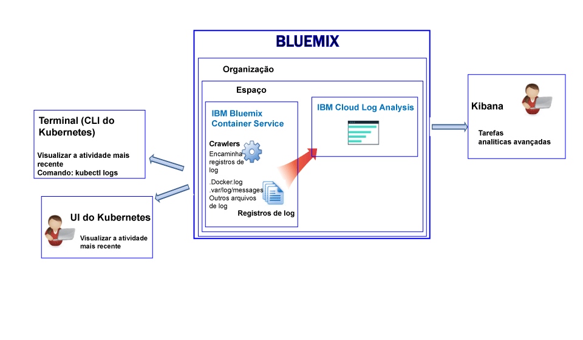
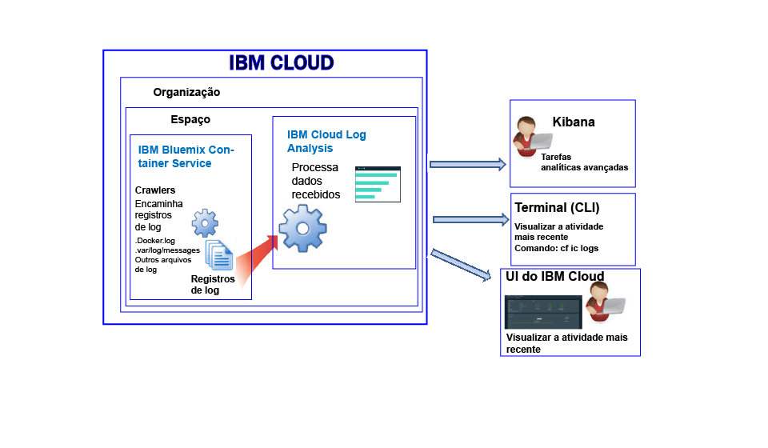

---

copyright:
  years: 2017

lastupdated: "2017-07-19"

---

{:shortdesc: .shortdesc}
{:new_window: target="_blank"}
{:codeblock: .codeblock}
{:screen: .screen}
{:pre: .pre}


# Criação de log para o IBM Bluemix Container Service
{: #logging_containers_ov}

É possível visualizar, filtrar e analisar logs para contêineres do Docker que são implementados na infraestrutura em nuvem gerenciada pelo {{site.data.keyword.IBM}} e para contêineres do Docker que são executados em clusters do Kubernetes. A criação de log de contêineres é ativada automaticamente quando você implementa um contêiner no {{site.data.keyword.Bluemix_notm}} ou em um cluster do Kubernetes.
{:shortdesc}

Os logs do contêiner são monitorados e encaminhados de fora do contêiner usando crawlers. Os dados são
enviados pelos crawlers para um Elasticsearch de diversos locatários no
{{site.data.keyword.Bluemix_notm}}.


## Coletando logs para um contêiner que é executado em um cluster do Kubernetes
{: #logging_containers_ov_logs_collected_kubernetes}

A figura a seguir mostra uma visualização de alto nível de criação de log para o {{site.data.keyword.containershort}}:



No {{site.data.keyword.Bluemix_notm}}, ao implementar aplicativos em um cluster do Kubernetes, considere as informações a seguir:

* Em uma conta do {{site.data.keyword.Bluemix_notm}}, é possível ter 1 ou mais organizações. 
* Cada organização pode ter 1 ou mais espaço do {{site.data.keyword.Bluemix_notm}}. 
* É possível ter 1 ou mais clusters do Kubernetes em uma organização. 
* A coleção de logs é ativada automaticamente quando você cria um cluster do Kubernetes. 
* Um cluster do Kubernetes é agnóstico de espaços do {{site.data.keyword.Bluemix_notm}}. No entanto, os dados do log de um cluster e seus recursos são associados a um espaço do {{site.data.keyword.Bluemix_notm}}.
* Os dados do log são coletados para um aplicativo assim que o pod é implementado.
* Para analisar os dados do log para um cluster, deve-se acessar os painéis do Kibana para a região Pública de Nuvem na qual o cluster é criado.

Antes de criar um cluster, seja por meio da [UI do {{site.data.keyword.Bluemix_notm}}](/docs/containers/cs_cluster.html#cs_cluster_ui) ou da [linha de comandos](/docs/containers/cs_cluster.html#cs_cluster_cli), deve-se efetuar login em uma região, uma conta, uma organização e um espaço específico do {{site.data.keyword.Bluemix_notm}}. O espaço no qual você está com login efetuado é o espaço no qual os dados de criação de log para o cluster e seus recursos são coletados.

Por padrão, as informações que qualquer processo de contêiner imprime para stdout (saída padrão) e stderr (erro padrão) são coletadas. O envio de informações para stdout e stderr é a convenção padrão do Docker para expor as informações de um contêiner. 

Se você encaminha os dados do log de um app que é executado em um contêiner para o coletor do log do Docker no formato JSON, é possível procurar e analisar os dados do log no Kibana usando campos JSON. Para obter mais informações, veja [Configurando campos customizados como campos de procura do Kibana](logging_containers_ov.html#send_data_in_json).

**Nota:** ao trabalhar com um cluster do Kubernetes, os namespaces *ibm-system* e *kube-system* são reservados. Não crie, exclua, modifique ou mude permissões de recursos que estão disponíveis nesses namespaces. Os logs para esses namespaces são para uso da {{site.data.keyword.IBM_notm}}.


## Coletando logs para um contêiner gerenciado pelo Bluemix
{: #logging_containers_ov_logs_collected}

A figura a seguir mostra uma visualização de alto nível de criação de log para o {{site.data.keyword.containershort}}:



Por padrão, os logs a seguir são coletados para um contêiner que está implementado na infraestrutura em nuvem gerenciada pelo {{site.data.keyword.Bluemix_notm}}:

<table>
  <caption>Tabela 2. Logs coletados para contêineres implementados na infraestrutura em nuvem gerenciada pelo Bluemix</caption>
  <tbody>
    <tr>
      <th align="center">Log</th>
      <th align="center">Descrição</th>
    </tr>
    <tr>
      <td align="left" width="30%">/var/log/messages</td>
      <td align="left" width="70%"> Por padrão, as mensagens do Docker são armazenadas na pasta
/var/log/messages do contêiner. Esse log inclui mensagens do sistema.
      </td>
    </tr>
    <tr>
      <td align="left">./docker.log</td>
      <td align="left">Este é o log do Docker. <br> O arquivo de log do Docker não é armazenado como um arquivo dentro do contêiner, mas é coletado de qualquer maneira. Esse arquivo de log é coletado por padrão, pois ele é a convenção do Docker padrão para expor as informações
de stdout (saída padrão) e stderr (erro padrão) para o contêiner. As informações que qualquer processo de contêiner imprime para stdout e stderr são coletadas. 
      </td>
     </tr>
  </tbody>
</table>

Para coletar logs adicionais, inclua a variável de ambiente **LOG_LOCATIONS**
com um caminho para o arquivo de log ao criar o contêiner. É possível incluir múltiplos arquivos de log
separando-os com vírgulas. Para obter mais informações, consulte
[Coletando dados de log não
padrão de um contêiner](logging_containers_other_logs.html#logging_containers_collect_data).


##  Configurando campos customizados como campos de procura do Kibana 
{: #send_data_in_json}

Por padrão, a criação de log é ativada automaticamente para os contêineres. Cada entrada no arquivo de log do Docker é exibida no Kibana no campo `message`. Se você precisar filtrar e analisar seus dados no Kibana usando um campo específico que faça parte da entrada de log do contêiner, configure seu aplicativo para enviar uma saída formatada em JSON válida.

Considere as seguintes informações:

* Para contêineres que são implementados em um cluster do Kubernetes, registre a mensagem no formato JSON para stdout (saída padrão) e stderr (erro padrão).

    Cada campo que está disponível na mensagem é analisado para o tipo de campo que corresponde a seu valor. Por exemplo, cada campo na mensagem JSON a seguir:
    
    ```
    {"field1":"string type",
        "field2":123,
        "field3":false,
        "field4":"4567"
    }
    ```
    
    está disponível como um campo que pode ser usado para filtragem e procuras:
    
    * `field1` é analisado como `field1_str` do tipo sequência.
    * `field2` é analisado como `field1_int` do tipo número inteiro.
    * `field3` é analisado como `field3_bool` do tipo booleano.
    * `field4` é analisado como `field4_str` do tipo sequência.
    
* Para contêineres que são implementados na infraestrutura em nuvem gerenciada pelo {{site.data.keyword.Bluemix_notm}}, conclua as etapas a seguir para analisar entradas de log do contêiner em campos individuais:

    1. Efetue a mensagem para um arquivo. 
    2. Inclua o arquivo de log na lista de logs não padrão que estão disponíveis para análise de um contêiner. Para obter mais informações, consulte
[Coletando dados de log não
padrão de um contêiner](logging_containers_other_logs.html#logging_containers_collect_data). 
    
    Quando as entradas de log JSON são enviadas para o arquivo de log do Docker de um contêiner como STDOUT, elas não são analisadas como JSON. 
    
    Se você registra a mensagem em um arquivo e uma mensagem é determinada como JSON válido, os campos são analisados e novos campos são criados para cada campo na mensagem. Somente valores de campos do tipo sequência estão disponíveis para filtragem e classificação no Kibana

## Ingestão de log
{: #log_ingestion}

O serviço {{site.data.keyword.loganalysisshort}} oferece planos diferentes. Cada plano define se será possível ou não enviar logs para a Coleção de logs. Todos os planos, com a exceção do plano *Lite*, incluem a capacidade de enviar logs para a Coleção de logs. Para obter mais informações sobre os planos, veja [Planos de serviços](/docs/services/CloudLogAnalysis/log_analysis_ov.html#plans).

É possível enviar logs para o {site.data.keyword.loganalysisshort}} usando o multi-tenant Logstash Forwarder. Para obter mais informações, veja [Enviar dados do log usando um Multi-Tenant Logstash Forwarder (mt-logstash-forwarder).](/docs/services/CloudLogAnalysis/how-to/send-data/send_data_mt.html#send_data_mt).


## Coleta de registro
{: #log_collection}

Por padrão, o {{site.data.keyword.Bluemix_notm}} armazena dados do log por até 3 dias:   

* Um máximo de 500 MB por espaço de dados é armazenado por dia. Qualquer log além desse valor máximo de 500 MB é descartado. As dotações de limite são reconfiguradas diariamente às 0h30 UTC.
* Até 1,5 GB de dados podem ser procurados por um máximo de 3 dias. Os dados do log são substituídos (Primeiro a entrar, Primeiro a sair) depois de atingir 1,5 GB de dados ou depois de 3 dias.

O serviço {{site.data.keyword.loganalysisshort}} fornece planos adicionais que permitem armazenar logs na Coleção de logs o tempo que for necessário. Para obter mais informações sobre o preço de cada plano, veja [Planos de serviços](/docs/services/CloudLogAnalysis/log_analysis_ov.html#plans).

É possível configurar uma política de retenção de log que possa ser usada para definir o número de dias que você deseja manter os logs na Coleção de logs. Para obter mais informações, veja [Política de retenção de log](/docs/services/CloudLogAnalysis/log_analysis_ov.html#policies).


## Procura de log
{: #log_search}

Por padrão, é possível usar o Kibana para procurar até 500 MB de logs por dia no {{site.data.keyword.Bluemix_notm}}. 

O serviço {{site.data.keyword.loganalysisshort}} fornece múltiplos planos. Cada plano possui recursos de procura de log diferentes, por exemplo, o plano *Coleção de logs* permite procurar até 1 GB de dados por dia. Para obter mais informações sobre os planos, veja [Planos de serviços](/docs/services/CloudLogAnalysis/log_analysis_ov.html#plans).


## Visualizando logs do contêiner para um contêiner que é executado em um cluster do Kubernetes
{: #logging_containers_ov_methods_view_kube}

É possível visualizar os logs mais recentes para um contêiner em um pod do Kubernetes usando qualquer um dos métodos a seguir:

* Visualize os logs por meio da UI Kubernetes. Para cada pod, é possível selecioná-lo e acessar seus logs. Para obter mais informações, veja [Painel da UI da web ](https://kubernetes.io/docs/tasks/access-application-cluster/web-ui-dashboard/ "Ícone de link externo"){: new_window}.

* Visualize os logs usando o comando da CLI do Kubernetes [kubectl logs ](https://kubernetes-v1-4.github.io/docs/user-guide/kubectl/kubectl_logs/ "Ícone de link externo"){: new_window}. 

Para visualizar logs de longo prazo, é possível usar o Kibana. Verifique os [planos de serviços](/docs/services/CloudLogAnalysis/log_analysis_ov.html#plans) para obter informações sobre políticas de período de retenção de dados.


## Visualizando logs para um contêiner gerenciado pelo Bluemix
{: #logging_containers_ov_methods_view_bmx}

É possível visualizar os logs mais recentes para um contêiner que está implementado na infraestrutura em nuvem gerenciada pelo {{site.data.keyword.Bluemix_notm}} usando qualquer um dos métodos a seguir:

* Visualize os logs pela UI do {{site.data.keyword.Bluemix_notm}} para monitorar a atividade mais recente do contêiner.
    
    É possível visualizar, filtrar e analisar logs por
meio da guia **Monitoramento e logs** que está disponível para cada contêiner. Para obter mais informações, consulte [Analisando
logs no painel do Bluemix](/docs/services/CloudLogAnalysis/logging_view_dashboard.html#analyzing_logs_bmx_ui).
    
    
* Visualize logs usando a CLI do {{site.data.keyword.containershort}}. Use comandos para gerenciar logs programaticamente.
    
    É possível visualizar, filtrar e analisar logs por meio da interface da linha de comandos usando o
comando **cf ic logs**. Para obter mais informações, consulte
[Analisando logs na interface da
linha de comandos](/docs/services/CloudLogAnalysis/logging_view_cli.html#analyzing_logs_cli).


## Analisando logs do contêiner
{: #logging_containers_ov_methods}

Para analisar dados do log do contêiner, use o Kibana para executar tarefas analíticas avançadas. É possível usar o Kibana, uma plataforma de software livre para análise de dados e
visualização, para monitorar, procurar, analisar e visualizar seus dados em uma variedade de
gráficos, por exemplo, diagramas e tabelas. Para obter mais informações, veja [Analisando logs no Kibana](/docs/services/CloudLogAnalysis/kibana/analyzing_logs_Kibana.html#analyzing_logs_Kibana).


## Tutorial: analisar logs no Kibana para um app que é implementado em um cluster do Kubernetes
{: #tutorial1}

Para aprender a usar o Kibana para analisar os logs de um contêiner que é implementado em um cluster do Kubernetes, veja [Tutorial: analisar logs no Kibana para um app que é implementado em um cluster do Kubernetes](/docs/services/CloudLogAnalysis/containers/tutorials/kibana_tutorial_1.html#kibana_tutorial_1).


