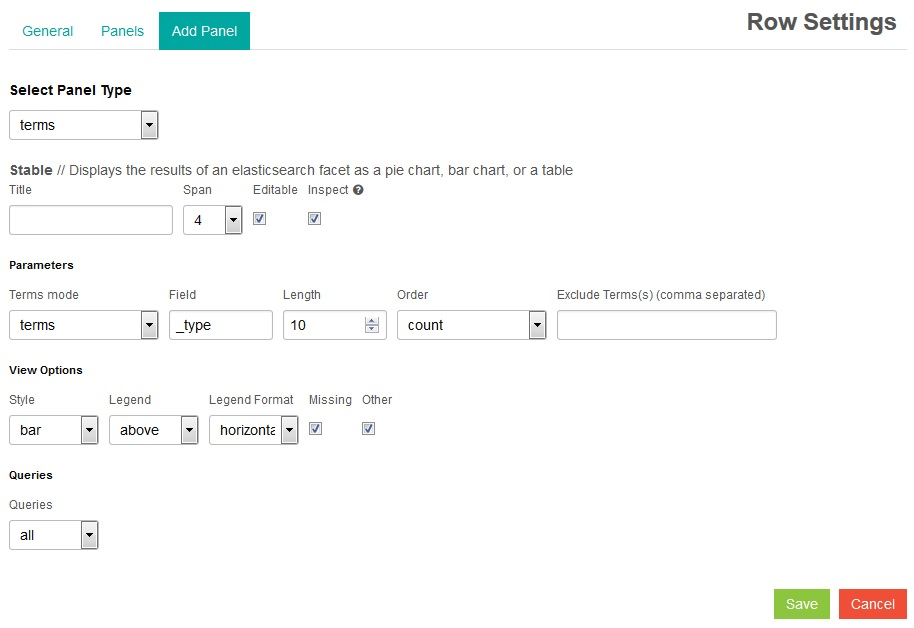
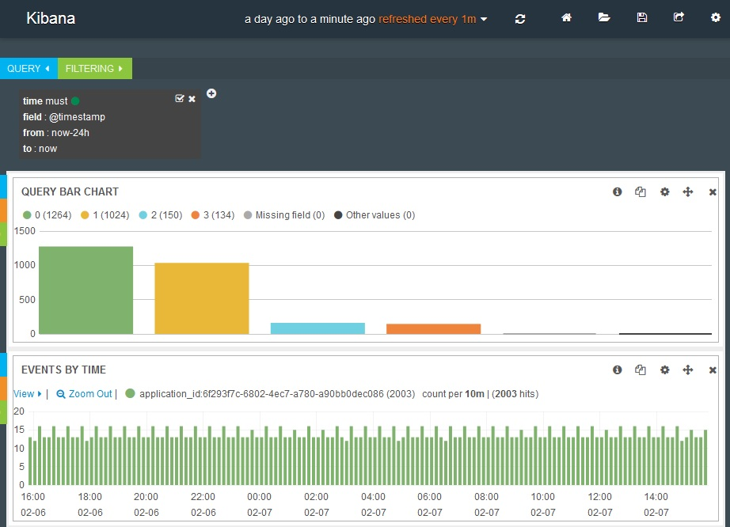
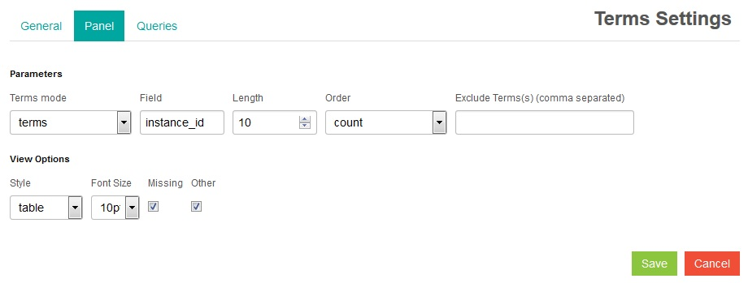

---

copyright:
  years: 2015, 2018

lastupdated: "2018-01-10"

---
{:new_window: target="_blank"}
{:shortdesc: .shortdesc}
{:screen:.screen}
{:codeblock:.codeblock}

# Criando tabelas e gráficos das consultas no Kibana
{: #logging_kibana_tables_graphs}

Use o Kibana para criar gráficos e tabelas para suas consultas para visualizar os dados do log e comparar resultados. É possível acessar o painel do Kibana na guia **Logs** para seu app Cloud Foundry. 
{:shortdesc}

O painel do Kibana é organizado como uma série de linhas, cada linha contendo um ou mais painéis. É possível configurar painéis para exibir representações gráficas de seus dados. Use consultas para determinar quais dados devem ser exibidos. Para criar um gráfico ou tabela, deve-se primeiro criar uma linha em branco; em seguida, criar um painel. Se você acessar o painel do Kibana na guia **Logs** em seu app CF, o painel exibirá automaticamente dois painéis: um histograma e uma tabela.

Conclua as tarefas a seguir para incluir um gráfico ou tabela no painel do Kibana:

1. Para acessar a guia **Logs** de seu app Cloud Foundry, clique no nome do app na tabela **Apps Cloud Foundry** no painel **Apps** do {{site.data.keyword.Bluemix_notm}}; em seguida, clique na guia **Logs**. Os logs para seu app são exibidos.

2. Para acessar a exibição do painel do Kibana de seu app, clique em **Visualização avançada** . O painel do Kibana é exibido.

3. No painel do Kibana, role para a parte inferior do painel e clique em **INCLUIR UMA LINHA**  para criar uma linha para o painel que você deseja incluir. A área de janela Configurações de painel é exibida. 
	
	
	
	Na área de janela Incluir linha, insira um nome para sua linha no campo **Título**; em seguida, clique em **Criar linha**. Uma nova linha é incluída. É possível ajustar a ordem das linhas clicando nos ícones de **Seta para cima** ou **Seta para baixo** ao lado dos títulos de linhas. Depois de configurar a ordem das linhas, clique em **Salvar**. Uma linha vazia é criada no painel do Kibana.

4. Inclua um painel clicando em **Incluir painel na linha vazia**. A área de janela Configurações de linha é exibida.

    
	
	É possível escolher diferentes tipos de painéis, como **tabela**, **histograma** ou **termos** na lista suspensa **Selecionar tipo de painel**. Selecione **termos** para criar um gráfico de barras, gráfico de pizza ou tabela com base em suas consultas. Um intervalo de opções de configuração é exibido na área de janela Configurações de linha.
	
	
	
	Configure seu painel. Insira um **Título** para sua exibição gráfica. Selecione o **Período** de seu painel na lista suspensa; o **Período** determina a largura de seu painel ao longo do painel. Na seção Parâmetros, exclua os conteúdos de **Campo** e insira um campo de log válido; por exemplo, `instance_id`. 

5. Na seção Opções de visualização, selecione **barra**, **pizza** ou **tabela** na lista suspensa **Estilo** para escolher um gráfico de barras, gráfico de pizza ou tabela. Na seção Consultas, selecione **selecionado** na lista suspensa **Consultas** para usar os dados do log de suas consultas do painel. Finalmente, clique em **Salvar**. Seu novo painel é exibido no painel.

	
	
6. Para mudar esse painel para que exiba uma tabela, clique no ícone **Configurar** . A área de janela Configurações de termos é exibida. 

	
	
	Clique na guia **Painel**; em seguida, selecione **tabela** na lista suspensa **Estilo**. Clique em **Salvar** para atualizar o painel e retornar ao painel.

7. Inclua linhas e painéis adicionais em seu painel. Quando concluir, salve as mudanças nesse painel clicando no ícone **Salvar**.

    **Nota:** se você tentar salvar um painel com um nome contendo espaços em branco, ele não será salvo. Insira um nome sem espaços e clique no ícone **Salvar**.

    .

