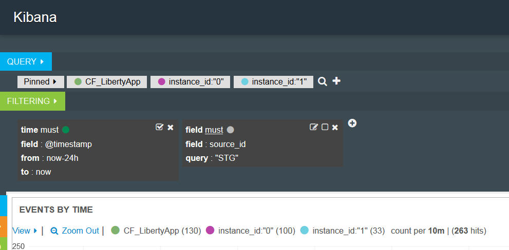

---

copyright:
  years: 2015, 2018

lastupdated: "2018-01-10"

---

{:shortdesc: .shortdesc}
{:new_window: target="_blank"}
{:codeblock: .codeblock}
{:screen: .screen}

# Analisando logs no Kibana 3 (descontinuado)
{: #analyzing_logs_Kibana3}

No {{site.data.keyword.Bluemix}}, é possível usar o Kibana, uma plataforma de software livre para análise de dados e visualização, para monitorar, procurar, analisar e visualizar seus dados em uma variedade de gráficos, por exemplo, diagramas e tabelas. Use o Kibana para executar tarefas analíticas avançadas.
{:shortdesc}

## Filtrando dados em um painel do Kibana
{: #filter_data_kibana_dashboard}

No {{site.data.keyword.Bluemix}}, é possível analisar dados usando o painel do Kibana padrão que é fornecido por recurso ou por espaço do {{site.data.keyword.Bluemix}}. Por padrão, esses painéis exibem todos os dados que estão disponíveis para as últimas 24 horas. No entanto, é possível restringir as informações exibidas por meio de um painel. É possível incluir consultas e filtros em um painel padrão e, em seguida, salvá-lo para reutilização futura.

Em um painel, é possível incluir múltiplas consultas e filtros. Uma consulta define um subconjunto de entradas de log.  Um filtro define a seleção de dados incluindo ou excluindo informações. 

Para apps Cloud Foundry, a lista a seguir descreve exemplos de como filtrar dados:
* Se estiver procurando informações nos logs que incluam termos chave, será possível criar consultas para filtrar por esses termos. Com o Kibana, é possível comparar as consultas visualmente no painel. Para obter mais informações, veja [Filtrando seus logs do app Cloud Foundry com consultas no Kibana](kibana3/logging_kibana_query.html#logging_kibana_query).

* Se estiver procurando informações dentro de um período de tempo específico, será possível filtrar dados dentro de um intervalo de tempo. Para obter mais informações, veja [Filtrando seus logs do app Cloud Foundry por horário no Kibana](kibana3/logging_kibana_filter_by_time_period.html#logging_kibana_time_filter).

* Se estiver procurando informações para um ID da instância específico, será possível filtrar dados por ID da instância. Para obter mais informações, veja [Filtrando seus logs do app Cloud Foundry por ID da instância no Kibana](kibana3/logging_kibana_filter_by_instance_id.html#logging_kibana_instance_id) e [Filtrando seus logs do app Cloud Foundry por ID do aplicativo conhecido no Kibana](kibana3/logging_kibana_filter_by_known_application_id.html#logging_kibana_known_application_id).

* Se estiver procurando informações para um componente específico, será possível filtrar dados por componente (tipo de log). Para obter mais informações, veja [Filtrando seus logs do app Cloud Foundry por tipo de log no Kibana](kibana3/logging_kibana_filter_by_component.html#logging_kibana_component_filter).

* Se estiver procurando informações, por exemplo, mensagens de erro, será possível filtrar dados por tipo de mensagem. Para obter mais informações, veja [Filtrando seus logs do app Cloud Foundry por tipo de mensagem no Kibana](kibana3/logging_kibana_filter_by_message_type.html#logging_kibana_message_type_filter).

## Customizando um painel de Kibana
{: #customize_kibana_dashboard}

É possível customizar diferentes tipos de painéis para visualizar e analisar os dados, por exemplo:
* Painel Single-cf-app: esse é um painel que mostra informações para um único aplicativo Cloud Foundry.  
* Painel Multi-cf-app: esse é um painel que mostra informações para todos os aplicativos Cloud Foundry implementados no mesmo espaço do {{site.data.keyword.Bluemix}}. 

Ao customizar um painel, é possível configurar consultas e filtros para selecionar um subconjunto dos dados do log para mostrar por meio do painel.

Para visualizar os dados, é possível configurar painéis. O Kibana inclui diferentes painéis, como tabela, tendências e histograma, que podem ser usados para analisar as informações. É possível incluir, remover e reorganizar os painéis no painel. O objetivo de cada painel varia. Alguns painéis são organizados em linhas que fornecem os resultados de uma ou mais consultas. Outros painéis exibem documentos ou informações customizadas. Por exemplo, é possível configurar um gráfico de barras, gráfico de pizza ou tabela para visualizar os dados e analisá-los.  

## Salvando um painel do Kibana
{: #save_Kibana_dashboard}

Conclua as etapas a seguir para salvar um painel do Kibana após sua customização:

1. Na barra de ferramentas, clique no ícone **Salvar**.

2. Insira um nome para o painel.

    **Nota:** se você tentar salvar um painel com um nome contendo espaços em branco, ele não será salvo.

3. Próximo ao campo de nome, clique no ícone **Salvar**.

## Analisando logs por meio de um painel do Kibana
{: #analyze_kibana_logs}

Depois de customizar um painel do Kibana, é possível visualizar e analisar os dados por meio de seus painéis. 

Para procurar informações, é possível fixar ou desafixar as consultas. 

* É possível fixar uma consulta no painel e automaticamente a procura será ativada.
* Para remover conteúdo do painel, é possível desativar uma consulta.

Para filtrar informações, é possível ativar ou desativar filtros. 

* É possível marcar a caixa de seleção **Alternar**  em um filtro para ativá-la.   
* É possível desmarcar a caixa de seleção **Alternar**  em um filtro para desativá-la. 

Os gráficos e diagramas em seu painel exibem os dados. É possível usar os gráficos e diagramas em seu painel para monitorar os dados. 

Por exemplo, para um painel single-cf-app, o painel inclui informações sobre um aplicativo Cloud Foundry. Os dados que podem ser visualizados e analisados estão limitados a esse app. É possível usar o painel para analisar dados para todas as instâncias do app. É possível comparar as instâncias. É possível filtrar as informações por ID da instância. 

É possível definir e fixar uma consulta para cada ID da instância no painel. 

Em seguida, é possível ativar ou desativar consultas individuais, dependendo das informações da instância que você deseja ver no painel. 

A figura a seguir mostra uma consulta ativada e a outra desativada:

Se você desejar comparar 2 instâncias em um Histograma, será possível definir duas consultas no mesmo painel, uma para cada ID da instância. É possível conceder a elas um alias e uma cor exclusiva para identificá-las facilmente. O Kibana manipula múltiplas consultas associando-as a um OR lógico. 

A figura a seguir mostra o painel para configurar um alias e uma cor para uma consulta, para fixá-la no painel e para desativá-la:

