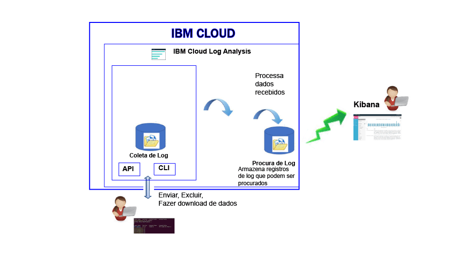

---

copyright:
  years: 2017

lastupdated: "2017-07-19"

---

{:shortdesc: .shortdesc}
{:new_window: target="_blank"}
{:codeblock: .codeblock}
{:screen: .screen}
{:pre: .pre}

# Sobre
{: #log_analysis_ov}

Use o serviço {{site.data.keyword.loganalysisfull}} para expandir suas capacidades de coleção de logs, retenção de log e procura de log no {{site.data.keyword.Bluemix}}. Confira poderes à equipe do DevOps com recursos, como agregação de logs de aplicativo e de ambiente para insights consolidados de aplicativo ou ambiente, criptografia de logs, retenção de dados do log durante o tempo que for necessário e detecção e resolução rápida de problemas. Use o Kibana para tarefas de análise avançadas.
{:shortdesc}

Os recursos de criação de log do {{site.data.keyword.Bluemix_notm}} são integrados na plataforma:

* A coleção de dados é ativada automaticamente para recursos em nuvem. O {{site.data.keyword.Bluemix_notm}}, por padrão, coleta e exibe os logs para seus apps, tempos de execução de apps e tempos de execução de cálculo nos quais esses apps são executados. 
* É possível procurar até 500 MB de logs por dia. 
* Os logs dos últimos 3 dias são armazenados na Procura de log, um componente do serviço {{site.data.keyword.loganalysisshort}}.

É possível usar os recursos de criação de log no {{site.data.keyword.Bluemix_notm}} para entender o comportamento da plataforma de nuvem e os recursos que estão em execução nela. Nenhuma instrumentação especial é necessária para coletar os logs de saída padrão e erro padrão. Por exemplo, é possível usar logs para fornecer uma trilha de auditoria para um aplicativo, detectar problemas no serviço, identificar vulnerabilidades, solucionar problemas de implementações de app e de comportamento de tempo de execução, detectar problemas na infraestrutura na qual o app está em execução, rastrear o app entre os componentes na plataforma de nuvem e detectar padrões que podem ser usados para priorizar ações que possam afetar o SLA de serviço.

A figura a seguir mostra uma visualização de alto nível dos componentes do serviço {{site.data.keyword.loganalysisshort}}: 

Para coletar e procurar logs de recursos em nuvem, deve-se provisionar uma instância do serviço {{site.data.keyword.loganalysisshort}} no mesmo espaço do {{site.data.keyword.Bluemix_notm}} no qual esses recursos em nuvem estão em execução.

Os logs são coletados e armazenados em Procura de log, por padrão. Ao selecionar um plano de serviço que inclua os recursos de procura e coleta estendidas, os logs também são coletados e armazenados no componente de Coleção de logs. Os dados do log armazenados na Coleção de logs são criptografados.

O tamanho de log que pode ser coletado e armazenado na Coleção de logs é determinado pelo plano de serviço escolhido. Você paga por GB de dados por mês para os dados armazenados. Os logs são armazenados na Coleção de logs como JSON.

É possível usar o Kibana 5.1 para tarefas de análise de procura de log avançadas:

* Cada plano limita o tamanho de log que pode ser procurado por dia. 
* As procuras só cobrem os dados dos últimos 3 dias.

Para acessar logs com mais de 3 dias, é possível usar a CLI ou a API da Coleção de logs para fazer download de logs localmente ou canalizar logs para outros aplicativos ou serviços de nuvem de terceiros. 

É possível excluir logs automaticamente configurando uma política de retenção ou manualmente usando a CLI do {{site.data.keyword.loganalysisshort}}.

## Por que usar o serviço de Log
{: #value}

1. **Gaste menos tempo instrumentando seu aplicativo e mais tempo aprimorando seu valor**

    O {{site.data.keyword.loganalysislong_notm}} coleta automaticamente dados de serviços de nuvem selecionados da {{site.data.keyword.IBM_notm}}, sem a necessidade de instrumentação.
	
	É possível escolher a quantia de logs que podem ser procurados por dia. Estão disponíveis planos diferentes que podem ser usados para procurar até 500 MB, 2 GB, 5 GB e 10 GB de logs por dia.

2. **Mantenha seus dados de log próximos das cargas de trabalho do aplicativo e protegidos nas soluções econômicas de armazenamento da classe de nuvem**

    Colete e armazene dados de log dos aplicativos tradicionais e orientados a microsserviços em execução no {{site.data.keyword.IBM_notm}} Cloud em um log centralizado. Retenha dados do log por quanto tempo você precisar.
	
	Os logs são armazenados no armazenamento do {{site.data.keyword.IBM_notm}} Cloud. Será possível fazer download de logs quando eles forem necessários.

3. **Obtenha insights em seu ambiente para detectar, diagnosticar e identificar problemas rapidamente**

    Visualize, analise e interaja com seus dados por meio de painéis customizáveis. Construídos com base na plataforma Elastic Stack, os recursos de procura de log oferecem a flexibilidade e a familiaridade do Kibana para construir rapidamente seu painel de acordo com as necessidades do seu aplicativo.

4. **Robusto integração com APIs**

    Integre os dados do log nos aplicativos e nas operações por meio de APIs do serviço. Use as APIs do serviço {{site.data.keyword.loganalysisshort}} para gerenciar seus logs retidos e enviar dados de log de fora do {{site.data.keyword.IBM_notm}} Cloud.

	
## Coletando logs
{: #log_collection}

Por padrão, o {{site.data.keyword.Bluemix_notm}} armazena dados de log por até 3 dias em Procura de log:   

* Um máximo de 500 MB por espaço de dados é armazenado por dia. Qualquer log além desse valor máximo de 500 MB é descartado. As dotações de limite são reconfiguradas diariamente às 0h30 UTC.
* Até 1,5 GB de dados podem ser procurados por um máximo de 3 dias. Os dados do log são substituídos (Primeiro a entrar, Primeiro a sair) depois de atingir 1,5 GB de dados ou depois de 3 dias.

O serviço {{site.data.keyword.loganalysisshort}} fornece planos adicionais que permitem armazenar logs na Coleção de logs o tempo que for necessário. Para obter mais informações sobre cada plano, veja [Planos de serviços](/docs/services/CloudLogAnalysis/log_analysis_ov.html#plans).

## Excluindo logs
{: #log_deletion}

Os logs armazenados em Procura de log são excluídos depois de 3 dias.

Os logs armazenados em Coleção de logs são excluídos automaticamente depois de 30 dias, a menos que você configure uma política de retenção. 

* É possível configurar uma política de retenção de log para definir o número de dias que você deseja manter os logs na Coleção de logs. Para obter mais informações, veja [Política de retenção de log](/docs/services/CloudLogAnalysis/log_analysis_ov.html#policies).

* É possível desativar a política configurando seu valor como *-1*. 

É possível usar a API ou a CLI de Coleção de logs para excluir manualmente os logs da Coleção de logs. Para obter mais informações sobre como excluir manualmente os logs por meio da CLI, veja [cf logging delete](/docs/services/CloudLogAnalysis/reference/logging_cli.html#delete).

## Alimentando os logs
{: #log_ingestion}

Todos os planos do serviço {{site.data.keyword.loganalysisshort}}, com exceção do plano *Lite*, incluem a capacidade de enviar logs para a Coleção de logs de fora do {{site.data.keyword.IBM_notm}} Cloud. Para obter mais informações sobre os planos, veja [Planos de serviços](/docs/services/CloudLogAnalysis/log_analysis_ov.html#plans).

É possível enviar logs para o {{site.data.keyword.loganalysisshort}} usando o multi-tenant Logstash Forwarder. Para obter mais informações, veja [Enviar dados do log usando um Multi-Tenant Logstash Forwarder (mt-logstash-forwarder).](/docs/services/CloudLogAnalysis/how-to/send-data/send_data_mt.html#send_data_mt).

## Procurando logs
{: #log_search}

Por padrão, é possível usar o Kibana 5.1 para procurar até 500 MB de logs por dia no {{site.data.keyword.Bluemix_notm}}. 

O serviço {{site.data.keyword.loganalysisshort}} fornece múltiplos planos. Cada plano possui recursos de procura de log diferentes, por exemplo, o plano *Coleção de logs* permite procurar até 1 GB de dados por dia. Para obter mais informações sobre os planos, veja [Planos de serviços](/docs/services/CloudLogAnalysis/log_analysis_ov.html#plans).

## Análise do log no Bluemix
{: #logging_bmx_ov_ui}

No {{site.data.keyword.Bluemix_notm}}, é possível visualizar os logs recentes ou acompanhar os logs em tempo real para apps ou contêineres CF implementados em uma infraestrutura gerenciada pelo {{site.data.keyword.Bluemix_notm}}:

* É possível visualizar, filtrar e analisar logs por meio da UI. Para obter mais informações, veja [Analisando logs do console do Bluemix](/docs/services/CloudLogAnalysis/logging_view_dashboard.html#analyzing_logs_bmx_ui).

* É possível visualizar, filtrar e analisar logs usando a linha de comandos para gerenciar logs programaticamente. Para obter mais informações, veja [Analisando logs da CLI](/docs/services/CloudLogAnalysis/logging_view_cli.html#analyzing_logs_cli).

* É possível executar análise avançada usando o Kibana.

## Análise de log avançada com o Kibana
{: #logging_bmx_ov_kibana}

No {{site.data.keyword.Bluemix_notm}}, é possível usar o Kibana, uma plataforma de software livre para análise de dados e visualização, para monitorar, procurar, analisar e visualizar seus dados em uma variedade de gráficos, por exemplo, diagramas e tabelas. Para obter mais informações, veja [Análise avançada do log com o Kibana](/docs/services/CloudLogAnalysis/kibana/analyzing_logs_Kibana.html#analyzing_logs_Kibana).

## Gerenciando logs por meio da CLI
{: #managing_logs}

Use o {{site.data.keyword.loganalysisshort}} CLI para gerenciar logs.

* Para saber como instalar a CLI, veja [Instalando a CLI de criação de log](/docs/services/CloudLogAnalysis/how-to/manage-logs/config_log_collection_cli.html#config_log_collection_cli).
* Para verificar a versão da CLI, execute o comando [cf logging](/docs/services/CloudLogAnalysis/reference/logging_cli.html#base) com o parâmetro * -version*.
* Para obter ajuda sobre como executar comandos, veja [Obtendo ajuda da linha de comandos para executar comandos](/docs/services/CloudLogAnalysis/how-to/manage-logs/config_log_collection_cli.html#cli_help).

Para obter informações gerais sobre seus logs, use o comando `cf logging status`. Por exemplo, você pode:

* [Obter informações sobre os logs em um período de tempo](/docs/services/CloudLogAnalysis/how-to/manage-logs/viewing_log_information.html#viewing_logs).
* [Obtenha informações sobre um tipo de log em um período de tempo](/docs/services/CloudLogAnalysis/how-to/manage-logs/viewing_log_information.html#viewing_logs_by_log_type).
* [Obter informações de conta sobre logs](/docs/services/CloudLogAnalysis/how-to/manage-logs/viewing_log_information.html#viewing_logs_account).

Para manter o custo sob controle, talvez você queira monitorar o tamanho dos logs de seus apps em um período de tempo. Por exemplo, talvez você queira saber o tamanho de cada tipo de log durante uma semana para um espaço do {{site.data.keyword.Bluemix_notm}} para identificar se algum app ou serviço está gerando mais logs do que o esperado. Para verificar o tamanho de seus logs, use o comando `cf logging status`. Para obter mais informações, veja [Visualizando a informação de log](/docs/services/CloudLogAnalysis/how-to/manage-logs/viewing_log_information.html#viewing_log_status).

É possível procurar logs dos últimos 3 dias no Kibana. Para poder analisar dados de log mais antigos, é possível fazer download de logs em um arquivo local ou canalizar esses logs para outros programas, como um Elastic Stack local. Para obter mais informações, consulte [Fazendo Download de logs](/docs/services/CloudLogAnalysis/how-to/manage-logs/downloading_logs.html#downloading_logs).

Para excluir manualmente os logs que não são mais necessários, use o comando [cf logging delete](/docs/services/CloudLogAnalysis/reference/logging_cli.html#delete). 

## Políticas
{: #policies}

**Política de retenção de log**

É possível usar a CLI do {{site.data.keyword.loganalysisshort}} para visualizar e configurar a política de retenção de log. Essa política especifica o número de dias que os logs são mantidos na Coleção de logs. 

* Por padrão, os logs são mantidos por 30 dias. 
* Após a expiração do período de retenção, os logs são excluídos automaticamente da Coleção de logs e não podem ser recuperados.
* É possível especificar um período de retenção para uma conta. O período de retenção é configurado automaticamente para todos os espaços nessa conta. 
* É possível especificar um período de retenção para um espaço do {{site.data.keyword.Bluemix_notm}}.
* É possível mudar a qualquer momento a política de retenção.
* É possível desativar a política configurando seu valor como *-1*. 

**Nota:** quando você desativar a política de retenção de log, deverá manter os logs da Coleção de logs. É possível usar o comando da CLI [cf logging delete](/docs/services/CloudLogAnalysis/reference/logging_cli.html#delete) para excluir logs antigos.

Para obter mais informações, veja [Visualizando e configurando a política de retenção de log](/docs/services/CloudLogAnalysis/how-to/manage-logs/configuring_retention_policy.html#configuring_retention_policy).

## Planos de serviço
{: #plans}

O serviço {{site.data.keyword.loganalysisshort}} fornece múltiplos planos. Cada plano tem recursos diferentes de coleção de logs e de procura de log. 

É possível mudar um plano por meio da UI do {{site.data.keyword.Bluemix_notm}} ou da linha de comandos. É possível fazer upgrade ou reduzir seu plano a qualquer momento. Para obter mais informações sobre upgrades de plano de serviço no {{site.data.keyword.Bluemix_notm}}, veja [Mudando o plano](/docs/services/CloudLogAnalysis/plan/change_plan.html#change_plan). 

A tabela a seguir descreve os planos disponíveis:

<table>
    <caption>Resumo dos recursos de Procura de log e Coleção de logs por plano</caption>
      <tr>
        <th>Planejar</th>
        <th>Ingestão de Log</th>
        <th>Retenção do Log</th>
        <th>Criptografia de Dados</th>
        <th>Procura de Log</th>
      </tr>
      <tr>
        <td>Lite (padrão)</td>
        <td>Não</td>
        <td>Últimos 3 dias</td>
        <td>Não</td>
        <td>Procurar até 500 MB</td>
      </tr>
      <tr>
        <td>Coleta de Log</td>
        <td>Sim</td>
        <td>O número configurável de dias.</td>
        <td>Sim</td>
        <td>Procurar até 500 MB por dia</td>
      </tr>
      <tr>
        <td>Coleta de Log com 2GB/Day Search</td>
        <td>Sim</td>
        <td>O número configurável de dias.</td>
        <td>Sim</td>
        <td>Procurar até 2 GB por dia</td>
      </tr>
      <tr>
        <td>Coleta de Log com 5GB/Day Search</td>
        <td>Sim</td>
        <td>O número configurável de dias.</td>
        <td>Sim</td>
        <td>Procurar até 5 GB por dia</td>
      </tr>
       <tr>
        <td>Coleta de Log com 10GB/Day Search</td>
        <td>Sim</td>
        <td>O número configurável de dias.</td>
        <td>Sim</td>
        <td>Procurar até 10 GB por dia</td>
      </tr>
</table>

**Nota:** o custo mensal do armazenamento de Coleção de logs é calculado como uma média do ciclo de faturamento.

## Regiões
{: #regions}

O serviço {{site.data.keyword.loganalysisfull_notm}} está disponível na região a seguir:

* Sul dos Estados Unidos

