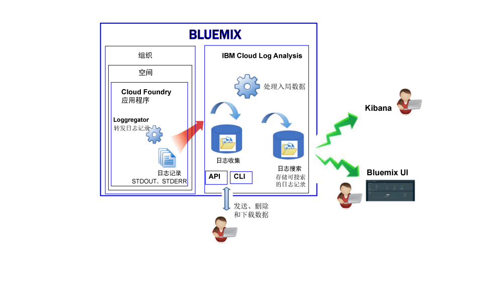

---

copyright:
  years: 2017

lastupdated: "2017-07-19"

---

{:shortdesc: .shortdesc}
{:new_window: target="_blank"}
{:codeblock: .codeblock}
{:screen: .screen}
{:pre: .pre}

# 在 Bluemix 中对 Cloud Foundry 应用程序进行日志记录
{: #logging_bluemix_cf_apps}

在 {{site.data.keyword.Bluemix}} 中，可以通过 {{site.data.keyword.Bluemix_notm}} 仪表板、Kibana 以及命令行界面来查看、过滤和分析 Cloud Foundry (CF) 日志。此外，还可以将日志记录传送到外部日志管理工具。
{:shortdesc}

{{site.data.keyword.Bluemix_notm}} 会记录由 Cloud Foundry 平台和 Cloud Foundry 应用程序生成的日志数据。在日志中，可以查看为应用程序生成的错误、警告和参考消息。 

在云平台即服务 (PaaS)（如 {{site.data.keyword.Bluemix_notm}} 上的 Cloud Foundry）中运行应用程序时，无法通过 SSH 或 FTP 连接到运行应用程序的基础架构来访问日志。该平台由云提供者进行控制。在 {{site.data.keyword.Bluemix_notm}} 上运行的 Cloud Foundry 应用程序使用 Loggregator 组件从 Cloud Foundry 基础架构内部转发日志记录。Loggregator 会自动选取 STDOUT 和 STDERR 数据。可以通过 {{site.data.keyword.Bluemix_notm}} 仪表板、Kibana 以及命令行界面对这些日志进行可视化和分析。

下图显示了 {{site.data.keyword.Bluemix_notm}} 中 Cloud Foundry 应用程序的日志记录的高级别视图：

 
使用 Cloud Foundry 基础架构在 {{site.data.keyword.Bluemix_notm}} 上运行应用程序时，会自动启用 Cloud Foundry 应用程序的日志记录。要查看 Cloud Foundry 运行时日志，必须将日志写入 STDOUT 和 STDERR。有关更多信息，请参阅[通过 CF 应用程序进行运行时应用程序日志记录](/docs/services/CloudLogAnalysis/cfapps/logging_writing_to_log_from_cf_app.html#logging_writing_to_log_from_cf_app)。

{{site.data.keyword.Bluemix_notm}} 会保留数量有限的日志信息。记录信息时，较新的信息会将旧的信息替换掉。如果您必须遵守的组织或行业策略要求您保留部分或所有日志信息以用于审计或其他用途，那么可以将日志传送到外部日志主机，例如第三方日志管理服务或其他主机。有关更多信息，请参阅[配置外部日志主机](/docs/services/CloudLogAnalysis/external/logging_external_hosts.html#thirdparty_logging)。

## 日志获取
{: #log_ingestion}

{{site.data.keyword.loganalysisshort}} 服务提供了不同的套餐。每种套餐都定义了您是否能将日志发送到“日志收集”中。所有套餐（*Lite* 套餐除外）都包含将日志发送到“日志收集”的功能。有关套餐的更多信息，请参阅[服务套餐](/docs/services/CloudLogAnalysis/log_analysis_ov.html#plans)。

可以使用多租户 Logstash 转发器将日志发送到 {{site.data.keyword.loganalysisshort}}。有关更多信息，请参阅[使用多租户 Logstash 转发器 (mt-logstash-forwarder) 发送日志数据](/docs/services/CloudLogAnalysis/how-to/send-data/send_data_mt.html#send_data_mt)。

## 日志收集
{: #log_collection}

缺省情况下，{{site.data.keyword.Bluemix_notm}} 会在“日志搜索”中存储最长 3 天的日志数据：   

* 每天每个空间最多存储 500 MB 数据。超过 500 MB 上限的任何日志都会被废弃。每天凌晨 12:30 UTC 会重置分配的上限。
* 可搜索最长 3 天最多 1.5 GB 的数据。日志数据达到 1.5 GB 或超过 3 天后，会对数据进行滚动式覆盖（先进先出）。

{{site.data.keyword.loganalysisshort}} 服务提供了其他套餐，允许您根据自己的需要，将日志在“日志收集”中存储任意长的时间。有关每个套餐价格的更多信息，请参阅[服务套餐](/docs/services/CloudLogAnalysis/log_analysis_ov.html#plans)。

可以配置日志保留时间策略，可用于定义您希望日志在“日志收集”中保留的天数。有关更多信息，请参阅[日志保留时间策略](/docs/services/CloudLogAnalysis/log_analysis_ov.html#policies)。

## 日志搜索
{: #log_search}

缺省情况下，在 {{site.data.keyword.Bluemix_notm}} 中可以使用 Kibana 每天最多搜索 500 MB 日志。 

{{site.data.keyword.loganalysisshort}} 服务提供了多种套餐。每种套餐有不同的日志搜索功能，例如*日志收集*套餐允许每天最多搜索 1 GB 数据。有关套餐的更多信息，请参阅[服务套餐](/docs/services/CloudLogAnalysis/log_analysis_ov.html#plans)。

## 用于分析 CF 应用程序日志的方法
{: #logging_bluemix_cf_apps_log_methods}

可以选择以下任一方法来分析 Cloud Foundry 应用程序的日志：

* 在 {{site.data.keyword.Bluemix_notm}} 中分析日志以查看应用程序的最新活动。
    
    在 {{site.data.keyword.Bluemix_notm}} 中，可以通过可用于每个 Cloud Foundry 应用程序的**日志**选项卡来查看、过滤和分析日志。有关更多信息，请参阅[通过 Bluemix 仪表板分析 CF 应用程序日志](/docs/services/CloudLogAnalysis/logging_view_dashboard.html#analyzing_logs_bmx_ui)。
    
* 在 Kibana 中分析日志以执行高级分析任务。
    
    在 {{site.data.keyword.Bluemix_notm}} 中，可以使用 Kibana（一种开放式源代码分析和可视化平台）通过各种图形（例如，图表和表）来对数据进行监视、搜索、分析和可视化。有关更多信息，请参阅[在 Kibana 中分析日志](/docs/services/CloudLogAnalysis/kibana/analyzing_logs_Kibana.html#analyzing_logs_Kibana)。
	
	**提示**：要启动 Kibana，请参阅[通过 CF 应用程序的仪表板导航至 Kibana](/docs/services/CloudLogAnalysis/kibana/launch.html#launch_Kibana_from_cf_app)。

* 通过 CLI 分析日志，使用命令以编程方式管理日志。
    
    在 {{site.data.keyword.Bluemix_notm}} 中，可以通过命令行界面使用 **cf logs** 命令来查看、过滤和分析日志。有关更多信息，请参阅[通过命令行界面分析 Cloud Foundry 应用程序日志](/docs/services/CloudLogAnalysis/logging_view_cli.html#analyzing_logs_cli)。

## 在 Diego 上部署的 CF 应用程序的日志源
{: #cf_apps_log_sources_diego}

对于在基于 Diego 的 Cloud Foundry 体系结构中部署的 Cloud Foundry (CF) 应用程序，提供了以下日志源：
    
| 日志源| 组件名称| 描述
| 
|------------|----------------|-------------|
| LGR| Loggregator| LGR 组件提供有关 Cloud Foundry Loggregator 的信息，Loggregator 用于从 Cloud Foundry 内部转发日志。|
| RTR| 路由器| RTR 组件提供有关向应用程序发出的 HTTP 请求的信息。| 
| STG| 编译打包| STG 组件提供有关应用程序如何编译打包或重新编译打包的信息。| 
| APP| 应用程序| APP 组件提供应用程序中的日志。这里将显示代码的 stderr 和 stdout。| 
| API| Cloud Foundry API| API 组件提供有关因用户请求更改应用程序状态而引发的内部操作的信息。| 
| CELL| Diego 单元| CELL 组件提供有关应用程序启动、停止或崩溃的信息。|
| SSH| SSH| SSH 组件提供每次用户使用 **cf ssh** 命令访问应用程序的相关信息。|
{: caption="表 1. 在基于 Diego 的 CF 体系结构中部署的 CF 应用程序的日志源" caption-side="top"}

下图显示了基于 Diego 的 Cloud Foundry 体系结构中的不同组件（日志源）： 

	
## 在 DEA 上部署的 CF 应用程序的日志源
{: #logging_bluemix_cf_apps_log_sources}

对于在 Droplet Execution Agent (DEA) 体系结构中部署的 Cloud Foundry (CF) 应用程序，提供了以下日志源：
    
| 日志源| 组件名称| 描述
| 
|------------|----------------|-------------|
| LGR| Loggregator| LGR 组件提供有关 Cloud Foundry Loggregator 的信息，Loggregator 用于从 Cloud Foundry 内部转发日志。|
| RTR| 路由器| RTR 组件提供有关向应用程序发出的 HTTP 请求的信息。| 
| STG| 编译打包| STG 组件提供有关应用程序如何编译打包或重新编译打包的信息。| 
| APP| 应用程序| APP 组件提供应用程序中的日志。这里将显示代码的 stderr 和 stdout。| 
| API| Cloud Foundry API| API 组件提供有关因用户请求更改应用程序状态而引发的内部操作的信息。| 
| DEA| Droplet Execution Agent| DEA 组件提供有关应用程序启动、停止或崩溃的信息。  仅当应用程序部署在基于 DEA 的 Cloud Foundry 体系结构中时，此组件才可用。| 
{: caption="表 2. 在基于 DEA 的 CF 体系结构中部署的 CF 应用程序的日志源" caption-side="top"}

下图显示了基于 DEA 的 Cloud Foundry 体系结构中的不同组件（日志源）： 

 的 Cloud Foundry 体系结构中的组件（日志源）。")

