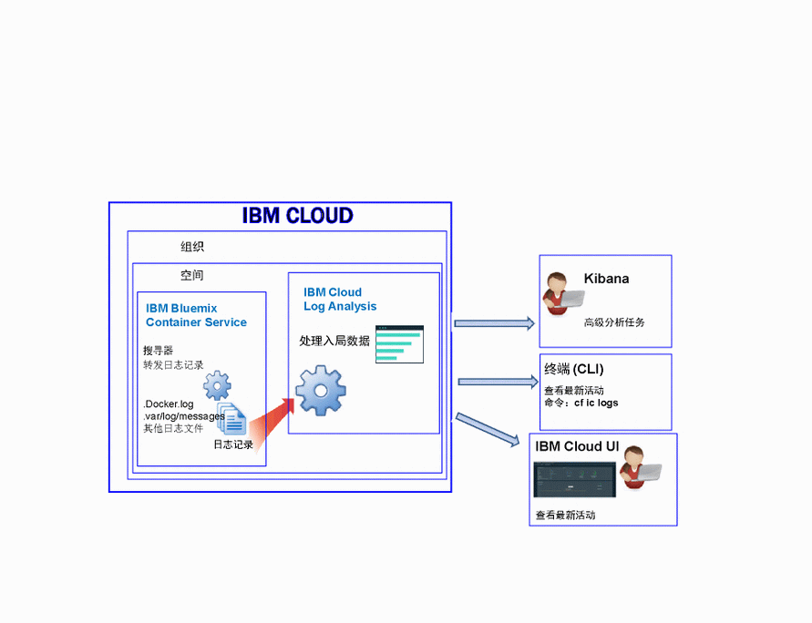

---

copyright:
  years: 2017, 2018

lastupdated: "2018-01-10"

---

{:shortdesc: .shortdesc}
{:new_window: target="_blank"}
{:codeblock: .codeblock}
{:screen: .screen}
{:pre: .pre}

# 对由 IBM Cloud 管理的容器进行日志记录（已弃用）
{: #containers_bluemix}

您可以查看、过滤和分析在 {{site.data.keyword.IBM}} 管理的基础架构中部署的 Docker 容器的日志。
{:shortdesc}

使用搜寻器从容器外部监视和转发容器日志。搜寻器会将数据发送到 {{site.data.keyword.Bluemix_notm}} 中的多租户 Elasticsearch。

下图显示了 {{site.data.keyword.containershort}} 的日志记录的高级别视图：

缺省情况下，系统会为在 {{site.data.keyword.Bluemix_notm}} 管理的云基础架构中部署的容器收集以下日志：

<table>
  <caption>表 2. 为在 {{site.data.keyword.Bluemix_notm}} 管理的基础架构中部署的容器收集的日志</caption>
  <tbody>
    <tr>
      <th align="center">日志</th>
      <th align="center">描述</th>
    </tr>
    <tr>
      <td align="left" width="30%">/var/log/messages</td>
      <td align="left" width="70%"> 缺省情况下，Docker 消息会存储在容器的 /var/log/messages 文件夹中。此日志包含系统消息。</td>
    </tr>
    <tr>
      <td align="left">./docker.log</td>
      <td align="left">此日志是 Docker 日志。  Docker 日志文件并不会存储为容器内部的文件，但无论如何都会收集该文件。缺省情况下会收集此日志文件，因为这是用于公开容器的 stdout（标准输出）和 stderr（标准错误）信息的标准 Docker 约定。收集任何容器进程发至 stdout 或 stderr 的信息。</td>
     </tr>
  </tbody>
</table>

## 分析日志
{: #logging_containers_ov_methods}

要分析容器日志数据，请使用 Kibana 执行高级分析任务。可以使用 Kibana（一种开放式源代码分析和可视化平台）通过各种图形（例如，图表和表）来对数据进行监视、搜索、分析和可视化表示。有关更多信息，请参阅[在 Kibana 中分析日志](/docs/services/CloudLogAnalysis/kibana/analyzing_logs_Kibana.html#analyzing_logs_Kibana)。

## 收集定制日志
{: #collect_custom_logs}

要收集其他日志，请在创建容器时添加带有日志文件路径的 **LOG_LOCATIONS** 环境变量。 

可以添加多个日志文件，各文件之间用逗号分隔。 

有关更多信息，请参阅[从容器收集非缺省日志数据](logging_containers_other_logs.html#logging_containers_collect_data)。

## 搜索日志
{: #log_search}

缺省情况下，在 {{site.data.keyword.Bluemix_notm}} 中可以使用 Kibana 每天最多搜索 500 MB 日志。 

{{site.data.keyword.loganalysisshort}} 服务提供了多种套餐。每种套餐有不同的日志搜索功能，例如*日志收集*套餐允许每天最多搜索 1 GB 数据。有关套餐的更多信息，请参阅[服务套餐](/docs/services/CloudLogAnalysis/log_analysis_ov.html#plans)。

## 发送日志以便可以将消息中的字段用作 Kibana 搜索字段
{: #send_data_in_json}

缺省情况下，会对容器自动启用日志记录。Docker 日志文件中的每个条目都会显示在 Kibana 的 `message` 字段中。如果您需要使用容器日志条目中的特定字段在 Kibana 中过滤和分析数据，请配置应用程序以发送有效的 JSON 格式的输出。

完成以下步骤以发送将容器日志条目解析为个别字段的日志：

1. 将消息记录到文件。 
2. 将日志文件添加到容器中可供分析的非缺省日志的列表。有关更多信息，请参阅[从容器收集非缺省日志数据](logging_containers_other_logs.html#logging_containers_collect_data)。 
    
JSON 日志条目作为 STDOUT 发送到容器的 Docker 日志文件时，不会将这些日志条目解析为 JSON。 
    
如果您将消息记录到文件且系统确定消息是有效的 JSON，那么会对该字段进行解析，并会为消息中的每个字段创建新字段。在 Kibana 中，只有字符串类型的字段值可用于过滤和排序

## 在日志收集中存储日志
{: #store_logs}

缺省情况下，{{site.data.keyword.Bluemix_notm}} 会将日志数据最长存储 3 天：   

* 每天每个空间最多存储 500 MB 数据。超过 500 MB 上限的任何日志都会被废弃。每天凌晨 12:30 UTC 会重置分配的上限。
* 可搜索最长 3 天最多 1.5 GB 的数据。日志数据达到 1.5 GB 或超过 3 天后，会对数据进行滚动式覆盖（先进先出）。

{{site.data.keyword.loganalysisshort}} 服务提供了其他套餐，允许您根据自己的需要，将日志在“日志收集”中存储任意长的时间。有关每个套餐价格的更多信息，请参阅[服务套餐](/docs/services/CloudLogAnalysis/log_analysis_ov.html#plans)。

如果您需要存储日志或搜索更大的日志，您可以供应 {{site.data.keyword.loganalysisshort}} 服务，并选择不同的服务套餐。其他套餐允许您根据自己的需要，将日志在“日志收集”中存储任意长的时间，并搜索更大的日志大小。有关更多信息，请参阅[服务套餐](/docs/services/CloudLogAnalysis/log_analysis_ov.html#plans)。

## 查看日志
{: #logging_containers_ov_methods_view_bmx}

您可以使用以下任何方法来查看在 {{site.data.keyword.Bluemix_notm}} 管理的基础架构中部署的容器的最新日志：

* 通过 {{site.data.keyword.Bluemix_notm}} UI 查看日志，以监视容器的最新活动。
    
    可以通过可用于每个容器的**监视和日志**选项卡来查看、过滤和分析日志。 
	
	要查看在 {{site.data.keyword.IBM_notm}} 管理的基础架构中部署的 Docker 容器的部署或运行时日志，请完成以下步骤：

    1. 在“应用程序”仪表板中，单击单个容器或容器组。 
    
    2. 在“应用程序详细信息”页面中，单击**监视和日志**。

    3. 选择**日志记录**选项卡。在**日志记录**选项卡中，可以查看容器的最近日志或实时跟踪日志。 
	
* 使用 {{site.data.keyword.containershort}} CLI 查看日志。使用命令以编程方式管理日志。
    
    可以通过命令行界面使用 **cf ic logs** 命令来查看、过滤和分析日志。 
	
	使用 `bx cf ic logs` 命令来显示 {{site.data.keyword.Bluemix_notm}} 中容器的日志。例如，可以使用日志来分析容器停止的原因或用于查看容器输出。 
	
	要通过 `cf ic logs` 命令来查看在容器中运行的应用程序的应用程序错误，该应用程序必须将其日志写入标准输出 (STDOUT) 和标准错误 (STDERR) 输出流。如果将应用程序设计为写入这些标准输出流，那么可以通过命令行来查看日志，即便容器关闭或崩溃也如此。

    有关 `cf ic logs` 命令的更多信息，请参阅 [cf ic logs 命令](/docs/containers/container_cli_reference_cfic.html#container_cli_reference_cfic__logs)。

