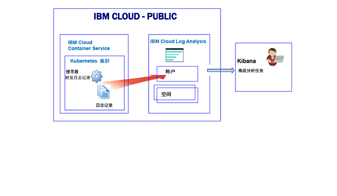
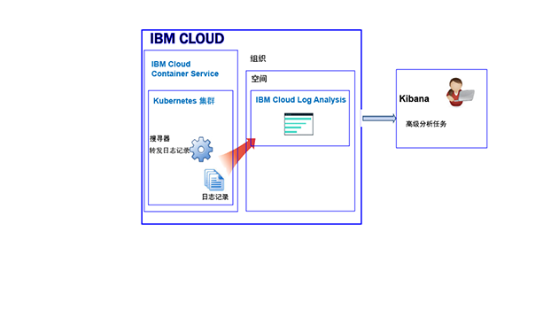
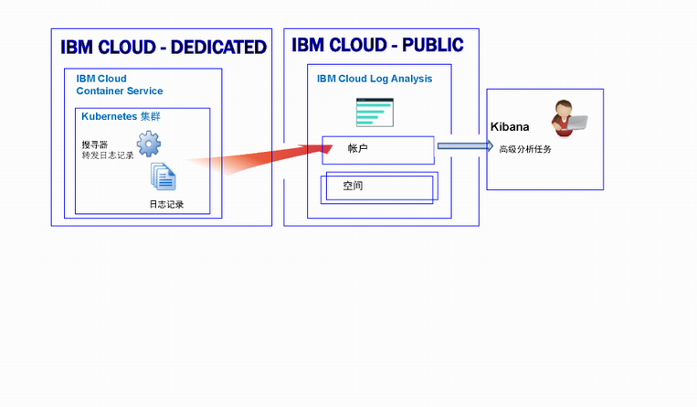

---

copyright:
  years: 2017, 2018

lastupdated: "2018-02-01"

---

{:new_window: target="_blank"}
{:shortdesc: .shortdesc}
{:screen: .screen}
{:pre: .pre}
{:table: .aria-labeledby="caption"}
{:codeblock: .codeblock}
{:tip: .tip}
{:download: .download}


# 在 Kubernetes 集群中对资源进行日志记录
{: #containers_kubernetes}

可以通过 {{site.data.keyword.Bluemix_notm}} 中的 {{site.data.keyword.loganalysisshort}} 服务查看、过滤和分析 Kubernetes 集群中的资源日志。
{:shortdesc}

缺省情况下，不会自动启用将日志从集群发送到 {{site.data.keyword.loganalysisshort}} 服务。**注：**这是针对新集群的最新更改。先前，当您创建集群时，{{site.data.keyword.containershort}} 会自动收集容器进程发至 stdout（标准输出）和 stderr（标准错误）并转发到 {{site.data.keyword.loganalysisshort}} 服务的信息。现在，您必须在集群中创建一个或多个日志记录配置，以将日志自动转发到 {{site.data.keyword.loganalysisshort}} 服务。

使用集群日志时，请考虑以下信息：

* 将信息发送到 stdout 和 stderr 是用于公开容器信息的标准 Docker 约定。
* 使用搜寻器从容器外部监视和转发容器日志。 
* 搜寻器会将数据发送到 {{site.data.keyword.Bluemix_notm}} 中的多租户 Elasticsearch。 
* 您可以配置集群，以将 stdout 和 stderr 日志、其他应用程序日志、工作程序节点日志、Kubernetes 系统组件日志和 Ingress 控制器日志转发到 {{site.data.keyword.loganalysisshort}} 服务。有关更多信息，请参阅[收集其他应用程序和集群日志](/docs/services/CloudLogAnalysis/containers/containers_kubernetes.html#collect_logs)。

## 关于在 Public 中进行日志记录
{: #public}

在 {{site.data.keyword.Bluemix_notm}} 中，您可以使用 {{site.data.keyword.loganalysisshort}} 服务在 Public 中存储并分析由 {{site.data.keyword.containershort}} 自动收集的容器日志和 Kubernetes 集群日志。

在帐户中，您可以具有 1 个或多个 Kubernetes 集群。在供应集群时，{{site.data.keyword.containershort}} 会自动收集日志。 

* 在部署 Pod 时，系统会收集应用程序日志。 
* {{site.data.keyword.containershort}} 会自动收集容器进程发至 stdout（标准输出）和 stderr（标准错误）的信息。

要使这些日志可用于在 {{site.data.keyword.loganalysisshort}} 服务中进行分析，您必须配置集群以将集群日志转发到 {{site.data.keyword.loganalysisshort}}。可以将日志转发到帐户域或帐户中的空间域。

* 在美国南部区域可用的集群会将日志发送到美国南部区域可用的 {{site.data.keyword.loganalysisshort}} 服务。
* 在美国东部区域可用的集群会将日志发送到美国南部区域可用的 {{site.data.keyword.loganalysisshort}} 服务。
* 在德国区域可用的集群会将日志发送到德国区域可用的 {{site.data.keyword.loganalysisshort}} 服务。
* 在悉尼区域可用的集群会将日志发送到悉尼区域可用的 {{site.data.keyword.loganalysisshort}} 服务。
* 在英国区域可用的集群会将日志发送到德国区域可用的 {{site.data.keyword.loganalysisshort}} 服务。


要在 Kibana 中分析集群的日志数据，请考虑以下信息：

* 您必须在 Public 区域中启动 Kibana，在该区域中会供应用于查看日志的 {{site.data.keyword.loganalysisshort}} 实例。 
* 您的用户标识必须具有查看日志的许可权。 

    要查看帐户域中的日志，用户需要 {{site.data.keyword.loganalysisshort}} 服务的 IAM 策略。用户需要**查看者**许可权。 
    
    要查看空间域中的日志，用户需要 CF 角色。有关更多信息，请参阅[用户查看日志所需的角色](/docs/services/CloudLogAnalysis/kibana/analyzing_logs_Kibana.html#roles)。

要管理位于长期存储（日志收集）中的日志数据，您的用户标识必须具有 IAM 策略以使用 {{site.data.keyword.loganalysisshort}} 服务。您的用户标识必须具有**管理员**许可权或**编辑者**许可权。有关更多信息，请参阅[用户管理日志所需的角色](/docs/services/CloudLogAnalysis/manage_logs.html#roles)。

**注：**当您使用 Kubernetes 集群时，系统会保留 *ibm-system* 和 *kube-system* 名称空间。请勿创建、删除、修改或更改这些名称空间中可用的资源的许可权。这些名称空间的日志供 {{site.data.keyword.IBM_notm}} 使用。


### 将日志转发到帐户域的集群的日志记录的高级别视图
{: #acc}


下图显示了集群将日志转发到帐户域时，Public 中 {{site.data.keyword.containershort}} 的日志记录的高级别视图：




### 将日志转发到空间域的集群的日志记录的高级别视图
{: #space}

下图显示了集群将日志转发到空间域时，Public 中 {{site.data.keyword.containershort}} 的日志记录的高级别视图：



   


## 关于在 Dedicated 中进行日志记录
{: #dedicated}

在 {{site.data.keyword.Bluemix_notm}} 中，您可以使用 Public 中的 {{site.data.keyword.loganalysisshort}} 服务，在 Dedicated 中存储并分析由 {{site.data.keyword.containershort}} 自动收集的容器日志和 Kubernetes 集群日志。

请考虑以下信息：

* 在帐户中，您可以具有 1 个或多个 Kubernetes 集群。在供应集群时，{{site.data.keyword.containershort}} 会自动收集日志。 
* 要通过 {{site.data.keyword.loganalysisshort}} 服务查看应用程序和集群日志，必须在集群中定义一个或多个日志记录配置。每个配置条目会定义将哪些日志信息转发到 {{site.data.keyword.loganalysisshort}} 服务。例如，在部署 Pod 时，系统会收集 stdout 和 stderr 日志数据。要转发这些日志，必须为 *container* 类型的日志源定义日志记录配置。
* 定义日志记录配置时，您将决定将日志发送到帐户域还是空间域。**注：**目前，帐户域的搜索配额限制为每天 500 MB，您无法在“日志收集”中长期存储日志。要能够搜索较大日志，并在“日志收集”中存储日志，请将日志发送到空间域。
* 定义将日志发送到帐户域的日志记录配置时，日志会转发到 Dedicated {{site.data.keyword.containershort}} 运行所在的相同 Public 区域中的帐户域。

    在美国南部区域可用的集群会将日志发送到美国南部区域可用的 {{site.data.keyword.loganalysisshort}} 服务。</br>
在美国东部区域可用的集群会将日志发送到美国南部区域可用的 {{site.data.keyword.loganalysisshort}} 服务。</br>
在德国区域可用的集群会将日志发送到德国区域可用的 {{site.data.keyword.loganalysisshort}} 服务。</br>
在悉尼区域可用的集群会将日志发送到悉尼区域可用的 {{site.data.keyword.loganalysisshort}} 服务。</br>
在英国区域可用的集群会将日志发送到德国区域可用的 {{site.data.keyword.loganalysisshort}} 服务。


要在 Kibana 中查看和分析集群的日志数据，请考虑以下信息：

* 您必须针对在供应 {{site.data.keyword.loganalysisshort}} 实例的 Cloud Public 区域，启动 Kibana。 
* 用户标识必须具有 IAM 策略才能使用 {{site.data.keyword.loganalysisshort}} 服务。您需要具有**查看者**许可权才能查看帐户域中的日志。  

要管理位于长期存储（日志收集）中的日志数据，用户标识必须具有 IAM 策略才能使用 {{site.data.keyword.loganalysisshort}} 服务。您需要有**管理员**许可权或**编辑者**许可权。  

下图显示了 Dedicated 中针对 {{site.data.keyword.containershort}} 的日志记录的高级别视图：




## 日志源
{: #log_sources}


可以配置集群以将日志转发到 {{site.data.keyword.loganalysisshort}} 服务。下表列出了可启用的将日志转发到 {{site.data.keyword.loganalysisshort}} 服务的不同日志源：

<table>
  <caption>Kuberenetes 集群的日志源</caption>
  <tr>
    <th>日志源</th>
	<th>描述</th>
	<th>日志路径</th>
  </tr>
  <tr>
    <td>容器</td>
	<td>容器日志。</td>
	<td>标准输出 (stdout) 和标准错误 (stderr) 日志。</td>
  </tr>
  <tr>
    <td>应用程序</td>
	<td>在 Kubernetes 集群中运行的自己的应用程序的日志。</td>
	<td>`/var/log/apps/**/*.log`  </br>`/var/log/apps/**/*.err`</br>**注：**在 Pod 上，可将日志写入 `/var/logs/apps/` 或 `/var/logs/apps/` 下的任何子目录。在工作程序上，必须将 `/var/log/apps/` 安装到 Pod 中应用程序写入日志的目录中。</td>
  </tr>
  <tr>
    <td>工作程序</td>
	<td>Kubernetes 集群中虚拟机工作程序节点的日志。</td>
	<td>`/var/log/syslog` </br>`/var/log/auth.log`</td>
  </tr>
  <tr>
    <td>Kubernetes 系统组件</td>
	<td>Kubernetes 系统组件的日志。</td>
	<td>*/var/log/kubelet.log* </br>*/var/log/kube-proxy.log*</td>
  </tr>
  <tr>
    <td>Ingress 控制器</td>
	<td>管理流入 Kubernetes 集群的网络流量的 Ingress 控制器的日志。</td>
	<td>`/var/log/alb/ids/*.log` </br>`/var/log/alb/ids/*.err` </br>`/var/log/alb/customerlogs/*.log` </br>`/var/log/alb/customerlogs/*.err`</td>
  </tr>
</table>


## 转发应用程序日志的注意事项
{: #forward_app_logs}

要启用应用程序日志的日志转发，必须定义将**日志源**设置为 **application** 的集群日志记录配置。

查看应用程序日志转发的以下方面：

* 可以转发主机节点上特定目录中可用的日志。使用安装路径将主机路径卷安装到容器中即可完成此操作。此安装路径用作容器上发送应用程序日志的目录。创建卷安装时，将自动创建预定义的主机路径目录 `/var/log/apps`。

    例如，请查看部署描述符 volumeMounts 部分和 volumes 部分的样本：

    ```
    volumeMounts:
            - mountPath: /var/app
              name: application-log
    volumes:
        - name: application-log
          hostPath:
            path: /var/log/apps

    ```
    {: codeblock}

* 日志以递归方式从 `/var/log/apps` 路径中进行读取。可以将应用程序日志置于 `/var/log/apps` 路径的子目录中。
    
* 仅会转发具有 **.log** 或 **.err** 文件扩展名的应用程序日志文件。

* 首次启用日志转发时，会从应用程序日志尾部进行读取，而不是从头进行读取。 

    不会读取任何日志在启用应用程序日志记录之前已经存在的内容。日志会从启用日志记录时的位置开始进行读取。但是，首次启用日志转发之后，日志将始终从上次停止的位置继续。

* 将 */var/log/apps* 主机路径卷安装到多个容器时，所有容器都会写入主机（工作程序）上的同一目录。如果容器要写入相同名称的文件，那么容器会写入主机上完全相同的文件，并进行覆盖。 

    **注：**当所有容器都写入相同名称的文件时，请不要启用对“日志源”设置为 *application* 的日志的日志转发，以转发 ReplicaSets 大于 1 的应用程序日志。可以改为将应用程序中的日志写入 STDOUT 和 STDERR，这会作为容器日志进行选取。要转发写入到 STDOUT 和 STDERR 的应用程序日志，请启用日志源设置为 *container* 的日志转发。


## 将日志转发到日志域的注意事项
{: #forward_logs_domain}

可以配置集群以将日志文件转发到 {{site.data.keyword.loganalysisshort}} 服务。 

日志可转发到帐户域或空间域。

决定将日志转发到空间域还是帐户域时，请考虑以下信息：

* 将日志发送到帐户域时，搜索配额为每天 500 MB，并且无法在“日志收集”中长期存储日志。
* 将日志发送到空间域时，可以选择定义每天搜索配额的 {{site.data.keyword.loganalysisshort}} 服务套餐，并且可以在“日志收集”中长期存储日志。


## 转发应用程序和集群日志
{: #forward_logs}

要配置集群以将日志转发到 {{site.data.keyword.loganalysisshort}} 服务，必须完成以下步骤：

1. 检查用户标识是否具有将日志记录配置添加到集群的许可权。 

    只有具有 {{site.data.keyword.containershort}} 的 IAM 策略且具有管理集群许可权的用户可创建、更新或删除集群日志记录配置。需要以下任意角色：管理员或操作员

2. 打开终端，并设置集群上下文。

3. 创建集群的日志记录配置。您可以选择转发给 Log Analysis 服务的集群日志。

    要启用 stdout 和 stderr 的自动日志收集和转发，请参阅[启用容器日志的自动日志收集和转发](/docs/services/CloudLogAnalysis/containers/containers_kube_other_logs.html#containers)。</br>
要启用应用程序日志的自动日志收集和转发，请参阅[启用应用程序日志的自动日志收集和转发](/docs/services/CloudLogAnalysis/containers/containers_kube_other_logs.html#apps)。</br>
要启用工作程序日志的自动日志收集和转发，请参阅[启用工作程序日志的自动日志收集和转发](/docs/services/CloudLogAnalysis/containers/containers_kube_other_logs.html#workers)。</br>
要启用 Kubernetes 系统组件日志的自动日志收集和转发，请参阅[启用 Kubernetes 系统组件日志的自动日志收集和转发](/docs/services/CloudLogAnalysis/containers/containers_kube_other_logs.html#system)。</br>
要启用 Kubernetes Ingress 控制器日志的自动日志收集和转发，请参阅[启用 Kubernetes Ingress 控制器日志的自动日志收集和转发](/docs/services/CloudLogAnalysis/containers/containers_kube_other_logs.html#controller)。
    
4. 将日志转发到空间时，还必须向组织和空间中的 {{site.data.keyword.containershort}} 密钥所有者授予 Cloud Foundry (CF) 许可权。密钥所有者需要组织的 *orgManager* 角色，以及空间的 *SpaceManager* 和 *Developer*。

有关如何配置集群以将日志文件转发到 {{site.data.keyword.loganalysisshort}} 服务的更多信息，请参阅[启用集群日志的自动收集](/docs/services/CloudLogAnalysis/containers/containers_kube_other_logs.html#containers_kube_other_logs)一节。


## 在 {{site.data.keyword.Bluemix_notm}} 中配置定制防火墙配置的网络流量
{: #ports}

当您设置有其他防火墙，或者您已在 {{site.data.keyword.Bluemix_notm}} 基础架构 (SoftLayer) 中定制防火墙设置时，您需要允许从工作程序节点到 {{site.data.keyword.loganalysisshort}} 服务的出局网络流量。 

您必须针对定制防火墙中的以下 IP 地址，从每个工作程序到 {{site.data.keyword.loganalysisshort}} 服务，打开 TCP 端口 443 和 TCP 端口 9091：

<table>
  <tr>
    <th>区域</th>
    <th>数据获取 URL</th>
	<th>公共 IP 地址</th>
  </tr>
  <tr>
    <td>德国</td>
	<td>ingest-eu-fra.logging.bluemix.net</td>
	<td>158.177.88.43 <br>159.122.87.107</td>
  </tr>
  <tr>
    <td>英国</td>
	<td>ingest.logging.eu-gb.bluemix.net</td>
	<td>169.50.115.113</td>
  </tr>
  <tr>
    <td>美国南部</td>
	<td>ingest.logging.ng.bluemix.net</td>
	<td>169.48.79.236 <br>169.46.186.113</td>
  </tr>
  <tr>
    <td>悉尼</td>
	<td>ingest-au-syd.logging.bluemix.net</td>
	<td>130.198.76.125 <br>168.1.209.20</td>
  </tr>
</table>


## 搜索日志
{: #log_search}

缺省情况下，在 {{site.data.keyword.Bluemix_notm}} 中可以使用 Kibana 每天最多搜索 500 MB 日志。 

要搜索较大型的日志，您可以使用 {{site.data.keyword.loganalysisshort}} 服务。该服务提供了多种套餐。每种套餐有不同的日志搜索功能，例如*日志收集*套餐允许每天最多搜索 1 GB 数据。有关可用套餐的更多信息，请参阅[服务套餐](/docs/services/CloudLogAnalysis/log_analysis_ov.html#plans)。

当您搜索日志时，请考虑 Kibana 中可用的以下字段：

任何日志条目常用的字段：

<table>
  <caption>常用字段列表</caption>
  <tr>
    <th>字段名称</th>
	<th>描述</th>
	<th>值</th>
  </tr>
  <tr>
    <td>ibm-containers.region_str</td>
	<td>可以使用集群的区域</td>
	<td>例如，`us-south` 是在美国南部区域中可用的集群的值。</td>
  </tr>
  <tr>
    <td>ibm-containers.account_id_str</td>
	<td>帐户标识</td>
	<td></td>
  </tr>
  <tr>
    <td>ibm-containers.cluster_id_str</td>
	<td>群集 ID</td>
	<td></td>
	<tr>
    <td>ibm-containers.cluster_name_str</td>
	<td>集群名称</td>
	<td></td>
  </tr>
</table>

分析容器 stdout 和 stderr 日志时可能会有用的字段：

<table>
  <caption>应用程序的字段列表</caption>
  <tr>
    <th>字段名称</th>
	<th>描述</th>
	<th>值</th>
  </tr>
  <tr>
    <td>kubernetes.container_name_str</td>
	<td>容器名称</td>
	<td></td>
  </tr>
  <tr>
    <td>kubernetes.namespace_name_str</td>
	<td>集群中应用程序运行所在的名称空间名称</td>
	<td></td>
  </tr>
  <tr>
    <td>stream_str</td>
	<td>日志类型</td>
	<td>*stdout* </br>*stderr*</td>
  </tr>
</table>

分析工作程序日志时可能会有用的字段：

<table>
  <caption>与工作程序相关的字段列表</caption>
  <tr>
    <th>字段名称</th>
	<th>描述</th>
	<th>值</th>
  </tr>
  
  <tr>
    <td>filename_str</td>
	<td>文件的路径和名称</td>
	<td>*/var/log/syslog*  </br>*/var/log/auth.log*</td>
  </tr>
  <tr>
    <td>tag_str</td>
	<td>日志类型</td>
	<td>*logfiles.worker.var.log.syslog* </br>*logfiles.worker.var.log.auth.log*</td>
  </tr>
  <tr>
    <td>worker_str</td>
	<td>工作程序名称</td>
	<td>例如，*w1*</td>
  </tr>
</table>

分析 Kubernetes 系统组件日志时可能会有用的字段：

<table>
  <caption>与 Kubernetes 系统组件相关的字段列表</caption>
  <tr>
    <th>字段名称</th>
	<th>描述</th>
	<th>值</th>
  </tr>
  <tr>
    <td>tag_str</td>
	<td>日志类型</td>
	<td>*logfiles.kubernetes.var.log.kubelet.log* </br>*logfiles.kubernetes.var.log.kube-proxy.log*</td>
  </tr>
  <tr>
    <td>filename_str</td>
	<td>文件的路径和名称</td>
	<td>*/var/log/kubelet.log* </br>*/var/log/kube-proxy.log*</td>
  </tr>
 </table>

分析 Ingress 控制器日志时可能会有用的字段：
 
<table>
  <caption>与 Ingress 控制器相关的字段列表</caption>
  <tr>
    <th>字段名称</th>
	<th>描述</th>
	<th>值</th>
  </tr>
 <tr>
    <td>tag_str</td>
	<td>日志类型</td>
	<td></td>
  </tr>
  <tr>
    <td>filename_str</td>
	<td>文件的路径和名称</td>
	<td>*/var/log/alb/ids/*.log* </br>*/var/log/alb/ids/*.err* </br>*/var/log/alb/customerlogs/*.log* </br>*/var/log/alb/customerlogs/*.err*</td>
  </tr>
</table>


## 发送日志以便可以将消息中的字段用作 Kibana 搜索字段
{: #send_data_in_json}

缺省情况下，会对容器自动启用日志记录。Docker 日志文件中的每个条目都会显示在 Kibana 的 **message** 字段中。如果您需要使用容器日志条目中的特定字段在 Kibana 中过滤和分析数据，请配置应用程序以发送有效的 JSON 格式的输出。例如，以 JSON 格式将消息记录到 stdout（标准输出）和 stderr（标准错误）。

消息中可用的每个字段都会解析为与值相匹配的字段类型。例如，以下 JSON 消息中的每个字段：
    
```
{"field1":"string type",
 "field2":123,
 "field3":false,
 "field4":"4567"
}
```
{: codeblock}
    
可供您用于过滤和搜索的字段：
    
* `field1` 解析为字符串类型的 `field1_str`。
* `field2` 解析为整数类型的 `field1_int`。
* `field3` 解析为布尔类型的 `field3_bool`。
* `field4` 解析为字符串类型的 `field4_str`。
    

## 在日志收集中存储日志
{: #log_collection}

使用日志时，请考虑 {{site.data.keyword.Bluemix_notm}} 中的缺省行为的以下信息：

* {{site.data.keyword.Bluemix_notm}} 会将日志数据最长存储 3 天。
* 每天最多存储 500 MB 数据。超过 500 MB 上限的任何日志都会被废弃。每天凌晨 12:30 UTC 会重置分配的上限。
* 可搜索最长 3 天最多 1.5 GB 的数据。日志数据达到 1.5 GB 或超过 3 天后，会对数据进行滚动式覆盖（先进先出）。
* “日志收集”中不会长期存储日志。

{{site.data.keyword.loganalysisshort}} 服务提供了其他套餐，允许您根据自己的需要，将日志在“日志收集”中存储任意长的时间。有关每个套餐价格的更多信息，请参阅[服务套餐](/docs/services/CloudLogAnalysis/log_analysis_ov.html#plans)。 

要管理“日志收集”中的日志，请考虑以下信息：

* 可以配置日志保留时间策略，可用于定义您希望日志在“日志收集”中保留的天数。有关更多信息，请参阅[日志保留时间策略](/docs/services/CloudLogAnalysis/log_analysis_ov.html#policies)。
* 您可以使用日志收集 CLI 或日志收集 API 手动删除日志。 
* 要管理日志收集中的日志，用户需要 IAM 策略且具有使用 {{site.data.keyword.Bluemix_notm}} 中的 {{site.data.keyword.loganalysisshort}} 服务的许可权。有关更多信息，请参阅 [IAM 角色](/docs/services/CloudLogAnalysis/security_ov.html#iam_roles)。

## 查看和分析日志
{: #logging_containers_ov_methods}

要分析日志数据，请使用 Kibana 执行高级分析任务。Kibana 是一种开放式源代码分析和可视化平台，您可以使用它来通过各种图形（例如，图表和表）来对数据进行监视、搜索、分析和可视化表示。有关更多信息，请参阅[在 Kibana 中分析日志](/docs/services/CloudLogAnalysis/kibana/analyzing_logs_Kibana.html#analyzing_logs_Kibana)。

* 您可以通过 Web 浏览器直接启动 Kibana。有关更多信息，请参阅[通过 Web 浏览器导航至 Kibana](/docs/services/CloudLogAnalysis/kibana/launch.html#launch_Kibana_from_browser)。
* 您可以在集群上下文中通过 {{site.data.keyword.Bluemix_notm}} UI 来启动 Kibana。有关更多信息，请参阅[通过在 Kubernetes 集群中部署的容器的仪表板导航至 Kibana](/docs/services/CloudLogAnalysis/kibana/launch.html#launch_Kibana_for_containers_kube)。

如果您将在容器中运行的应用程序的日志数据以 JSON 格式转发到 Docker 日志收集器，那么可以使用 JSON 字段在 Kibana 中搜索和分析日志数据。有关更多信息，请参阅[将定制字段配置为 Kibana 搜索字段](logging_containers_ov.html#send_data_in_json)。

要查看 Kibana 中的日志，请考虑以下信息：

* 要查看空间域中的日志，用户必须在与该集群相关联的空间中具有**审计员**角色或**开发者**角色。
* 要查看帐户域中的日志，用户必须具有 IAM 策略才能使用 {{site.data.keyword.loganalysisshort}} 服务。允许查看日志条目的最小角色是**查看者**。


## 教程：在 Kibana 中分析 Kubernetes 集群中部署的应用程序的日志
{: #tutorial1}

要了解如何使用 Kibana 分析 Kubernetes 集群中部署的容器的日志，请参阅[在 Kibana 中分析 Kubernetes 集群中部署的应用程序的日志](/docs/services/CloudLogAnalysis/tutorials/container_logs.html#container_logs)。
