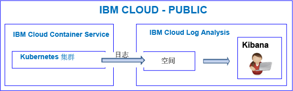
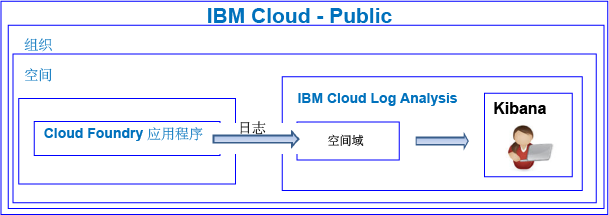

---

copyright:
  years: 2017, 2018

lastupdated: "2018-07-25"

---

{:new_window: target="_blank"}
{:shortdesc: .shortdesc}
{:screen: .screen}
{:pre: .pre}
{:table: .aria-labeledby="caption"}
{:codeblock: .codeblock}
{:tip: .tip}
{:download: .download}

# 入门教程
{: #getting-started-with-cla}

使用本教程可了解如何开始使用 {{site.data.keyword.Bluemix}} 中的 {{site.data.keyword.loganalysislong}} 服务。
{:shortdesc}

缺省情况下，{{site.data.keyword.Bluemix_notm}} 会为所选服务提供集成的日志记录功能。使用日志时，可以通过 {{site.data.keyword.loganalysisshort}} 服务来扩展收集和保留功能。

## 开始之前
{: #prereqs}

您必须具有作为 {{site.data.keyword.Bluemix_notm}} 帐户的成员或所有者的用户标识。要获取 {{site.data.keyword.Bluemix_notm}} 用户标识，请转至[注册 ](https://console.bluemix.net/registration/){:new_window}

## 步骤 1：选择要查看其日志的云资源
{: #step1}

在 {{site.data.keyword.Bluemix_notm}} 中，CF 应用程序、{{site.data.keyword.containershort}} 上运行的容器以及所选服务会自动收集日志数据，然后将这些数据转发到 {{site.data.keyword.loganalysisshort}} 服务。

下表列出了不同的云资源。要开始使用 {{site.data.keyword.loganalysisshort}} 服务，请完成相关资源的教程：

<table>
  <caption>用于开始使用 {{site.data.keyword.loganalysisshort}} 服务的教程</caption>
  <tr>
    <th>资源</th>
    <th>教程</th>
    <th>云环境</th>
    <th>场景</th>
  </tr>
  <tr>
    <td>在 {{site.data.keyword.containershort}} 上运行的容器</td>
    <td>[在 Kibana 中分析 Kubernetes 集群中部署的应用程序的日志](/docs/services/CloudLogAnalysis/tutorials/container_logs.html#container_logs)</td>
    <td>Public </br>Dedicated</td>
    <td></td>
  </tr>
  <tr>
    <td>CF 应用程序</td>
    <td>[在 Kibana 中分析 Cloud Foundry 应用程序的日志](https://console.bluemix.net/docs/tutorials/application-log-analysis.html#generate-access-and-analyze-application-logs)</td>
    <td>Public</td>
    <td></td>
  </tr>
</table>


## 步骤 2：为用户设置日志查看许可权
{: #step2}

要控制允许用户执行的 {{site.data.keyword.loganalysisshort}} 操作，您可以向用户分配角色和策略。 

在 {{site.data.keyword.Bluemix_notm}} 中有两种类型的安全许可权，用于控制用户使用 {{site.data.keyword.loganalysisshort}} 服务时可以执行的操作：

* Cloud Foundry (CF) 角色：向用户授予 CF 角色，以定义用户具有查看空间中日志的许可权。
* IAM 角色：向用户授予 IAM 策略，以定义用户具有查看帐户域中日志的许可权，以及用户具有管理“日志收集”中所存储日志的许可权。 


要授予用户查看空间中日志的许可权，请完成以下步骤：

1. 登录到 {{site.data.keyword.Bluemix_notm}} 控制台。

    打开 Web 浏览器并启动 {{site.data.keyword.Bluemix_notm}}“仪表板”：[http://bluemix.net ](http://bluemix.net){:new_window}
	
	使用用户标识和密码登录后，{{site.data.keyword.Bluemix_notm}} UI 将打开。

2. 从菜单栏，单击**管理 > 帐户 > 用户**。 

    *用户*窗口显示用户列表，其中包含目前所选帐户的电子邮件地址。
	
3. 如果用户是帐户的成员，请从列表中选择用户名，或者从*操作*菜单中单击**管理用户**。

    如果用户不是帐户的成员，请参阅[邀请用户](/docs/iam/iamuserinv.html#iamuserinv)。

4. 选择 **Cloud Foundry 访问权**，然后选择组织。

    这将列出该组织中可用空间的列表。

5. 选择已供应 {{site.data.keyword.loganalysisshort}} 服务的空间。然后，从菜单操作中，选择**编辑空间角色**。

6. 选择*审计员*。 

    您可以选择 1 个或多个空间角色。以下所有角色均允许用户查看日志：*管理员*、*开发者*和*审计员*
	
7. 单击**保存角色**。


有关更多信息，请参阅[授予许可权](/docs/services/CloudLogAnalysis/security/grant_permissions.html#grant_permissions_ui_account)。


用户必须在日志数据所在的云 Public 区域中访问 Kibana，才能查看和分析日志数据。 

例如，要在美国南部区域启动 Kibana，请打开 Web 浏览器，然后输入以下 URL：

```
https://logging.ng.bluemix.net/
```
{: codeblock}


有关如何在其他区域中启动 Kibana 的更多信息，请参阅[通过 Web 浏览器导航至 Kibana](/docs/services/CloudLogAnalysis/kibana/launch.html#launch_Kibana_from_browser)。

**注**：启动 Kibana 时，如果收到指示*不记名令牌无效* 的消息，请检查您在空间中的许可权。此消息指示您的用户标识无权查看日志。

## 后续步骤 
{: #next_steps}

定制 Kibana 以查看和分析日志数据。有关更多信息，请参阅[查看和分析日志](/docs/services/CloudLogAnalysis/kibana/analyzing_logs_Kibana.html#analyzing_logs_Kibana)。
    


