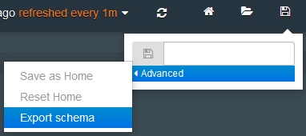
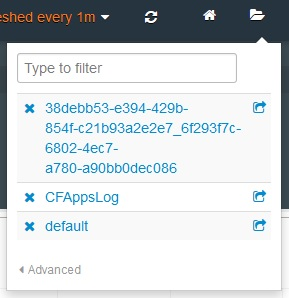

---

copyright:
  years: 2015, 2018

lastupdated: "2018-01-10"

---
{:new_window: target="_blank"}
{:shortdesc: .shortdesc}
{:screen:.screen}
{:codeblock:.codeblock}

# 导出和共享 Kibana 仪表板
{: #exporting_sharing_kibana_dash}

将仪表板模式导出为 JSON 文件或共享日志数据的定制仪表板的 URL。
{:shortdesc}

使用 Kibana，您可以通过将仪表板导出为 JSON 文件或共享仪表板的 URL 来与其他项目干系人协作。

完成以下任务以将 Kibana 仪表板导出为 JSON 文件：

1. 单击**保存**图标 ，然后单击**高级** **>** **导出模式**。

    

2. 为 JSON 文件选择有意义的名称，然后单击**保存**。具有此 JSON 文件的任何用户都可以打开其 Kibana 仪表板中的文件。 

完成一下任务，以创建并共享 Kibana 仪表板的 URL：

1. 在 Kibana 仪表板上，单击**文件夹**图标 ，以显示列出所有最近仪表板的菜单。除了按名称保存的仪表板外，菜单还会根据一下格式，列出未命名的仪表板：*ALCH_TENANT_ID_application_id*。 

    

2. 针对要共享的仪表板，单击**共享**图标 。此时将会创建并显示可共享的 URL。 

    

    复制 URL 以与其他用户共享仪表板。单击**关闭**以返回仪表板。
