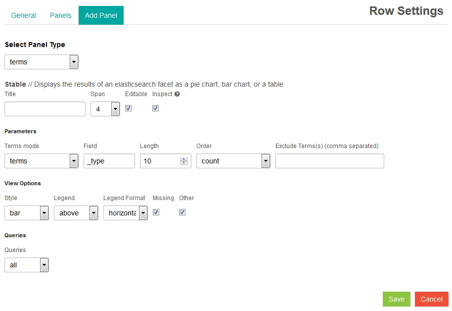
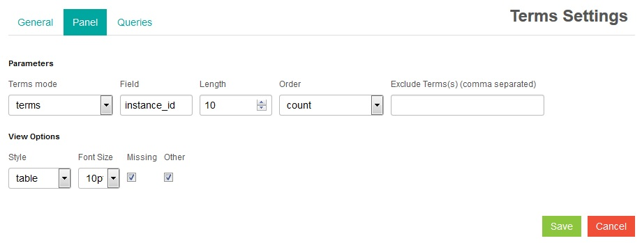

---

copyright:
  years: 2015, 2018

lastupdated: "2018-01-10"

---
{:new_window: target="_blank"}
{:shortdesc: .shortdesc}
{:screen:.screen}
{:codeblock:.codeblock}

# 在 Kibana 中通过查询创建表和图形
{: #logging_kibana_tables_graphs}

使用 Kibana 可以为您的查询创建图形和表，以可视化日志数据并比较结果。可以从 Cloud Foundry 应用程序的**日志**选项卡访问 Kibana 仪表板。
{:shortdesc}

Kibana 仪表板的布局为一系列行，其中每行都包含一个或多个面板。您可以配置面板以显示数据的图形表示法。使用查询来确定要显示的数据。要创建图形或表，您必须先创建空白行，然后再创建面板。如果从 CF 应用程序的**日志**选项卡访问 Kibana 仪表板，那么仪表板会自动显示两个画面：直方图和表。

完成以下任务以在 Kibana 仪表板上添加图形或表：

1. 要访问 Cloud Foundry 应用程序的**日志**选项卡，请在 {{site.data.keyword.Bluemix_notm}} **应用程序** 仪表板上单击 **Cloud Foundry 应用程序**表中的应用程序名称，然后单击**日志**选项卡。这将显示应用程序的日志。

2. 要访问应用程序的 Kibana 仪表板显示画面，请单击**高级视图** 。这将显示 Kibana 仪表板。

3. 在 Kibana 仪表板上，滚动到仪表板的底部并单击**添加行**  以针对要添加的面板创建行。这将显示“仪表板设置”窗格。 
	
	
	
	在“添加行”窗格中的**标题**字段中输入行的名称，然后单击**创建行**。这将添加一个新行。您可以单击行标题旁边的** 上箭头**或**下箭头**图标，来调整行的顺序。当您设置行顺序后，请单击**保存**。此时将在 Kibana 仪表板上创建一个空行。

4. 单击**向空行添加面板**以添加面板。这将显示“行设置”窗格。

    
	
	您可以从**选择面板类型**下拉列表中选择不同的面板类型，如**表**、**直方图**或**项**。选择**项**可根据您的查询创建条形图、饼图或表。在“行设置”窗格中会显示一系列配置选项。
	
	
	
	配置面板。针对您的图形显示画面，输入**标题**。从下拉列表中选择面板的**跨度**，**跨度**可确定面板跨仪表板的宽度。在“参数”部分中，删除**字段**的内容并输入有效的日志字段，例如 `instance_id`。 

5. 在“视图选项”部分中，从**样式**下拉列表中选择**条形图**、**饼图**或**表**，以选择条形图、饼图或表。在“查询”部分中，从**查询**下拉列表中选择**已选择**，以使用仪表板查询的日志数据。最后，单击**保存**。您的面板将显示在仪表板上。

	
	
6. 要更改此面板，以便其显示表，请单击**配置**图标 。这将显示“项设置”窗格。 

	
	
	单击**面板**选项卡，然后从**样式**下拉列表中选择**表**。单击**保存**以更新面板并返回到仪表板。

7. 向仪表板添加进一步的行和面板。当您完成时，请单击**保存**图标以保存对此仪表板的更改。

    **注：**如果尝试使用包含空格的名称来保存仪表板，那么不会保存该仪表板。请输入不带空格的名称并单击**保存**图标。

    。

