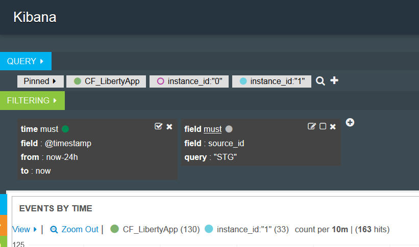

---

copyright:
  years: 2015, 2018

lastupdated: "2018-01-10"

---

{:shortdesc: .shortdesc}
{:new_window: target="_blank"}
{:codeblock: .codeblock}
{:screen: .screen}

# 在 Kibana 3 中分析日志（不推荐）
{: #analyzing_logs_Kibana3}

在 {{site.data.keyword.Bluemix}} 中，可以使用 Kibana（一种开放式源代码分析和可视化平台）通过各种图形（例如，图表和表）来对数据进行监视、搜索、分析和可视化表示。使用 Kibana 可执行高级分析任务。
{:shortdesc}

## 在 Kibana 仪表板中过滤数据
{: #filter_data_kibana_dashboard}

在 {{site.data.keyword.Bluemix}} 中，可以使用按每个资源或按 {{site.data.keyword.Bluemix}} 空间提供的缺省 Kibana 仪表板来分析数据。缺省情况下，这些仪表板会显示最近 24 小时可用的所有数据。但是，可以通过仪表板来约束显示的信息。您可以向缺省仪表板添加查询和过滤器，然后保存该仪表板以供未来复用。

在仪表板中，可以添加多个查询和过滤器。一个查询会定义一部分日志条目。过滤器通过包含或排除信息来优化数据选择内容。 

对于 Cloud Foundry 应用程序，以下列表概述了有关如何过滤数据的示例：
* 如果要在日志中查找包含关键项的信息，可以创建查询以按这些项进行过滤。通过 Kibana，可以在仪表板上直观地比较查询。有关更多信息，请参阅[在 Kibana 中使用查询过滤 Cloud Foundry 应用程序日志](kibana3/logging_kibana_query.html#logging_kibana_query)。

* 如果要查找特定时间段内的信息，可以按时间范围过滤数据。有关更多信息，请参阅[在 Kibana 中按时间过滤 Cloud Foundry 应用程序日志](kibana3/logging_kibana_filter_by_time_period.html#logging_kibana_time_filter)。

* 如果要查找特定实例标识的信息，可以按实例标识过滤数据。有关更多信息，请参阅[在 Kibana 中按实例标识过滤 Cloud Foundry 应用程序日志](kibana3/logging_kibana_filter_by_instance_id.html#logging_kibana_instance_id)和[在 Kibana 中按已知应用程序标识过滤 Cloud Foundry 应用程序日志](kibana3/logging_kibana_filter_by_known_application_id.html#logging_kibana_known_application_id)。

* 如果要查找特定组件的信息，可以按组件（日志类型）过滤数据。有关更多信息，请参阅[在 Kibana 中按日志类型过滤 Cloud Foundry 应用程序日志](kibana3/logging_kibana_filter_by_component.html#logging_kibana_component_filter)。

* 如果要查找信息（例如错误消息），那么可以按消息类型过滤数据。有关更多信息，请参阅[在 Kibana 中按消息类型过滤 Cloud Foundry 应用程序日志](kibana3/logging_kibana_filter_by_message_type.html#logging_kibana_message_type_filter)。

## 定制 Kibana 仪表板
{: #customize_kibana_dashboard}

可定制不同类型的仪表板来对数据进行可视化表示和分析，例如：
* 单 CF 应用程序仪表板：此仪表板用于显示单个 Cloud Foundry 应用程序的信息。  
* 多 CF 应用程序仪表板：此仪表板用于显示同一 {{site.data.keyword.Bluemix}} 空间内部署的所有 Cloud Foundry 应用程序的信息。 

定制仪表板后，可以配置查询和过滤器以选择要通过仪表板显示的日志数据子集。

要将数据可视化，可以配置面板。Kibana 包含可用于分析信息的不同面板，如表、趋势和直方图。可以在仪表板中添加、除去和重新排列面板。每个面板的用途各不相同。一些面板组织成行，用于提供一个或多个查询的结果。另一些面板则显示文档或定制信息。例如，可以配置条形图、饼图或表来对数据进行可视化表示和分析。  

## 保存 Kibana 仪表板
{: #save_Kibana_dashboard}

要保存定制后的 Kibana 仪表板，请完成以下步骤：

1. 在工具栏中，单击**保存**图标。

2. 输入仪表板的名称。

    **注：**如果尝试使用包含空格的名称来保存仪表板，那么不会保存该仪表板。

3. 在“名称”字段旁边，单击**保存**图标。

## 通过 Kibana 仪表板分析日志
{: #analyze_kibana_logs}

定制 Kibana 仪表板后，可以通过其面板对数据进行可视化表示和分析。 

要搜索信息，可以将查询置顶或取消置顶。 

* 可以在仪表板中将查询置顶，这将自动激活搜索。
* 要从仪表板中除去内容，可以取消激活查询。

要过滤信息，可以启用或禁用过滤器。 

* 可以选中过滤器中的**切换**复选框  以启用该过滤器。   
* 可以取消选中过滤器中的**切换**复选框  以禁用该过滤器。 

仪表板中的图形和图表将显示数据。可以使用仪表板中的图形和图表来监视数据。 

例如，单 CF 应用程序仪表板中包含有关一个 Cloud Foundry 应用程序的信息。可进行可视化表示和分析的数据仅限于该应用程序。您可以使用此仪表板来分析该应用程序的所有实例的数据。可以比较实例。也可以按实例标识来过滤信息。 

可以定义每个实例标识的查询并在仪表板中将其置顶。 

然后，可以根据要在仪表板中查看的实例信息来激活或取消激活各个查询。 

下图显示一个查询已激活，另一个查询已取消激活：

如果要在直方图中比较 2 个实例，可以在同一仪表板中定义 2 个查询，每个实例标识各一个查询。可以为其提供别名和唯一颜色，以便能轻松识别。Kibana 通过用逻辑 OR 连接多个查询来处理这些查询。 

下图显示的面板用于配置查询的别名和颜色、在仪表板中将查询置顶以及取消激活查询：

