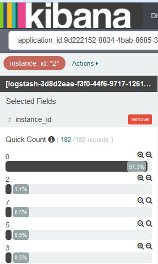

---

copyright:
  years: 2017, 2019

lastupdated: "2019-03-06"

keywords: IBM Cloud, logging

subcollection: cloudloganalysis

---

{:new_window: target="_blank"}
{:shortdesc: .shortdesc}
{:screen: .screen}
{:pre: .pre}
{:table: .aria-labeledby="caption"}
{:codeblock: .codeblock}
{:tip: .tip}
{:download: .download}
{:important: .important}
{:note: .note}
{:deprecated: .deprecated}

# 在 Kibana 中过滤日志
{:#k4_filter_logs}

在“发现”页面中，可以创建搜索查询，并应用过滤器来限制显示以供分析的信息。
{:shortdesc}

* 可以在“发现”页面的搜索栏中定义一个或多个搜索查询。一个搜索查询会定义一部分日志条目。使用 Lucene 查询语言来定义搜索查询。 

* 可以从*字段列表*或从表条目添加过滤器。过滤器通过包含或排除信息来优化数据选择内容。可以启用或禁用过滤器，反转过滤操作，将过滤器切换为开启或关闭，或者完全除去过滤器。 

在定义新搜索后将其保存，以便能够重复使用，将来在“发现”页面中用于分析，或用来创建可在定制仪表板中使用的可视化项。 

执行新搜索时，直方图、表和字段列表会自动更新，以显示搜索结果。要了解显示哪些数据，请参阅[确定在“发现”页面中显示的数据](/docs/services/CloudLogAnalysis/kibana4?topic=cloudloganalysis-kibana_analize_logs_interactively#k4_identify_data)。

可以创建定制搜索来过滤日志。以下列表概述了有关如何过滤日志中数据的场景：

* 可以搜索日志以查找在字段值中包含特定文本的条目。有关更多信息，请参阅[针对字段值中的特定文本过滤日志](/docs/services/CloudLogAnalysis/kibana4?topic=cloudloganalysis-k4_filter_logs#k4_filter_logs_spec_text)。
 
* 可以搜索日志以查找特定字段值，也可以排除日志中包含特定字段值的条目。有关更多信息，请参阅[针对特定字段值过滤日志](/docs/services/CloudLogAnalysis/kibana4?topic=cloudloganalysis-k4_filter_logs#k4_filter_logs_spec_field)。
 
* 可以过滤日志以显示某个时间段内的条目。有关更多信息，请参阅[设置时间过滤器](/docs/services/CloudLogAnalysis/kibana4?topic=cloudloganalysis-k4_filter_logs#set_time_filter1)。
     

## 为*字段列表*中未列出的值添加过滤器
{:#k4_add_filter_out_value}

要为*字段列表*中未显示的值添加过滤器，请通过查询来搜索包含该值的记录。然后，从“发现”页面中提供的表条目添加过滤器。
 

要为在*字段列表*部分中显示的列表中不可用的值添加过滤器，请完成以下步骤：

1. 查看 Kibana 的“发现”页面，以确定它显示的数据子集。有关更多信息，请参阅[确定在 Kibana 的“发现”页面中显示的数据](/docs/services/CloudLogAnalysis/kibana4?topic=cloudloganalysis-kibana_analize_logs_interactively#k4_identify_data)。

    例如，下图显示了*字段列表*中 CF 应用程序实例的值。 
    
    
    
    您关注的是编号为 *3* 的实例，但该实例在显示的列表中不可用。

2. 在“发现”页面中，修改查询以搜索特定字段值。

    例如，要搜索实例 *3*，输入的查询如下所示：`application_id:9d222152-8834-4bab-8685-3036cd25931a AND instance_id:"3"`
    
    
    
    在该表中，可以看到与查询匹配的所有记录。 
    
 3. 展开一条记录，并选择“放大镜”按钮  以添加过滤器。
 
     例如，要为值为 *3* 的实例标识添加过滤器，请单击 *instance_id* 字段旁边的“放大镜”按钮 。
     
     
     
4. 检查过滤器是否已添加。

    例如，下图显示了从表添加过滤器后，该过滤器已启用。
    
    
    
    

## 针对特定字段值过滤日志
{:#k4_filter_logs_spec_field}

可以搜索包含特定字段值的条目。
 

要搜索包含特定字段值的条目，请完成以下步骤：

1. 查看 Kibana 的“发现”页面，以确定它显示的数据子集。有关更多信息，请参阅[确定在 Kibana 的“发现”页面中显示的数据](/docs/services/CloudLogAnalysis/kibana4?topic=cloudloganalysis-kibana_analize_logs_interactively#k4_identify_data)。

2. 在*字段列表*中，确定要为其定义过滤器的字段，并单击该字段。

    该字段最多显示 5 个值。每个值有两个“放大镜”按钮。 
    
    如果看不到值，请参阅[为字段列表中未列出的值添加过滤器](/docs/services/CloudLogAnalysis/kibana4?topic=cloudloganalysis-k4_filter_logs#k4_add_filter_out_value)。

3. 要添加过滤器以搜索具有某个字段值的条目，请选择该值的放大按钮 。

    

    要添加过滤器以搜索不包含该字段值的条目，请选择该值的放大按钮 。

    

4. 选择以下任一选项以在 Kibana 中使用过滤器：

    <table>
      <caption>表 1. 使用过滤器的方法</caption>
      <tbody>
        <tr>
          <th align="center">选项</th>
          <th align="center">描述</th>
          <th align="center">其他信息</th>
        </tr>
        <tr>
          <td align="left">启用</td>
          <td align="left">选择此选项可启用过滤器。</td>
          <td align="left">添加过滤器时，会自动启用该过滤器。  如果过滤器已禁用，请单击该过滤器以将其启用。</td>
        </tr>
        <tr>
          <td align="left">禁用</td>
          <td align="left">选择此选项可禁用过滤器。</td>
          <td align="left">添加过滤器后，如果要隐藏某个字段值的条目，请单击**禁用**。</td>
        </tr>
        <tr>
          <td align="left">锁定</td>
          <td align="left">选择此选项可在各个 Kibana 页面之间持久存储该过滤器。</td>
          <td align="left">可以在*发现*页面、*可视化*页面或*仪表板*页面中锁定过滤器。</td>
        </tr>
        <tr>
          <td align="left">切换</td>
          <td align="left">选择此选项可切换过滤器。</td>
          <td align="left">缺省情况下，将显示与过滤器匹配的条目。要显示不匹配的条目，请切换过滤器。</td>
        </tr>
        <tr>
          <td align="left">除去</td>
          <td align="left">选择此选项可除去过滤器。</td>
          <td align="left"></td>
        </tr>
      </tbody>
    </table>

## 按源过滤 CF 应用程序日志
{:#k4_filter_logs_by_source}

要搜索包含特定日志源的条目，请完成以下步骤：

1. 查看 Kibana 的“发现”页面，以确定它显示的数据子集。有关更多信息，请参阅[确定在 Kibana 的“发现”页面中显示的数据](/docs/services/CloudLogAnalysis/kibana4?topic=cloudloganalysis-kibana_analize_logs_interactively#k4_identify_data)。

2. 在*字段列表*中，选择 **source_id** 字段。

         

3. 要添加过滤器以搜索包含特定 source_id 的条目，请选择该值的放大按钮 。

    有关可用于 CF 应用程序的日志源的列表，请参阅 [CF 应用程序的日志源](/docs/services/CloudLogAnalysis/cfapps?topic=cloudloganalysis-logging_cf_apps#cf_apps_log_sources_diego)。

    例如，要添加过滤器以包含有关 CF 应用程序的启动、停止或崩溃的日志条目，请选择*字段列表*部分中可用于值 *CELL* 的“放大镜”按钮 。下图显示了用于已启用 source_id 值 *CELL* 的过滤器。
    
    

    要添加过滤器以搜索不包含特定 source_id 的条目，请选择该值的放大按钮 。
    
    例如，要添加过滤器以排除有关 CF 应用程序的启动、停止或崩溃的日志条目，请选择*字段列表*部分中可用于值 *CELL* 的“放大镜”按钮 。下图显示了排除 source_id 值 *CELL* 的条目的过滤器。

    

## 按日志类型过滤日志
{:#k4_filter_logs_by_log_type}

要搜索包含特定日志类型的条目，请完成以下步骤：

1. 查看 Kibana 的“发现”页面，以确定它显示的数据子集。有关更多信息，请参阅[确定在 Kibana 的“发现”页面中显示的数据](/docs/services/CloudLogAnalysis/kibana4?topic=cloudloganalysis-kibana_analize_logs_interactively#k4_identify_data)。

2. 在*字段列表*中，选择 **type** 字段。

    例如，在下图中，只有一种日志类型可用：*syslog*
    
    
   
3. 要添加过滤器以搜索特定日志类型，请选择要分析的日志类型的放大按钮 。

    例如，要添加过滤器以包含 *syslog* 的日志条目，请选择*字段列表*部分中可用于值 *syslog* 的“放大镜”按钮 。下图显示了包含日志类型 *syslog* 的条目的过滤器。

    

    要添加过滤器以搜索不包含特定日志类型的条目，请选择该值的放大按钮 。

     例如，要添加过滤器以排除 *syslog* 的日志条目，请选择*字段列表*部分中可用于值 *syslog* 的“放大镜”按钮 。下图显示了排除日志类型 *syslog* 的条目的过滤器。
     
     

## 按实例标识过滤日志
{:#k4_filter_logs_by_instance_id}

要在 Kibana 仪表板上按实例标识查看和过滤日志，请完成以下步骤：

1. 查看 Kibana 的“发现”页面，以确定它显示的数据子集。有关更多信息，请参阅[确定在 Kibana 的“发现”页面中显示的数据](/docs/services/CloudLogAnalysis/kibana4?topic=cloudloganalysis-kibana_analize_logs_interactively#k4_identify_data)。

2. 在*字段列表*中，选择以下其中一个字段来搜索特定实例标识：

    * **instance_ID**：此字段列出 Cloud Foundry 应用程序的日志中可用的不同实例标识。 
    * **instance**：此字段列出容器组的所有实例的不同 GUID。 

    例如，下图显示了 CF 应用程序实例的不同值：
    
    
   
3. 要添加过滤器以搜索特定日志类型，请选择要分析的日志类型的放大按钮 。

   例如，要添加过滤器以包含 CF 应用程序实例 *2* 的条目，请选择“字段列表”部分中可用于值 *2* 的“放大镜”按钮 。下图显示了包含实例 *2* 的条目的过滤器。
    
    

    要添加过滤器以搜索不包含特定实例标识的条目，请选择该值的放大按钮 。

     例如，要添加过滤器以排除 CF 应用程序实例 *2* 的条目，请选择“字段列表”部分中可用于值 *2* 的“放大镜”按钮 。下图显示了排除实例 *2* 的条目的过滤器。
     
      

## 按消息类型过滤 CF 应用程序日志
{:#k4_filter_cf_logs_by_msg_type}

要搜索包含特定消息类型的条目，请完成以下步骤：

1. 查看 Kibana 的“发现”页面，以确定它显示的数据子集。有关更多信息，请参阅[确定在 Kibana 的“发现”页面中显示的数据](/docs/services/CloudLogAnalysis/kibana4?topic=cloudloganalysis-kibana_analize_logs_interactively#k4_identify_data)。

2. 在*字段列表*中，选择 **message_type** 字段。

    下图显示了在 CF 应用程序的日志中针对 *message_type* 字段找到的值：
    
         

3. 要添加过滤器以搜索包含特定 *message_type* 的条目，请选择该值的放大按钮 。

    例如，要添加过滤器以包含 message_type 值为 *OUT* 的日志条目，请选择*字段列表*部分中可用于值 *OUT* 的“放大镜”按钮 。下图显示了用于已启用 message_type 值 *OUT* 的过滤器。
    
    

    要添加过滤器以搜索不包含特定 *message_type* 的条目，请选择该值的放大按钮 。
    
    例如，要添加过滤器以排除 message_type 为 *OUT* 的日志条目，请选择*字段列表*部分中可用于值 *OUT* 的“放大镜”按钮 。下图显示了排除 message_type 值 *OUT* 的条目的过滤器。

    

## 针对字段值中的特定文本过滤日志
{:#k4_filter_logs_spec_text}

查看和搜索在字段值中包含特定文本的条目。
 

**注意：**只能对 Elasticsearch 分析器分析的字符串字段执行自由文本搜索。 
    
Elasticsearch 分析字符串字段的值时，会根据 Unicode Consortium 定义的单词边界来拆分文本，除去标点符号并将所有单词转化成小写。
    
要搜索在字段值中包含特定文本的条目，请完成以下步骤：

1. 查看 Kibana 的“发现”页面，以确定它显示的数据子集。有关更多信息，请参阅[确定在 Kibana 的“发现”页面中显示的数据](/docs/services/CloudLogAnalysis/kibana4?topic=cloudloganalysis-kibana_analize_logs_interactively#k4_identify_data)。

2. 确定缺省情况下 Elasticsearch 中分析的字段。

    要显示可用于搜索和过滤日志数据的已分析字段的完整列表，请[重新装入字段列表](/docs/services/CloudLogAnalysis/kibana4?topic=cloudloganalysis-kibana_analize_logs_interactively#kibana_discover_view_reload_fields)。然后，在“发现”页面中可用的*字段列表*中，完成以下步骤：
    
    1. 单击“配置”图标 。这将显示**所选字段**部分，在其中可以过滤字段。

        
    
    2. 要确定已分析的字段，请在搜索字段**已分析**中选择**是**。

        
    
        这将显示已分析字段的列表。
    
        
        
         
    3. 检查要在其中查找自由文本的字段是否为缺省情况下 Elasticsearch 分析的字段。
    
3. 如果该字段已分析，请修改查询以在日志中搜索将该自由文本包含为字段值一部分的条目。

    
**示例**

如果通过 {{site.data.keyword.Bluemix}} UI 为 Cloud Foundry (CF) 应用程序启动了 Kibana，并且希望查找包含消息标识 *CWWKT0016I:* 的特定消息，请将搜索修改为包含该自由文本。
    
1. 检查装入的搜索查询以及在“发现”页面中显示的数据。
       
    
        
2. 要搜索消息标识 *CWWKT0016I*，请修改搜索查询，然后按 **Enter** 键：
    
    <pre class="pre">application_id:f52f6016-3aab-4b5c-aa2e-5493747cb978 AND message:"CWWKT0016I:" 
	</pre>
        
    
      
该表显示了 *message* 字段值中包含文本 *CWWKT0016I* 的 CF 应用程序条目。
    
     	
        

## 设置时间过滤器
{: #set_time_filter1}

通过配置*时间选取器*，查看和过滤某个时间段内的日志。

可以在“发现”页面中配置*时间选取器*。缺省情况下，时间选取器设置为最近 15 分钟。 

要搜索包含特定时间的条目，请完成以下步骤：

1. 在“发现”页面的菜单栏中，单击时间选取器 。

2. 设置时间间隔。 

    可以定义以下类型的时间间隔：
    
    * 快速：这些是预定义时间间隔，包含最常用的“相对”和“绝对”时间间隔，例如*今天*和*本月*。 
    
        
    
    * 相对：可以为这些时间间隔指定开始日期和时间以及结束日期和时间。可以按小时四舍五入。
    
        
    
    * 绝对：这些是介于开始日期和结束日期之间的时间间隔。
    
        
      

配置时间间隔后，Kibana 中的显示的数据对应于该时间范围内的条目。

