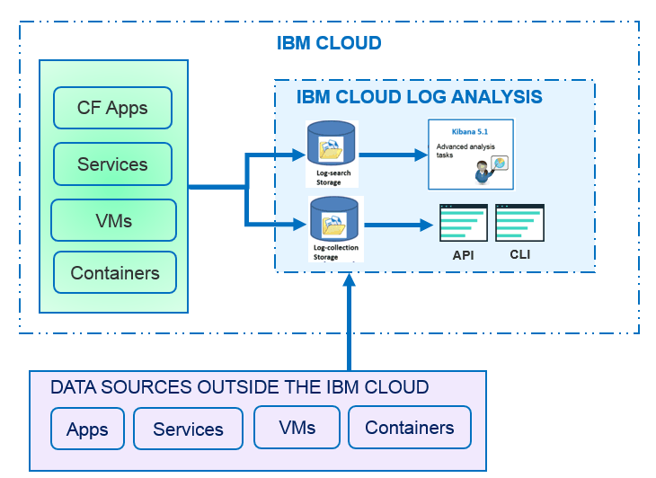

---

copyright:
  years: 2017

lastupdated: "2017-07-19"

---

{:shortdesc: .shortdesc}
{:new_window: target="_blank"}
{:codeblock: .codeblock}
{:screen: .screen}
{:pre: .pre}

# 关于 
{: #log_analysis_ov}

使用 {{site.data.keyword.loganalysisfull}} 服务可扩展 {{site.data.keyword.Bluemix}} 中的日志收集、日志保留时间和日志搜索功能。DevOps 团队将受益于多种功能，例如聚集应用程序和环境日志以获得综合性应用程序或环境洞察，加密日志，根据需要使日志数据保留任意长的时间，以及对问题进行快速检测和故障诊断。使用 Kibana 可执行高级分析任务。
{:shortdesc}

{{site.data.keyword.Bluemix_notm}} 日志记录功能集成在平台中：

* 对云资源自动启用了数据收集。缺省情况下，{{site.data.keyword.Bluemix_notm}} 会收集并显示应用程序、应用程序运行时以及运行这些应用程序的计算运行时的日志。 
* 每天最多可以搜索 500 MB 日志。 
* 最近 3 天的日志会存储在“日志搜索”（{{site.data.keyword.loganalysisshort}} 服务的一个组件）中。

您可以使用 {{site.data.keyword.Bluemix_notm}} 中的日志记录功能来了解云平台的行为以及其中所运行的资源。无需进行特殊检测，即可收集标准输出和标准错误日志。例如，可以使用日志来为应用程序提供审计跟踪，检测服务中的问题，识别漏洞，对应用程序部署和运行时行为进行故障诊断，检测运行应用程序的基础架构中的问题，在云平台中的组件之间跟踪应用程序，以及检测可用于提前制止可能影响服务 SLA 的操作的模式。

下图显示了 {{site.data.keyword.loganalysisshort}} 服务组件的高级别视图： 

要收集并搜索云资源的日志，必须在运行这些云资源的 {{site.data.keyword.Bluemix_notm}} 空间中供应 {{site.data.keyword.loganalysisshort}} 服务的实例。

缺省情况下，会在“日志搜索”中收集并存储日志。选择包含扩展搜索和收集功能的服务套餐时，还会在“日志收集”组件中收集并存储日志。存储在“日志收集”中的日志数据会加密。

可以在“日志收集”中收集并存储的日志大小由所选的服务套餐确定。您将按每月存储的每 GB 数据付费。日志会作为 JSON 存储在“日志收集”中。

可以使用 Kibana 5.1 来执行高级日志搜索分析任务：

* 每个套餐都会限制每天可以搜索的日志大小。 
* 搜索范围仅限于最近 3 天的数据。

要访问 3 天前的日志，可以使用“日志收集”CLI 或“日志收集”API 在本地下载日志，也可以通过管道将日志传递到其他应用程序或第三方云服务。 

可以通过设置保留时间策略来自动删除日志，也可以使用 {{site.data.keyword.loganalysisshort}} CLI 手动删除日志。

## 为什么要使用日志记录服务
{: #value}

1. **减少应用程序检测时间，将更多时间用于增强应用程序的价值**

    {{site.data.keyword.loganalysislong_notm}} 会自动从所选 {{site.data.keyword.IBM_notm}} 云服务收集数据，无需进行检测。
	
	可以选择每天可搜索的日志量。提供了不同的套餐，可分别用于每天搜索最多 500 MB、2 GB、5 GB 和 10 GB 日志。

2. **在云类经济型存储解决方案上，使日志数据保持在应用程序工作负载附近并保护其安全**

    收集来自 {{site.data.keyword.IBM_notm}} Cloud 中运行的传统应用程序和微服务驱动的应用程序的日志数据，并将其存储在集中式日志中。根据需要使日志数据保留任意长的时间。
	
	日志会存储在 {{site.data.keyword.IBM_notm}} Cloud 存储器中。可以在需要时下载日志。

3. **获取关于环境的洞察，以快速检测、诊断和识别问题**

    通过可定制仪表板对数据进行可视化和分析并与数据进行交互。日志搜索功能基于 Elastic 堆栈平台构建，借此您可利用 Kibana 的灵活性和对 Kibana 的熟悉程度，根据您的应用程序需求快速构建自己的仪表板。

4. **与 API 稳健集成**

    通过该服务的 API，将日志数据集成到应用程序和操作中。使用 {{site.data.keyword.loganalysisshort}} 服务 API 可管理保留的日志，并从 {{site.data.keyword.IBM_notm}} Cloud 外部发送日志数据。

	
## 收集日志
{: #log_collection}

缺省情况下，{{site.data.keyword.Bluemix_notm}} 会在“日志搜索”中存储最长 3 天的日志数据：   

* 每天每个空间最多存储 500 MB 数据。超过 500 MB 上限的任何日志都会被废弃。每天凌晨 12:30 UTC 会重置分配的上限。
* 可搜索最长 3 天最多 1.5 GB 的数据。日志数据达到 1.5 GB 或超过 3 天后，会对数据进行滚动式覆盖（先进先出）。

{{site.data.keyword.loganalysisshort}} 服务提供了其他套餐，允许您根据自己的需要，将日志在“日志收集”中存储任意长的时间。有关每种套餐的更多信息，请参阅[服务套餐](/docs/services/CloudLogAnalysis/log_analysis_ov.html#plans)。

## 删除日志
{: #log_deletion}

存储在“日志搜索”中的日志会在 3 天后删除。

除非您配置了保留时间策略，否则会在 30 天后自动删除“日志收集”中存储的日志。 

* 可以配置日志保留时间策略，以定义希望日志在“日志收集”中保留的天数。有关更多信息，请参阅[日志保留时间策略](/docs/services/CloudLogAnalysis/log_analysis_ov.html#policies)。

* 可以通过将该策略的值设置为 *-1* 以禁用该策略。 

可以使用“日志收集”API 或“日志收集”CLI 从“日志收集”中手动删除日志。有关通过 CLI 手动删除日志的更多信息，请参阅 [cf logging delete](/docs/services/CloudLogAnalysis/reference/logging_cli.html#delete)。

## 获取日志
{: #log_ingestion}

所有 {{site.data.keyword.loganalysisshort}} 服务套餐（*Lite* 套餐除外）都包含将来自 {{site.data.keyword.IBM_notm}} Cloud 外部的日志发送到“日志收集”的功能。有关套餐的更多信息，请参阅[服务套餐](/docs/services/CloudLogAnalysis/log_analysis_ov.html#plans)。

可以使用多租户 Logstash 转发器将日志发送到 {{site.data.keyword.loganalysisshort}}。有关更多信息，请参阅[使用多租户 Logstash 转发器 (mt-logstash-forwarder) 发送日志数据](/docs/services/CloudLogAnalysis/how-to/send-data/send_data_mt.html#send_data_mt)。

## 搜索日志
{: #log_search}

缺省情况下，在 {{site.data.keyword.Bluemix_notm}} 中可以使用 Kibana 5.1 每天最多搜索 500 MB 日志。 

{{site.data.keyword.loganalysisshort}} 服务提供了多种套餐。每种套餐有不同的日志搜索功能，例如*日志收集*套餐允许每天最多搜索 1 GB 数据。有关套餐的更多信息，请参阅[服务套餐](/docs/services/CloudLogAnalysis/log_analysis_ov.html#plans)。

## 在 Bluemix 中进行日志分析
{: #logging_bmx_ov_ui}

在 {{site.data.keyword.Bluemix_notm}} 中，可以查看在 {{site.data.keyword.Bluemix_notm}} 管理的基础架构中部署的 CF 应用程序或容器的最近日志或者实时跟踪其日志：

* 可以通过 UI 来查看、过滤和分析日志。有关更多信息，请参阅[通过 Bluemix 控制台分析日志](/docs/services/CloudLogAnalysis/logging_view_dashboard.html#analyzing_logs_bmx_ui)。

* 您可以使用命令行来查看、过滤和分析日志，从而以编程方式管理日志。有关更多信息，请参阅[通过 CLI 分析日志](/docs/services/CloudLogAnalysis/logging_view_cli.html#analyzing_logs_cli)。

* 可以使用 Kibana 执行高级分析。

## 使用 Kibana 进行高级日志分析
{: #logging_bmx_ov_kibana}

在 {{site.data.keyword.Bluemix_notm}} 中，可以使用 Kibana（一种开放式源代码分析和可视化平台）通过各种图形（例如，图表和表）来对数据进行监视、搜索、分析和可视化。有关更多信息，请参阅[使用 Kibana 进行高级日志分析](/docs/services/CloudLogAnalysis/kibana/analyzing_logs_Kibana.html#analyzing_logs_Kibana)。

## 通过 CLI 管理日志
{: #managing_logs}

使用 {{site.data.keyword.loganalysisshort}} CLI 来管理日志。

* 要了解如何安装 CLI，请参阅[安装日志记录 CLI](/docs/services/CloudLogAnalysis/how-to/manage-logs/config_log_collection_cli.html#config_log_collection_cli)。
* 要检查 CLI 的版本，请运行带有参数 *-version* 的 [cf logging](/docs/services/CloudLogAnalysis/reference/logging_cli.html#base) 命令。
* 要获取有关如何运行命令的帮助，请参阅[获取命令行帮助以运行命令](/docs/services/CloudLogAnalysis/how-to/manage-logs/config_log_collection_cli.html#cli_help)。

要获取有关日志的常规信息，请使用 `cf logging status` 命令。例如，可以：

* [获取有关日志在一段时间内的信息](/docs/services/CloudLogAnalysis/how-to/manage-logs/viewing_log_information.html#viewing_logs)。
* [获取有关某个日志类型在一段时间内的信息](/docs/services/CloudLogAnalysis/how-to/manage-logs/viewing_log_information.html#viewing_logs_by_log_type)。
* [获取有关日志的帐户信息](/docs/services/CloudLogAnalysis/how-to/manage-logs/viewing_log_information.html#viewing_logs_account)。

为了控制成本，您可能希望监视应用程序日志在一段时间内的大小。例如，您可能希望知道 {{site.data.keyword.Bluemix_notm}} 空间的每种日志类型在一周内的大小，以确定任何应用程序或服务生成的日志是否超过期望数量。要检查日志的大小，请使用 `cf logging status` 命令。有关更多信息，请参阅[查看日志信息](/docs/services/CloudLogAnalysis/how-to/manage-logs/viewing_log_information.html#viewing_log_status)。

可以在 Kibana 中搜索最近 3 天的日志。为了能够分析更早的日志数据，可以将日志下载到本地文件，也可以通过管道将这些日志传递到其他程序，例如本地 Elastic 堆栈。有关更多信息，请参阅[下载日志](/docs/services/CloudLogAnalysis/how-to/manage-logs/downloading_logs.html#downloading_logs)。

要手动删除不再需要的日志，请使用 [cf logging delete](/docs/services/CloudLogAnalysis/reference/logging_cli.html#delete) 命令。 

## 策略
{: #policies}

**日志保留时间策略**

可以使用 {{site.data.keyword.loganalysisshort}} CLI 来查看和配置日志保留时间策略。此策略指定日志在“日志收集”中的保留天数。 

* 缺省情况下，日志会保留 30 天。 
* 在保留期到期后，会自动从“日志收集”中删除日志，并且无法恢复这些日志。
* 可以为帐户指定保留期。保留期会自动针对该帐户中的所有空间进行配置。 
* 可以为 {{site.data.keyword.Bluemix_notm}} 空间指定保留期。
* 可以随时更改保留时间策略。
* 可以通过将该策略的值设置为 *-1* 以禁用该策略。 

**注**：禁用日志保留时间策略时，必须将日志保留在“日志收集”中。可以使用 CLI 命令 [cf logging delete](/docs/services/CloudLogAnalysis/reference/logging_cli.html#delete) 来删除旧日志。

有关更多信息，请参阅[查看和配置日志保留时间策略](/docs/services/CloudLogAnalysis/how-to/manage-logs/configuring_retention_policy.html#configuring_retention_policy)。

## 服务套餐
{: #plans}

{{site.data.keyword.loganalysisshort}} 服务提供了多种套餐。每种套餐都有不同的日志收集和日志搜索功能。 

可以通过 {{site.data.keyword.Bluemix_notm}} UI 或通过命令行来更改套餐。您可以随时升级或降级套餐。有关 {{site.data.keyword.Bluemix_notm}} 中的服务套餐升级的更多信息，请参阅[更改套餐](/docs/services/CloudLogAnalysis/plan/change_plan.html#change_plan)。 

下表概括了可用的套餐：

<table>
    <caption>每种套餐的“日志搜索”和“日志收集”功能摘要</caption>
      <tr>
        <th>套餐</th>
        <th>日志获取</th>
        <th>日志保留时间</th>
        <th>数据加密</th>
        <th>日志搜索</th>
      </tr>
      <tr>
        <td>Lite（缺省）</td>
        <td>否</td>
        <td>最近 3 天</td>
        <td>否</td>
        <td>最多搜索 500 MB</td>
      </tr>
      <tr>
        <td>日志收集</td>
        <td>是</td>
        <td>可配置的天数。</td>
        <td>是</td>
        <td>每天最多搜索 500 MB</td>
      </tr>
      <tr>
        <td>日志收集，每天搜索 2 GB</td>
        <td>是</td>
        <td>可配置的天数。</td>
        <td>是</td>
        <td>每天最多搜索 2 GB</td>
      </tr>
      <tr>
        <td>日志收集，每天搜索 5 GB</td>
        <td>是</td>
        <td>可配置的天数。</td>
        <td>是</td>
        <td>每天最多搜索 5 GB</td>
      </tr>
       <tr>
        <td>日志收集，每天搜索 10 GB</td>
        <td>是</td>
        <td>可配置的天数。</td>
        <td>是</td>
        <td>每天最多搜索 10 GB</td>
      </tr>
</table>

**注：**“日志收集”存储器每月成本作为计费周期的平均值进行计算。

## 区域
{: #regions}

{{site.data.keyword.loganalysisfull_notm}} 服务在以下区域中可用：

* 美国南部

