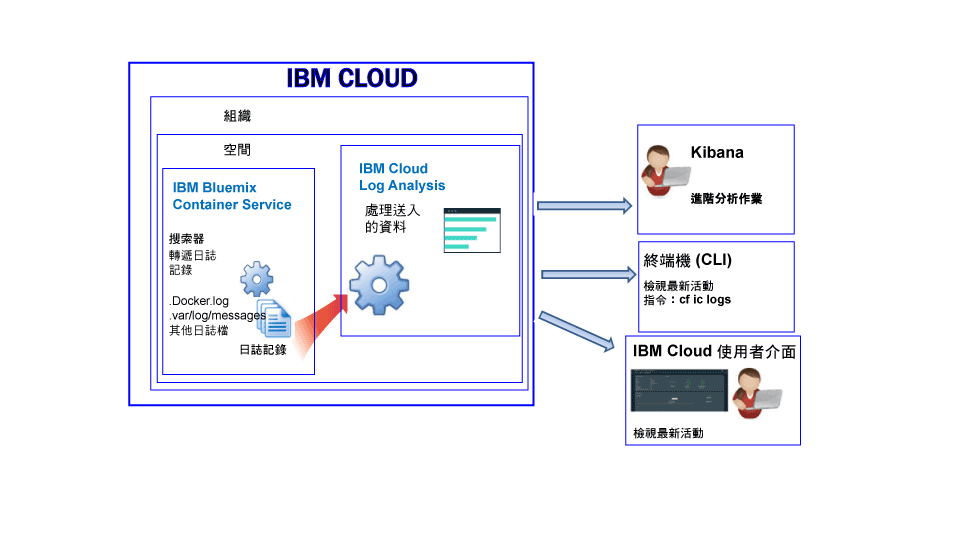

---

copyright:
  years: 2017, 2018

lastupdated: "2018-01-10"

---

{:shortdesc: .shortdesc}
{:new_window: target="_blank"}
{:codeblock: .codeblock}
{:screen: .screen}
{:pre: .pre}

# IBM Cloud 所管理容器的記載功能（已淘汰）
{: #containers_bluemix}

您可以針對在 {{site.data.keyword.IBM}} 所管理基礎架構中部署的 Docker 容器，來檢視、過濾及分析其日誌。
{:shortdesc}

您可以使用搜索器，從容器外部監視及轉遞容器日誌。搜索器會將資料傳送至 {{site.data.keyword.Bluemix_notm}} 中的多方承租戶 Elasticsearch。

下圖顯示 {{site.data.keyword.containershort}} 記載功能的高階視圖：

依預設，會收集 {{site.data.keyword.Bluemix_notm}} 所管理雲端基礎架構中所部署容器的下列日誌：

<table>
  <caption>表 2. 針對 {{site.data.keyword.Bluemix_notm}} 所管理基礎架構中所部署容器收集的日誌</caption>
  <tbody>
    <tr>
      <th align="center">日誌</th>
      <th align="center">說明</th>
    </tr>
    <tr>
      <td align="left" width="30%">/var/log/messages</td>
      <td align="left" width="70%"> 依預設，Docker 訊息儲存在容器的 /var/log/messages 資料夾中。此日誌包括系統訊息。
      </td>
    </tr>
    <tr>
      <td align="left">./docker.log</td>
      <td align="left">此日誌是 Docker 日誌。  Docker 日誌檔未儲存為容器內部的檔案，但仍然會予以收集。依預設，會收集此日誌檔，因為它是公開容器的 stdout（標準輸出）及 stderr（標準錯誤）資訊的標準 Docker 使用慣例。會收集任何容器處理程序列印到 stdout 或 stderr 的資訊。
      </td>
     </tr>
  </tbody>
</table>

## 分析日誌
{: #logging_containers_ov_methods}

若要分析容器日誌資料，請使用 Kibana 來執行進階分析作業。您可以使用 Kibana（一種開放程式碼分析與視覺化平台），在各種圖形（例如圖表和表格）中監視、搜尋、分析及視覺化您的資料。如需相關資訊，請參閱[在 Kibana 中分析日誌](/docs/services/CloudLogAnalysis/kibana/analyzing_logs_Kibana.html#analyzing_logs_Kibana)。

## 收集自訂日誌
{: #collect_custom_logs}

若要收集其他日誌，請在建立容器時，新增 **LOG_LOCATIONS** 環境變數，並包含日誌檔的路徑。 

您可以新增多個日誌檔，以逗點將其隔開。 

如需相關資訊，請參閱[收集容器中的非預設日誌資料](logging_containers_other_logs.html#logging_containers_collect_data)。

## 搜尋日誌
{: #log_search}

依預設，在 {{site.data.keyword.Bluemix_notm}} 中，您可以使用 Kibana 每天最多搜尋 500 MB 的日誌。 

{{site.data.keyword.loganalysisshort}} 服務提供多個方案。每一個方案都有不同的日誌搜尋功能，例如，*日誌收集* 方案可讓您每天最多搜尋 1 GB 的資料。如需方案的相關資訊，請參閱[服務方案](/docs/services/CloudLogAnalysis/log_analysis_ov.html#plans)。

## 傳送日誌，讓您可以使用訊息中的欄位作為 Kibana 搜尋欄位
{: #send_data_in_json}

依預設，會自動啟用容器的記載功能。Docker 日誌檔中的每個項目都會顯示在 Kibana 的 `message` 欄位中。如果您需要在 Kibana 中，使用屬於容器日誌項目一部分的特定欄位來過濾及分析資料，請配置應用程式以傳送有效的 JSON 格式化輸出。

完成下列步驟，以傳送將容器日誌項目剖析成個別欄位的日誌：

1. 將訊息記載至檔案。 
2. 將日誌檔新增至來自容器可供分析的非預設日誌清單。如需相關資訊，請參閱[收集容器中的非預設日誌資料](logging_containers_other_logs.html#logging_containers_collect_data)。 
    
以 STDOUT 形式將 JSON 日誌項目傳送至容器的 Docker 日誌檔時，不會將它們剖析為 JSON。 
    
如果您將訊息記載至檔案，而且訊息判斷為有效的 JSON，則會剖析欄位，並為訊息中的每一個欄位建立新欄位。在 Kibana 中，只能過濾及排序 string 類型欄位值。

## 在日誌收集中儲存日誌
{: #store_logs}

依預設，{{site.data.keyword.Bluemix_notm}} 會儲存最多 3 天的日誌資料：   

* 每個空間每天最多可儲存 500 MB 的資料。超過該 500 MB 上限的任何日誌都會被捨棄。上限配額會在每天凌晨 12:30（世界標準時間）重設。
* 可搜尋最多 3 天、最多 1.5 GB 的資料。達到 1.5 GB 資料或在 3 天之後，日誌資料就會輪替（先進先出）。

{{site.data.keyword.loganalysisshort}} 服務提供其他方案，讓您依所需在「日誌收集」中儲存日誌。如需每一個方案價格的相關資訊，請參閱[服務方案](/docs/services/CloudLogAnalysis/log_analysis_ov.html#plans)。

如果您需要儲存日誌，或搜尋較大的日誌，則可以佈建 {{site.data.keyword.loganalysisshort}} 服務，然後選擇不同的服務方案。其他方案可讓您依所需將日誌儲存在「日誌收集」，以及搜尋較大的日誌大小。如需相關資訊，請參閱[服務方案](/docs/services/CloudLogAnalysis/log_analysis_ov.html#plans)。

## 檢視日誌
{: #logging_containers_ov_methods_view_bmx}

您可以使用下列任何一種方法，檢視 {{site.data.keyword.Bluemix_notm}} 所管理基礎架構中所部署容器的最新日誌：

* 透過 {{site.data.keyword.Bluemix_notm}} 使用者介面來檢視日誌，以監視容器的最新活動。
    
    您可以透過每一個容器都有的**監視及日誌**標籤來檢視、過濾及分析日誌。 
	
	若要查看 {{site.data.keyword.IBM_notm}} 所管理基礎架構中所部署 Docker 容器的部署或運行環境日誌，請完成下列步驟：

    1. 從「應用程式」儀表板，按一下單一容器或容器群組。 
    
    2. 從應用程式詳細資料頁面，按一下**監視及日誌**。

    3. 選取**記載**標籤。從**記載**標籤，您可以檢視容器的最新日誌，或即時讀取日誌尾端的內容。 
	
* 使用 {{site.data.keyword.containershort}} CLI 來檢視日誌。請使用指令，以程式設計方式管理日誌。
    
    您可以透過指令行介面，使用 **cf ic logs** 指令來檢視、過濾及分析日誌。 
	
	使用 `bx cf ic logs` 指令可顯示 {{site.data.keyword.Bluemix_notm}} 中容器的日誌。例如，您可以使用這些日誌來分析容器停止的原因，或是檢閱容器輸出。 
	
	若要透過 `cf ic logs` 指令來查看在容器中執行之應用程式的應用程式錯誤，該應用程式必須將其日誌寫入標準輸出 (STDOUT) 及標準錯誤 (STDERR) 輸出串流。如果您將應用程式設計為寫入這些標準輸出串流，即使容器關閉或當機，也可以透過指令行來檢視日誌。

    如需 `cf ic logs` 指令的相關資訊，請參閱 [cf ic logs 指令](/docs/containers/container_cli_reference_cfic.html#container_cli_reference_cfic__logs)。

