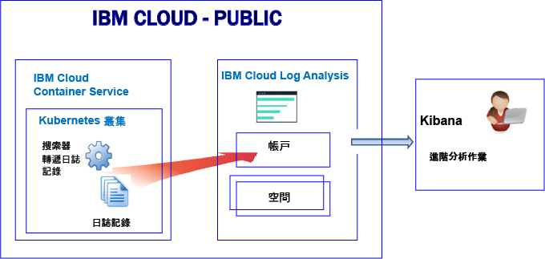
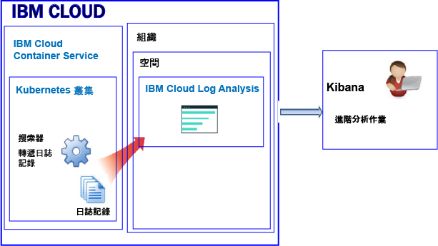
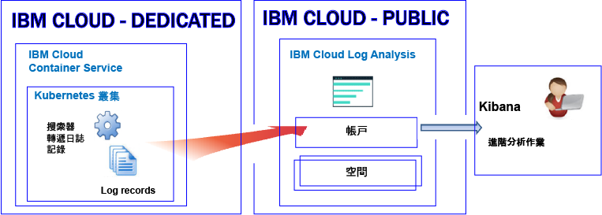

---

copyright:
  years: 2017, 2018

lastupdated: "2018-02-01"

---

{:new_window: target="_blank"}
{:shortdesc: .shortdesc}
{:screen: .screen}
{:pre: .pre}
{:table: .aria-labeledby="caption"}
{:codeblock: .codeblock}
{:tip: .tip}
{:download: .download}


# Kubernetes 叢集中的資源記載功能
{: #containers_kubernetes}

您可以透過 {{site.data.keyword.Bluemix_notm}} 中的 {{site.data.keyword.loganalysisshort}} 服務來檢視、過濾及分析 Kubernetes 叢集中資源的日誌。
{:shortdesc}

依預設，不會自動啟用將日誌從叢集傳送至 {{site.data.keyword.loganalysisshort}} 服務。**附註：**這是新叢集的最新變更。之前，當您建立叢集時，{{site.data.keyword.containershort}} 會自動收集容器處理程序列印到 stdout（標準輸出）及 stderr（標準錯誤）的資訊，並將其轉遞至 {{site.data.keyword.loganalysisshort}} 服務。現在，您必須在叢集中建立一個以上的記載配置，以將日誌自動轉遞至 {{site.data.keyword.loganalysisshort}} 服務。

使用叢集日誌時，請考量下列資訊：

* 將資訊傳送到 stdout 及 stderr 是公開容器資訊的標準 Docker 使用慣例。
* 您可以使用搜索器，從容器外部監視及轉遞容器日誌。 
* 搜索器會將資料傳送至 {{site.data.keyword.Bluemix_notm}} 中的多方承租戶 Elasticsearch。 
* 您可以配置叢集，以將 stdout 和 stderr 日誌、其他應用程式日誌、工作者節點日誌、Kubernetes 系統元件日誌以及 Ingress 控制器日誌轉遞至 {{site.data.keyword.loganalysisshort}} 服務。如需相關資訊，請參閱[收集其他應用程式及叢集日誌](/docs/services/CloudLogAnalysis/containers/containers_kubernetes.html#collect_logs)。

## 關於公用中的記載
{: #public}

在 {{site.data.keyword.Bluemix_notm}} 中，您可以使用 {{site.data.keyword.loganalysisshort}} 服務，來儲存及分析 {{site.data.keyword.containershort}} 在「公用」中自動收集的容器日誌和 Kubernetes 叢集日誌。

在帳戶中，您可以有一個以上的 Kubernetes 叢集。一旦佈建叢集，{{site.data.keyword.containershort}} 就會自動收集日誌。 

* 一旦部署 Pod，就會收集應用程式日誌。 
* {{site.data.keyword.containershort}} 會自動收集容器處理程序列印到 stdout（標準輸出）及 stderr（標準錯誤）的資訊。

若要讓這些日誌可用於在 {{site.data.keyword.loganalysisshort}} 服務中進行分析，您必須配置叢集，以將叢集日誌轉遞至 {{site.data.keyword.loganalysisshort}}。您可以將日誌轉遞至帳戶網域或是帳戶中的空間網域。

* 美國南部地區中可用的叢集，將日誌傳送至美國南部地區中可用的 {{site.data.keyword.loganalysisshort}} 服務。
* 美國東部地區中可用的叢集，將日誌傳送至美國東部地區中可用的 {{site.data.keyword.loganalysisshort}} 服務。
* 德國地區中可用的叢集，將日誌傳送至德國地區中可用的 {{site.data.keyword.loganalysisshort}} 服務。
* 雪梨地區中可用的叢集，將日誌傳送至雪梨地區中可用的 {{site.data.keyword.loganalysisshort}} 服務。
* 英國地區中可用的叢集，將日誌傳送至英國地區中可用的 {{site.data.keyword.loganalysisshort}} 服務。


若要在 Kibana 中分析叢集的日誌資料，請考量下列資訊：

* 您必須在佈建您用來檢視日誌之 {{site.data.keyword.loganalysisshort}} 實例的「公用」地區中啟動 Kibana。 
* 使用者 ID 必須具有檢視日誌的許可權。 

    若要查看帳戶網域中的日誌，使用者需要 {{site.data.keyword.loganalysisshort}} 服務的 IAM 原則。使用者需要**檢視者**許可權。 
    
    若要查看空間網域中的日誌，使用者需要 CF 角色。如需相關資訊，請參閱[使用者檢視日誌所需的角色](/docs/services/CloudLogAnalysis/kibana/analyzing_logs_Kibana.html#roles)。

若要管理長期儲存（日誌收集）中的日誌資料，使用者 ID 必須具有 IAM 原則，才能使用 {{site.data.keyword.loganalysisshort}} 服務。使用者 ID 必須具有**管理者**許可權或**編輯者**許可權。如需相關資訊，請參閱[使用者管理日誌所需的角色](/docs/services/CloudLogAnalysis/manage_logs.html#roles)。

**附註：**當您使用 Kubernetes 叢集時，名稱空間 *ibm-system* 及 *kube-system* 是保留的名稱空間。請不要在這些名稱空間中建立、刪除、修改或變更可用資源的許可權。這些名稱空間的日誌適用於 {{site.data.keyword.IBM_notm}}。


### 將日誌轉遞至帳戶網域之叢集的高階記載視圖
{: #acc}


下圖顯示叢集將日誌轉遞至帳戶網域時，{{site.data.keyword.containershort}}「公用」中的高階記載視圖：




### 將日誌轉遞至空間網域之叢集的高階記載視圖
{: #space}

下圖顯示叢集將日誌轉遞至空間網域時，{{site.data.keyword.containershort}}「公用」中的高階記載視圖：



   


## 關於專用中的記載
{: #dedicated}

在 {{site.data.keyword.Bluemix_notm}} 中，您可以在「公用」中使用 {{site.data.keyword.loganalysisshort}} 服務，來儲存及分析 {{site.data.keyword.containershort}} 在「專用」中自動收集的容器日誌和 Kubernetes 叢集日誌。

請考量下列資訊：

* 在帳戶中，您可以有一個以上的 Kubernetes 叢集。只要佈建叢集，{{site.data.keyword.containershort}} 就會自動收集日誌。 
* 若要透過 {{site.data.keyword.loganalysisshort}} 服務來檢視應用程式及叢集日誌，您必須在叢集中定義一個以上的記載配置。每一個配置項目都會定義轉遞至 {{site.data.keyword.loganalysisshort}} 服務的日誌資訊。例如，只要部署 Pod，就會收集 stdout 及 stderr 日誌資料。若要轉遞這些日誌，您必須定義*容器* 類型之日誌來源的記載配置。
* 當您定義記載配置時，請決定要將日誌傳送至帳戶網域還是空間網域。**附註：**目前，帳戶網域的每天限制搜尋配額為 500 MB，而且您無法將日誌儲存至「日誌收集」來進行長期儲存。若要可以搜尋較大的日誌，以及將日誌儲存至「日誌收集」，請將日誌傳送至空間網域。
* 當您定義記載配置以將日誌傳送至帳戶網域時，會將日誌轉遞至「專用 {{site.data.keyword.containershort}}」執行所在之相同「公用」地區的帳戶網域中。

    美國南部地區中可用的叢集，將日誌傳送至美國南部地區中可用的 {{site.data.keyword.loganalysisshort}} 服務。</br>
美國東部地區中可用的叢集，將日誌傳送至美國東部地區中可用的 {{site.data.keyword.loganalysisshort}} 服務。</br>
德國地區中可用的叢集，將日誌傳送至德國地區中可用的 {{site.data.keyword.loganalysisshort}} 服務。</br>
雪梨地區中可用的叢集，將日誌傳送至雪梨地區中可用的 {{site.data.keyword.loganalysisshort}} 服務。</br>
英國地區中可用的叢集，將日誌傳送至英國地區中可用的 {{site.data.keyword.loganalysisshort}} 服務。


若要在 Kibana 中檢視及分析叢集的日誌資料，請考量下列資訊：

* 您必須針對 {{site.data.keyword.loganalysisshort}} 實例佈建所在的「雲端公用」地區啟動 Kibana。 
* 使用者 ID 必須具有 IAM 原則，才能使用 {{site.data.keyword.loganalysisshort}} 服務。您需要具有**檢視者**許可權，才能查看帳戶網域中的日誌。  

若要管理長期儲存（日誌收集）中的日誌資料，使用者 ID 必須具有 IAM 原則，才能使用 {{site.data.keyword.loganalysisshort}} 服務。您需要具有**管理者**許可權或**編輯者**許可權。  

下圖顯示 {{site.data.keyword.containershort}}「專用」中的高階記載視圖：




## 日誌來源
{: #log_sources}


您可以配置叢集，以將日誌轉遞至 {{site.data.keyword.loganalysisshort}} 服務。下表列出可啟用以將日誌轉遞至 {{site.data.keyword.loganalysisshort}} 服務的不同日誌來源：

<table>
  <caption>Kuberenetes 叢集的日誌來源</caption>
  <tr>
    <th>日誌來源 </th>
	<th>說明</th>
	<th>日誌路徑</th>
  </tr>
  <tr>
    <td>容器</td>
	<td>容器日誌。</td>
	<td>標準輸出 (stdout) 及標準錯誤 (stderr) 日誌。</td>
  </tr>
  <tr>
    <td>應用程式 </td>
	<td>您在 Kubernetes 叢集中執行的專屬應用程式的日誌。</td>
	<td>`/var/log/apps/**/*.log`  </br>`/var/log/apps/**/*.err`</br>**附註：**在 Pod 上，日誌可以寫入 `/var/logs/apps/` 或 `/var/logs/apps/` 的任何子目錄中。在工作者上，您必須將 `/var/log/apps/` 裝載至 Pod 中應用程式要在其中寫入日誌的目錄。</td>
  </tr>
  <tr>
    <td>工作者</td>
	<td>Kubernetes 叢集內虛擬機器工作者節點的日誌。</td>
	<td>`/var/log/syslog` </br>`/var/log/auth.log`</td>
  </tr>
  <tr>
    <td>Kubernetes 系統元件</td>
	<td>Kubernetes 系統元件的日誌。</td>
	<td>*/var/log/kubelet.log* </br>*/var/log/kube-proxy.log*</td>
  </tr>
  <tr>
    <td>Ingress 控制器</td>
	<td>管理傳入 Kubernetes 叢集之網路資料流量的 Ingress 控制器的日誌。</td>
	<td>`/var/log/alb/ids/*.log` </br>`/var/log/alb/ids/*.err` </br>`/var/log/alb/customerlogs/*.log` </br>`/var/log/alb/customerlogs/*.err`</td>
  </tr>
</table>


## 應用程式日誌轉遞考量
{: #forward_app_logs}

若要啟用應用程式日誌的日誌轉遞，您必須定義將**日誌來源**設為**應用程式**的叢集記載配置。

請檢閱下列應用程式日誌轉遞層面：

* 您可以轉遞主機節點之特定目錄中的日誌。作法是使用裝載路徑，將主機路徑磁區裝載至容器。此裝載路徑作為傳送應用程式日誌的容器上的目錄。當您建立磁區裝載時，會自動建立預先定義的主機路徑目錄 `/var/log/apps`。

    例如，請參閱部署描述子 volumeMounts 區段及 volumes 區段範例：

    ```
    volumeMounts:
            - mountPath: /var/app
              name: application-log
    volumes:
        - name: application-log
          hostPath:
            path: /var/log/apps

    ```
    {: codeblock}

* 從 `/var/log/apps` 路徑遞迴地讀取日誌。您可以將應用程式日誌放入 `/var/log/apps` 路徑的子目錄中。
    
* 只會轉遞副檔名為 **.log** 或 **.err** 的應用程式日誌檔。

* 第一次啟用日誌轉遞時，應用程式日誌會加在後面，而不是從頭讀取。 

    不會讀取在啟用應用程式記載之前就已存在之所有日誌的內容。日誌是從啟用記載的時間點開始讀取。不過，在第一次啟用日誌轉遞之後，一律會從前次離開的位置來挑選日誌。

* 當您將 */var/log/apps* 主機路徑磁區裝載至多個容器時，所有容器都會寫入至主機（工作者）的相同目錄。如果您的容器寫入至相同的檔名，則容器會寫入至主機上完全相同的檔案，並予以改寫。 

    **附註：**所有容器都寫入至相同的檔名時，請不要啟用「日誌來源」設為*應用程式* 之日誌的日誌轉遞，以轉遞大於 1 的 ReplicaSets 的應用程式日誌。若要轉遞寫入至 STDOUT 及 STDERR 的應用程式日誌，請啟用「日誌來源」設為*容器* 的日誌轉遞。


## 將日誌轉遞至日誌網域的考量
{: #forward_logs_domain}

您可以配置叢集，以將日誌檔轉遞至 {{site.data.keyword.loganalysisshort}} 服務。 

日誌可以轉遞至帳戶網域或空間網域。

決定是否將日誌轉遞至空間網域或帳戶網域時，請考量下列資訊：

* 當您將日誌傳送至帳戶網域時，每天的搜尋配額為 500 MB，而且您無法將日誌儲存至「日誌收集」來進行長期儲存。
* 當您將日誌傳送至空間網域時，可以選擇定義每天搜尋配額的 {{site.data.keyword.loganalysisshort}} 服務方案，而且您可以將日誌儲存至「日誌收集」來進行長期儲存。


## 轉遞應用程式及叢集日誌
{: #forward_logs}

若要配置叢集以將日誌轉遞至 {{site.data.keyword.loganalysisshort}} 服務，您必須完成下列步驟：

1. 確認使用者 ID 具有將記載配置新增至叢集的許可權。 

    只有使用者具有含叢集管理許可權之 {{site.data.keyword.containershort}} 的 IAM 原則時，才能建立、更新或刪除叢集記載配置。需要下列任何角色：「管理者」、「操作員」。

2. 開啟終端機，並設定叢集環境定義。

3. 建立叢集的記載配置。您可以選擇要轉遞至 Log Analysis 服務的叢集日誌。

    若要啟用 stdout 及 stderr 的自動日誌收集及轉遞，請參閱[啟用容器日誌的自動日誌收集及轉遞](/docs/services/CloudLogAnalysis/containers/containers_kube_other_logs.html#containers)。</br>
若要啟用應用程式日誌的自動日誌收集及轉遞，請參閱[啟用應用程式日誌的自動日誌收集及轉遞](/docs/services/CloudLogAnalysis/containers/containers_kube_other_logs.html#apps)。</br>
若要啟用工作者日誌的自動日誌收集及轉遞，請參閱[啟用工作者日誌的自動日誌收集及轉遞](/docs/services/CloudLogAnalysis/containers/containers_kube_other_logs.html#workers)。</br>
若要啟用 Kubernetes 系統元件日誌的自動日誌收集及轉遞，請參閱[啟用 Kubernetes 系統元件日誌的自動日誌收集及轉遞](/docs/services/CloudLogAnalysis/containers/containers_kube_other_logs.html#system)。</br>
若要啟用 Kubernetes Ingress 控制器日誌的自動日誌收集及轉遞，請參閱[啟用 Kubernetes Ingress 控制器日誌的自動日誌收集及轉遞](/docs/services/CloudLogAnalysis/containers/containers_kube_other_logs.html#controller)。
    
4. 當您將日誌轉遞至空間時，也必須將 Cloud Foundry (CF) 許可權授與組織及空間中的 {{site.data.keyword.containershort}} 金鑰擁有者。金鑰擁有者需要組織的 *orgManager* 角色，以及空間的 *SpaceManager* 及 *Developer*。

如需如何配置叢集以將日誌檔轉遞至 {{site.data.keyword.loganalysisshort}} 服務的相關資訊，請參閱[啟用自動收集叢集日誌](/docs/services/CloudLogAnalysis/containers/containers_kube_other_logs.html#containers_kube_other_logs)小節。


## 配置 {{site.data.keyword.Bluemix_notm}} 中自訂防火牆配置的網路資料流量
{: #ports}

如果您已設定其他防火牆，或已在 {{site.data.keyword.Bluemix_notm}} 基礎架構 (SoftLayer) 中自訂防火牆設定，則需要容許從工作者節點到 {{site.data.keyword.loganalysisshort}} 服務的送出網路資料流量。 

您必須針對自訂防火牆中的下列 IP 位址，開啟從每一個工作者到 {{site.data.keyword.loganalysisshort}} 服務的 TCP 埠 443 及 TCP 埠 9091：

<table>
  <tr>
    <th>地區</th>
    <th>汲取 URL</th>
	<th>公用 IP 位址</th>
  </tr>
  <tr>
    <td>德國</td>
	<td>ingest-eu-fra.logging.bluemix.net</td>
	<td>158.177.88.43 <br>159.122.87.107</td>
  </tr>
  <tr>
    <td>英國</td>
	<td>ingest.logging.eu-gb.bluemix.net</td>
	<td>169.50.115.113</td>
  </tr>
  <tr>
    <td>美國南部</td>
	<td>ingest.logging.ng.bluemix.net</td>
	<td>169.48.79.236 <br>169.46.186.113</td>
  </tr>
  <tr>
    <td>雪梨</td>
	<td>ingest-au-syd.logging.bluemix.net</td>
	<td>130.198.76.125 <br>168.1.209.20</td>
  </tr>
</table>


## 搜尋日誌
{: #log_search}

依預設，在 {{site.data.keyword.Bluemix_notm}} 中，您可以使用 Kibana 每天最多搜尋 500 MB 的日誌。 

若要搜尋較大的日誌，您可以使用 {{site.data.keyword.loganalysisshort}} 服務。此服務提供多個方案。每一個方案都有不同的日誌搜尋功能，例如，*日誌收集* 方案可讓您每天最多搜尋 1 GB 的資料。如需可用方案的相關資訊，請參閱[服務方案](/docs/services/CloudLogAnalysis/log_analysis_ov.html#plans)。

當您搜尋日誌時，請考慮 Kibana 中的下列可用欄位：

任何日誌項目通用的欄位：

<table>
  <caption>通用欄位清單</caption>
  <tr>
    <th>欄位名稱</th>
	<th>說明</th>
	<th>值</th>
  </tr>
  <tr>
    <td>ibm-containers.region_str </td>
	<td>叢集可用的地區</td>
	<td>例如，`us-south` 是美國南部地區中可用叢集的值。</td>
  </tr>
  <tr>
    <td>ibm-containers.account_id_str</td>
	<td>帳戶 ID</td>
	<td></td>
  </tr>
  <tr>
    <td>ibm-containers.cluster_id_str </td>
	<td>叢集 ID</td>
	<td></td>
	<tr>
    <td>ibm-containers.cluster_name_str</td>
	<td>叢集名稱</td>
	<td></td>
  </tr>
</table>

分析容器 stdout 及 stderr 日誌時可能有用的欄位：

<table>
  <caption>應用程式的欄位清單</caption>
  <tr>
    <th>欄位名稱</th>
	<th>說明</th>
	<th>值</th>
  </tr>
  <tr>
    <td>kubernetes.container_name_str </td>
	<td>容器的名稱</td>
	<td></td>
  </tr>
  <tr>
    <td>kubernetes.namespace_name_str </td>
	<td>叢集中應用程式執行所在的名稱空間名稱</td>
	<td></td>
  </tr>
  <tr>
    <td>stream_str </td>
	<td>日誌類型</td>
	<td>*stdout* </br>*stderr *</td>
  </tr>
</table>

分析工作者日誌時可能有用的欄位：

<table>
  <caption>工作者的相關欄位清單</caption>
  <tr>
    <th>欄位名稱</th>
	<th>說明</th>
	<th>值</th>
  </tr>
  
  <tr>
    <td>filename_str</td>
	<td>檔案的路徑及名稱</td>
	<td>*/var/log/syslog*  </br>*/var/log/auth.log*</td>
  </tr>
  <tr>
    <td>tag_str </td>
	<td>日誌類型</td>
	<td>*logfiles.worker.var.log.syslog* </br>*logfiles.worker.var.log.auth.log*</td>
  </tr>
  <tr>
    <td>worker_str</td>
	<td>工作者名稱</td>
	<td>例如，*w1*</td>
  </tr>
</table>

分析 Kubernetes 系統元件日誌時可能有用的欄位：

<table>
  <caption>Kubernetes 系統元件的相關欄位清單</caption>
  <tr>
    <th>欄位名稱</th>
	<th>說明</th>
	<th>值</th>
  </tr>
  <tr>
    <td>tag_str </td>
	<td>日誌類型</td>
	<td>*logfiles.kubernetes.var.log.kubelet.log* </br>*logfiles.kubernetes.var.log.kube-proxy.log*</td>
  </tr>
  <tr>
    <td>filename_str</td>
	<td>檔案的路徑及名稱</td>
	<td>*/var/log/kubelet.log* </br>*/var/log/kube-proxy.log*</td>
  </tr>
 </table>

分析 Ingress 控制器日誌時可能有用的欄位：
 
<table>
  <caption>Ingress 控制器的相關欄位清單</caption>
  <tr>
    <th>欄位名稱</th>
	<th>說明</th>
	<th>值</th>
  </tr>
 <tr>
    <td>tag_str </td>
	<td>日誌類型</td>
	<td></td>
  </tr>
  <tr>
    <td>filename_str</td>
	<td>檔案的路徑及名稱</td>
	<td>*/var/log/alb/ids/*.log* </br>*/var/log/alb/ids/*.err* </br>*/var/log/alb/customerlogs/*.log* </br>*/var/log/alb/customerlogs/*.err*</td>
  </tr>
</table>


## 傳送日誌，讓您可以使用訊息中的欄位作為 Kibana 搜尋欄位
{: #send_data_in_json}

依預設，會自動啟用容器的記載功能。Docker 日誌檔中的每個項目都會顯示在 Kibana 的 **message** 欄位中。如果您需要在 Kibana 中，使用屬於容器日誌項目一部分的特定欄位來過濾及分析資料，請配置應用程式以傳送有效的 JSON 格式化輸出。例如，將訊息以 JSON 格式記載到 stdout（標準輸出）及 stderr（標準錯誤）。

訊息中可用的每一個欄位都會剖析成符合值的欄位類型。例如，下列 JSON 訊息中的每一個欄位：
    
```
    {"field1":"string type",
     "field2":123,
     "field3":false,
     "field4":"4567"
     }
    ```
{: codeblock}
    
可作為用於過濾及搜尋的欄位：
    
* `field1` 剖析為 string 類型的 `field1_str`。
* `field2` 剖析為 integer 類型的 `field1_int`。
* `field3` 剖析為 boolean 類型的 `field3_bool`。
* `field4` 剖析為 string 類型的 `field4_str`。
    

## 在日誌收集中儲存日誌
{: #log_collection}

請考量在使用日誌時 {{site.data.keyword.Bluemix_notm}} 中預設行為的下列資訊：

* {{site.data.keyword.Bluemix_notm}} 會儲存最多 3 天的日誌資料。
* 每天最多可儲存 500 MB 的資料。超過該 500 MB 上限的任何日誌都會被捨棄。上限配額會在每天凌晨 12:30（世界標準時間）重設。
* 可搜尋最多 3 天、最多 1.5 GB 的資料。達到 1.5 GB 資料或在 3 天之後，日誌資料就會輪替（先進先出）。
* 日誌不會儲存至「日誌收集」來進行長期儲存。

{{site.data.keyword.loganalysisshort}} 服務提供其他方案，讓您依所需將日誌儲存在「日誌收集」。如需每一個方案價格的相關資訊，請參閱[服務方案](/docs/services/CloudLogAnalysis/log_analysis_ov.html#plans)。 

若要在「日誌收集」中管理日誌，請考量下列資訊：

* 您可以配置日誌保留原則，用來定義您要將日誌保留在「日誌收集」中的天數。如需相關資訊，請參閱[日誌保留原則](/docs/services/CloudLogAnalysis/log_analysis_ov.html#policies)。
* 您可以使用「日誌收集 CLI」或「日誌收集 API」，手動刪除日誌。 
* 若要在日誌收集中管理日誌，使用者需要具有在 {{site.data.keyword.Bluemix_notm}} 中使用 {{site.data.keyword.loganalysisshort}} 服務之許可權的 IAM 原則。如需相關資訊，請參閱 [IAM 角色](/docs/services/CloudLogAnalysis/security_ov.html#iam_roles)。

## 檢視及分析日誌
{: #logging_containers_ov_methods}

若要分析日誌資料，請使用 Kibana 執行進階分析作業。Kibana 是一種開放程式碼分析與視覺化平台，可用來以各種圖形（例如圖表和表格）監視、搜尋、分析及視覺化您的資料。如需相關資訊，請參閱[在 Kibana 中分析日誌](/docs/services/CloudLogAnalysis/kibana/analyzing_logs_Kibana.html#analyzing_logs_Kibana)。

* 您可以直接從 Web 瀏覽器啟動 Kibana。如需相關資訊，請參閱[從 Web 瀏覽器導覽至 Kibana](/docs/services/CloudLogAnalysis/kibana/launch.html#launch_Kibana_from_browser)。
* 您可以在叢集環境定義內從 {{site.data.keyword.Bluemix_notm}} 使用者介面中啟動 Kibana。如需相關資訊，請參閱[從 Kubernetes 叢集中所部署容器的儀表板導覽至 Kibana](/docs/services/CloudLogAnalysis/kibana/launch.html#launch_Kibana_for_containers_kube)。

如果您將容器中所執行應用程式的日誌資料以 JSON 格式轉遞至 Docker 日誌收集程式，則可以在 Kibana 中使用 JSON 欄位來搜尋及分析日誌資料。如需相關資訊，請參閱[將自訂欄位配置為 Kibana 搜尋欄位](logging_containers_ov.html#send_data_in_json)。

若要在 Kibana 中檢視日誌，請考量下列資訊：

* 若要查看空間網域中的日誌，使用者必須具有與叢集相關聯之空間中的 **auditor** 角色或 **developer** 角色。
* 若要查看帳戶網域中的日誌，使用者必須具有 IAM 原則，才能使用 {{site.data.keyword.loganalysisshort}} 服務。容許檢視日誌項目的最低角色是**檢視者**。


## 指導教學：針對 Kubernetes 叢集中所部署的應用程式，在 Kibana 中分析日誌
{: #tutorial1}

若要瞭解如何使用 Kibana 來分析 Kubernetes 叢集中所部署容器的日誌，請參閱[針對 Kubernetes 叢集中所部署的應用程式，在 Kibana 中分析日誌](/docs/services/CloudLogAnalysis/tutorials/container_logs.html#container_logs)。
