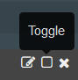

---

copyright:
  years: 2015, 2018

lastupdated: "2018-01-10"

---

{:shortdesc: .shortdesc}
{:new_window: target="_blank"}
{:codeblock: .codeblock}
{:screen: .screen}

# 在 Kibana 3 中分析日誌（已淘汰）
{: #analyzing_logs_Kibana3}

在 {{site.data.keyword.Bluemix}} 中，您可以使用 Kibana（一種開放程式碼分析與視覺化平台），在各種圖形（例如圖表和表格）中監視、搜尋、分析及視覺化您的資料。使用 Kibana 來執行進階分析作業。
{:shortdesc}

## 在 Kibana 儀表板中過濾資料
{: #filter_data_kibana_dashboard}

在 {{site.data.keyword.Bluemix}} 中，您可以使用根據每項資源或由 {{site.data.keyword.Bluemix}} 空間所提供的預設 Kibana 儀表板來分析資料。依預設，這些儀表板會顯示過去 24 小時可用的所有資料。不過，您可以限制透過儀表板顯示的資訊。您可以在預設儀表板中新增查詢及過濾器，然後儲存儀表板，以供日後重複使用。

您可以在一個儀表板中新增多個查詢及過濾器。查詢會定義一部分的日誌項目。而過濾器可以透過包含或排除資訊的方式來修正資料選取項目。 

對於 Cloud Foundry 應用程式，下列清單概述如何過濾資料的範例：
* 如果您要在日誌中尋找包括重要詞彙的資訊，則可以建立查詢，以依那些詞彙進行過濾。Kibana 可讓您在儀表板上以視覺化方式比較查詢。如需相關資訊，請參閱[在 Kibana 中以查詢來過濾 Cloud Foundry 應用程式日誌](kibana3/logging_kibana_query.html#logging_kibana_query)。

* 如果您要尋找特定一段時間內的資訊，則可以過濾某個時間範圍內的資料。如需相關資訊，請參閱[在 Kibana 中依時間過濾 Cloud Foundry 應用程式日誌](kibana3/logging_kibana_filter_by_time_period.html#logging_kibana_time_filter)。

* 如果您要尋找特定實例 ID 的資訊，則可以依實例 ID 過濾資料。如需相關資訊，請參閱[在 Kibana 中依實例 ID 過濾 Cloud Foundry 應用程式日誌](kibana3/logging_kibana_filter_by_instance_id.html#logging_kibana_instance_id)及[在 Kibana 中依已知的應用程式 ID 過濾 Cloud Foundry 應用程式日誌](kibana3/logging_kibana_filter_by_known_application_id.html#logging_kibana_known_application_id)。

* 如果您要尋找特定元件的資訊，則可以依元件（日誌類型）過濾資料。如需相關資訊，請參閱[在 Kibana 中依日誌類型過濾 Cloud Foundry 應用程式日誌](kibana3/logging_kibana_filter_by_component.html#logging_kibana_component_filter)。

* 如果您要尋找如錯誤訊息之類的資訊，則可以依訊息類型過濾資料。如需相關資訊，請參閱[在 Kibana 中依訊息類型過濾 Cloud Foundry 應用程式日誌](kibana3/logging_kibana_filter_by_message_type.html#logging_kibana_message_type_filter)。

## 自訂 Kibana 儀表板
{: #customize_kibana_dashboard}

您可以自訂不同類型的儀表板，以視覺化及分析資料，例如：
* 單一 CF 應用程式儀表板：此儀表板會顯示單一 Cloud Foundry 應用程式的資訊。  
* 多個 CF 應用程式儀表板：此儀表板會顯示部署在相同 {{site.data.keyword.Bluemix}} 空間中所有 Cloud Foundry 應用程式的資訊。 

自訂儀表板時，您可以配置查詢及過濾器，以選取要透過儀表板顯示的部分日誌資料。

若要將資料視覺化，您可以配置畫面。Kibana 包括可以用來分析資訊的各種畫面，例如表格、趨勢及直方圖。您可以新增、移除及重新排列儀表板中的畫面。每一個畫面的目標都不同。部分畫面會組織成數列，以提供一個以上查詢的結果。其他畫面則會顯示文件或自訂資訊。例如，您可以配置長條圖、圓餅圖或表格，以將資料視覺化，並進行分析。  

## 儲存 Kibana 儀表板
{: #save_Kibana_dashboard}

請完成下列步驟，以在自訂 Kibana 儀表板之後予以儲存：

1. 在工具列中，按一下**儲存**圖示。

2. 輸入儀表板的名稱。

    **附註：**如果您嘗試用來儲存儀表板的名稱包含空格，將不會進行儲存。

3. 按一下名稱欄位旁邊的**儲存**圖示。

## 透過 Kibana 儀表板來分析日誌
{: #analyze_kibana_logs}

自訂 Kibana 儀表板之後，您可以透過其畫面將資料視覺化並進行分析。 

若要搜尋資訊，您可以將查詢固定或取消固定。 

* 您可以將查詢固定至儀表板，並自動啟動搜尋。
* 若要移除儀表板中的內容，您可以取消啟動查詢。

若要過濾資訊，您可以啟用或停用過濾器。 

* 您可以選取過濾器中的**切換**勾選框 ，以進行啟用。   
* 您可以取消選取過濾器中的**切換**勾選框 ，以進行停用。 

儀表板中的圖形及圖表會顯示資料。您可以使用儀表板中的圖形及圖表來監視資料。 

例如，若為單一 CF 應用程式儀表板，儀表板中會包括某一個 Cloud Foundry 應用程式的相關資訊。您可以視覺化及分析的資料僅限於該應用程式。您可以使用儀表板來為所有應用程式實例分析資料。您可以比較實例。您可以依實例 ID 來過濾資訊。 

您可以為每一個實例 ID 定義查詢，並將查詢固定至儀表板。 

然後，您可以根據想要在儀表板中看到的實例資訊，啟動或取消啟動個別查詢。 

下圖顯示一個啟動的查詢，以及另一個取消啟動的查詢：

如果您要在直方圖中比較 2 個實例，則可以在相同的儀表板中定義兩個查詢，每一個實例 ID 都有一個查詢。您可以為其提供別名及唯一的顏色，以方便識別。Kibana 處理多個查詢時會使用邏輯 OR 來結合它們。 

下圖顯示用來為查詢配置別名和顏色、將查詢固定至儀表板，以及取消啟動查詢的畫面：

