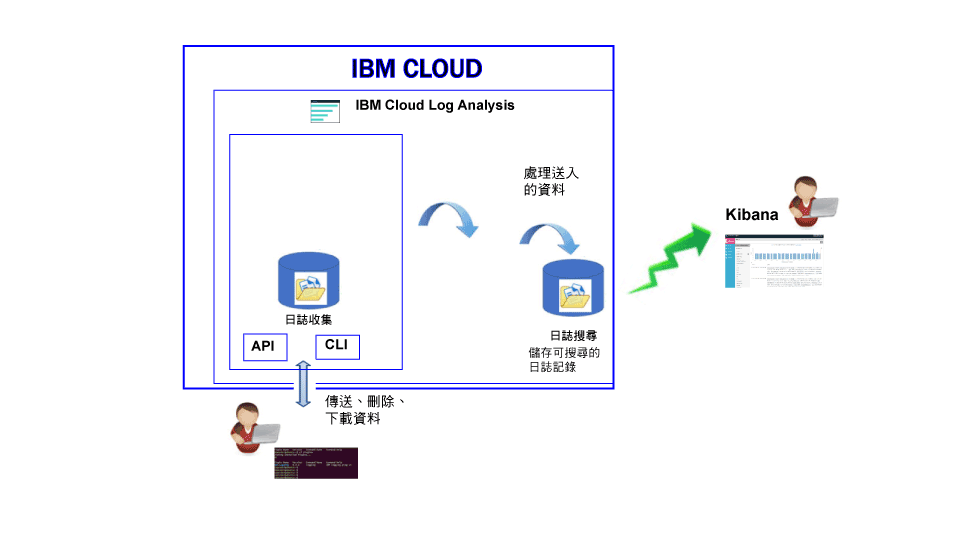

---

copyright:
  years: 2017

lastupdated: "2017-07-19"

---

{:shortdesc: .shortdesc}
{:new_window: target="_blank"}
{:codeblock: .codeblock}
{:screen: .screen}
{:pre: .pre}

# 關於
{: #log_analysis_ov}

使用 {{site.data.keyword.loganalysisfull}} 服務可擴展 {{site.data.keyword.Bluemix}} 中的日誌收集、日誌保留及日誌搜尋能力。使用下列這類特性強化 DevOps 團隊：聚集應用程式及環境日誌以獲得合併的應用程式環境見解、加密日誌、視需要保留日誌資料，以及快速偵測及疑難排解問題。使用 Kibana 進行進階分析作業。
{:shortdesc}

{{site.data.keyword.Bluemix_notm}} 記載功能已整合在平台中：

* 自動啟用雲端資源的資料收集。依預設，{{site.data.keyword.Bluemix_notm}} 會收集並顯示應用程式、應用程式運行環境以及這些應用程式執行所在運算運行環境的日誌。 
* 您每天最多可以搜尋 500 MB 的日誌。 
* 過去 3 天的日誌會儲存在「日誌搜尋」中，這是 {{site.data.keyword.loganalysisshort}} 服務的元件。

您可以使用 {{site.data.keyword.Bluemix_notm}} 中的記載功能來瞭解雲端平台的行為，以及在其中執行的資源。不需要特殊檢測，即可收集標準輸出和標準錯誤日誌。例如，您可以使用日誌來提供應用程式的審核追蹤、在服務中偵測問題、識別漏洞、對應用程式部署和運行環境行為進行疑難排解、在應用程式執行所在的基礎架構中偵測問題、在雲端平台中的各元件之間追蹤應用程式，以及偵測可用來提前處理可能影響服務 SLA 之動作的型樣。

下圖顯示 {{site.data.keyword.loganalysisshort}} 服務元件的高階視圖： 

若要收集與搜尋雲端資源的日誌，您必須在這些雲端資源執行所在的相同 {{site.data.keyword.Bluemix_notm}} 空間中佈建 {{site.data.keyword.loganalysisshort}} 服務實例。

依預設，會收集日誌，並將其儲存在「日誌搜尋」中。當您選取包括擴充搜尋及收集功能的服務方案時，也會收集日誌，並將其儲存在「日誌收集」元件中。「日誌收集」中儲存的日誌資料會進行加密。

您可收集並儲存在「日誌收集」中的日誌大小取決於您選擇的服務方案。針對儲存的資料，以每個月每 GB 的資料為單位來支付費用。這些日誌以 JSON 形式儲存在「日誌收集」裡。

您可以使用 Kibana 5.1 來進行進階日誌搜尋分析作業：

* 每一個方案都會限制您每天可搜尋的日誌大小。 
* 搜尋只會涵蓋過去 3 天的資料。

若要存取超過 3 天以前的日誌，您可以使用「日誌收集 CLI」或「日誌收集 API」在本端下載日誌，也可以透過管道將日誌傳送至其他應用程式或協力廠商雲端服務。 

您可以設定保留原則來自動刪除日誌，或使用 {{site.data.keyword.loganalysisshort}} CLI 來手動刪除日誌。

## 為何使用記載服務
{: #value}

1. **用較少的時間來檢測應用程式，而將更多的時間用在加強其價值**

    {{site.data.keyword.loganalysislong_notm}} 會自動從所選取的 {{site.data.keyword.IBM_notm}} 雲端服務中收集資料，而不需要任何檢測。
	
	您可以選擇每天可搜尋的日誌數量。有不同的方案可用，您可以用來搜尋每天最多 500 MB、2 GB、5 GB 和 10 GB 的日誌。

2. **讓日誌資料保持接近應用程式工作負載，並安全保護在雲端等級的經濟儲存空間解決方案上**

    從 {{site.data.keyword.IBM_notm}} Cloud 中所執行之傳統及微服務驅動應用程式，收集日誌資料並儲存在集中化日誌裡。視需要保留日誌資料。
	
	日誌儲存在 {{site.data.keyword.IBM_notm}} Cloud 儲存空間。您可以在需要時下載日誌。

3. **瞭解環境，以快速偵測、診斷及識別問題**

    透過可自訂的儀表板，視覺化及分析資料，並與之互動。日誌搜尋特性以彈性堆疊平台為建置基礎，可提供您 Kibana 的彈性及熟悉度，快速建置符合您應用程式需求的儀表板。

4. **與 API 的強固整合**

    透過服務的 API，將日誌資料整合到應用程式及作業。使用 {{site.data.keyword.loganalysisshort}} 服務 API 來管理已保留的日誌，以及從 {{site.data.keyword.IBM_notm}} Cloud 之外傳送日誌資料。

	
## 收集日誌
{: #log_collection}

依預設，{{site.data.keyword.Bluemix_notm}} 會在「日誌搜尋」中儲存最多 3 天的日誌資料：   

* 每個空間每天最多可儲存 500 MB 的資料。超過該 500 MB 上限的任何日誌都會被捨棄。上限配額會在每天凌晨 12:30（世界標準時間）重設。
* 可搜尋最多 3 天、最多 1.5 GB 的資料。達到 1.5 GB 資料或在 3 天之後，日誌資料就會輪替（先進先出）。

{{site.data.keyword.loganalysisshort}} 服務提供其他方案，讓您依所需將日誌儲存在「日誌收集」。如需每個方案的相關資訊，請參閱[服務方案](/docs/services/CloudLogAnalysis/log_analysis_ov.html#plans)。

## 刪除日誌
{: #log_deletion}

在 3 天後，即會刪除「日誌搜尋」中所儲存的日誌。

除非您配置保留原則，否則會在 30 天後自動刪除「日誌收集」中所儲存的日誌。 

* 您可以配置日誌保留原則，以定義您要將日誌保留在「日誌收集」中的天數。如需相關資訊，請參閱[日誌保留原則](/docs/services/CloudLogAnalysis/log_analysis_ov.html#policies)。

* 停用此原則的方式是將其值設為 *-1*。 

您可以使用「日誌收集 API」或「日誌收集 CLI」，手動刪除「日誌收集」中的日誌。如需透過 CLI 手動刪除日誌的相關資訊，請參閱 [cf logging delete](/docs/services/CloudLogAnalysis/reference/logging_cli.html#delete)。

## 汲取日誌
{: #log_ingestion}

所有 {{site.data.keyword.loganalysisshort}} 服務方案（不含*精簡* 方案）都可以從 {{site.data.keyword.IBM_notm}} Cloud 外部將日誌傳送至「日誌收集」。如需方案的相關資訊，請參閱[服務方案](/docs/services/CloudLogAnalysis/log_analysis_ov.html#plans)。

您可以使用「多方承租戶 Logstash 轉遞程式」，將日誌傳送至 {{site.data.keyword.loganalysisshort}}。如需相關資訊，請參閱[使用多方承租戶 Logstash 轉遞程式 (mt-logstash-forwarder) 傳送日誌資料](/docs/services/CloudLogAnalysis/how-to/send-data/send_data_mt.html#send_data_mt)。

## 搜尋日誌
{: #log_search}

依預設，在 {{site.data.keyword.Bluemix_notm}} 中，您可以使用 Kibana 5.1 每天最多搜尋 500 MB 的日誌。 

{{site.data.keyword.loganalysisshort}} 服務提供多個方案。每一個方案都有不同的日誌搜尋功能，例如，*日誌收集* 方案可讓您每天最多搜尋 1 GB 的資料。如需方案的相關資訊，請參閱[服務方案](/docs/services/CloudLogAnalysis/log_analysis_ov.html#plans)。

## Bluemix 中的日誌分析
{: #logging_bmx_ov_ui}

在 {{site.data.keyword.Bluemix_notm}} 中，您可以檢視 CF 應用程式或容器的最新日誌，或即時讀取日誌尾端的內容（CF 應用程式或容器部署在 {{site.data.keyword.Bluemix_notm}} 所管理基礎架構中）：

* 您可以透過使用者介面來檢視、過濾及分析日誌。如需相關資訊，請參閱[從 Bluemix 主控台分析日誌](/docs/services/CloudLogAnalysis/logging_view_dashboard.html#analyzing_logs_bmx_ui)。

* 您可以藉由使用指令行，以程式設計方式管理日誌，來檢視、過濾及分析日誌。如需相關資訊，請參閱[從 CLI 分析日誌](/docs/services/CloudLogAnalysis/logging_view_cli.html#analyzing_logs_cli)。

* 您可以使用 Kibana 來執行進階分析。

## 使用 Kibana 執行進階日誌分析
{: #logging_bmx_ov_kibana}

在 {{site.data.keyword.Bluemix_notm}} 中，您可以使用 Kibana（一種開放程式碼分析與視覺化平台），在各種圖形（例如圖表和表格）中監視、搜尋、分析及視覺化您的資料。如需相關資訊，請參閱[使用 Kibana 執行進階日誌分析](/docs/services/CloudLogAnalysis/kibana/analyzing_logs_Kibana.html#analyzing_logs_Kibana)。

## 透過 CLI 管理日誌
{: #managing_logs}

請使用 {{site.data.keyword.loganalysisshort}} CLI 來管理日誌。

* 若要瞭解如何安裝 CLI，請參閱[安裝記載 CLI](/docs/services/CloudLogAnalysis/how-to/manage-logs/config_log_collection_cli.html#config_log_collection_cli)。
* 若要檢查 CLI 版本，請執行指令 [cf logging](/docs/services/CloudLogAnalysis/reference/logging_cli.html#base) 並搭配參數 * -version*。
* 若要取得如何執行指令的協助，請參閱[取得執行指令的指令行協助](/docs/services/CloudLogAnalysis/how-to/manage-logs/config_log_collection_cli.html#cli_help)。

若要取得您日誌的一般資訊，請使用 `cf logging status` 指令。例如，您可以：

* [取得一段時間內的日誌相關資訊](/docs/services/CloudLogAnalysis/how-to/manage-logs/viewing_log_information.html#viewing_logs)。
* [取得一段時間內的某類型日誌相關資訊](/docs/services/CloudLogAnalysis/how-to/manage-logs/viewing_log_information.html#viewing_logs_by_log_type)。
* [取得日誌的帳戶資訊](/docs/services/CloudLogAnalysis/how-to/manage-logs/viewing_log_information.html#viewing_logs_account)。

若要持續控制成本，您可能要監視一段時間內的應用程式日誌大小。例如，您可能要知道 {{site.data.keyword.Bluemix_notm}} 空間一週內每一種日誌類型的大小，才能識別是否有任何應用程式或服務所產生的日誌超出預期。若要檢查日誌大小，請使用 `cf logging status` 指令。如需相關資訊，請參閱[檢視日誌資訊](/docs/services/CloudLogAnalysis/how-to/manage-logs/viewing_log_information.html#viewing_log_status)。

您可以在 Kibana 中搜尋過去 3 天的日誌。若要可以分析舊日誌資料，您可以將日誌下載至本端檔案，或透過管道將這些日誌輸入至其他程式（例如本端 Elastic Stack）。如需相關資訊，請參閱[下載日誌](/docs/services/CloudLogAnalysis/how-to/manage-logs/downloading_logs.html#downloading_logs)。

若要手動刪除您不再需要的日誌，請使用指令 [cf logging delete](/docs/services/CloudLogAnalysis/reference/logging_cli.html#delete)。 

## 原則
{: #policies}

**日誌保留原則**

您可以使用 {{site.data.keyword.loganalysisshort}} CLI 來檢視及配置日誌保留原則。此原則指定將日誌保留在「日誌收集」中的天數。 

* 依預設，日誌會保留 30 天。 
* 保留期間到期之後，會自動刪除「日誌收集」中的日誌，而且無法進行回復。
* 您可以指定帳戶的保留期間。會自動配置該帳戶中所有空間的保留期間。 
* 您可以指定 {{site.data.keyword.Bluemix_notm}} 空間的保留期間。
* 您隨時都可以變更保留原則。
* 停用此原則的方式是將其值設為 *-1*。 

**附註：**當您停用日誌保留原則時，必須在「日誌收集」中維護日誌。您可以使用 CLI 指令 [cf logging delete](/docs/services/CloudLogAnalysis/reference/logging_cli.html#delete) 來刪除舊日誌。

如需相關資訊，請參閱[檢視及配置日誌保留原則](/docs/services/CloudLogAnalysis/how-to/manage-logs/configuring_retention_policy.html#configuring_retention_policy)。

## 服務方案
{: #plans}

{{site.data.keyword.loganalysisshort}} 服務提供多個方案。每一個方案都會有不同的日誌收集及日誌搜尋功能。 

您可以透過 {{site.data.keyword.Bluemix_notm}} 使用者介面或透過指令行來變更方案。您隨時可以升級或降低方案。如需 {{site.data.keyword.Bluemix_notm}} 中服務方案升級的相關資訊，請參閱[變更方案](/docs/services/CloudLogAnalysis/plan/change_plan.html#change_plan)。 

下表概述可用的方案：

<table>
    <caption>每個方案的「日誌搜尋」及「日誌收集」功能摘要</caption>
      <tr>
        <th>方案</th>
        <th>日誌汲取</th>
        <th>日誌保留</th>
        <th>資料加密</th>
        <th>日誌搜尋</th>
      </tr>
      <tr>
        <td>精簡（預設值）</td>
        <td>否</td>
        <td>過去 3 天</td>
        <td>否</td>
        <td>最多搜尋 500 MB</td>
      </tr>
      <tr>
        <td>日誌收集</td>
        <td>是</td>
        <td>可配置的天數。</td>
        <td>是</td>
        <td>每天最多搜尋 500 MB</td>
      </tr>
      <tr>
        <td>日誌收集，每天搜尋 2 GB</td>
        <td>是</td>
        <td>可配置的天數。</td>
        <td>是</td>
        <td>每天最多搜尋 2 GB</td>
      </tr>
      <tr>
        <td>日誌收集，每天搜尋 5 GB</td>
        <td>是</td>
        <td>可配置的天數。</td>
        <td>是</td>
        <td>每天最多搜尋 5 GB</td>
      </tr>
       <tr>
        <td>日誌收集，每天搜尋 10 GB</td>
        <td>是</td>
        <td>可配置的天數。</td>
        <td>是</td>
        <td>每天最多搜尋 10 GB</td>
      </tr>
</table>

**附註：**日誌收集儲存空間的每月成本是以計費週期的平均值來計算。

## 地區
{: #regions}

下列地區提供 {{site.data.keyword.loganalysisfull_notm}} 服務：

* 美國南部

